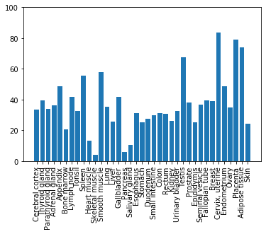

# Interacting with popular databases using Python

The primary mode of interaction with webpage is through the web communication protocol `HTTP` or `HTTPS` for encrypted. Within `HTTP`,
there are different methods for requesting and submitting information. The methods that we will be using today are `GET` and `POST` requests.

## HTTP Resquests


Source: [Mozilla Developer](https://developer.mozilla.org/en-US/docs/Web/HTTP/Messages) 

* `POST` request sends headers information as well as additional form data content.
* `GET` request only sends headers information.

## HTTP Response

Every request is returned with a response. The response composed of a headers which contain information of the enclosing data
as well as additional meta instruction for the browsing session. 


Source: [Mozilla Developer](https://developer.mozilla.org/en-US/docs/Web/HTTP/Messages) 

By convention, a request is successful when the response carry a `status` code of `200`. A request that could not be found
will receive a response with code `404`. A malformed or invalid request will received the response code `400`.

## HTTP API

An API is a collection of standard methods for requesting and submitting information with streamlined responses. Many website
use a standard API for getting information from their database then reorganizing them on the web document for the users.

Today, we are going to use Python interact directly with those API instead of having them display on a web document for browsing.


```python
import requests
import json
import pandas as pd
from io import StringIO
```

`requests` is the recommended module for requesting and sending resources to a web-based API endpoint

`json` is the built-in module for working with data serialization and deserialization.

# UniProt REST API


```python
uniprot_url = "https://www.uniprot.org/uploadlists"
headers = {
    "User-Agent": "Python, toan.phung@uq.net.au"
}
acc_file = "../data/testlist.txt"
```

`https://www.uniprot.org/uploadlists` is the url of the uniprot REST API that we will used to request information

`headers` is the metadata that should be included with every api requests for potential debugging purpose from uniprot admin


```python
with open(acc_file, "rt") as source_acc:
    l = [i.strip() for i in source_acc]
```

Opening the file containing our list of Uniprot accession id and store as an string array


```python
parameters = {
    "query": " ".join(l),
    "format": "tab",
    "from": "ACC,ID",
    "to": "REFSEQ_NT_ID"
}

```

From the `uploadlists` api endpoint, there are a few options we can choose.

For example, one can use Uniprot ability to convert input id format to id format in different databases.
Above, we are created a parameters dictionary to convert from Uniprot accession. The dictionary contain 4 keys.
- `query` value is a string constructed from the array above with each item joined by a space
- `format` the desired return file format
- `from` input format id type (uniprot acc and id)
- `to` output format id type (RefSeq nucleotide sequence id)


```python
response = requests.get(uniprot_url, params=parameters, headers=headers)
print(response.status_code)
```

    200
    

`response` is the variable containing the request result from Uniprot.


```python
result_refseq_nt = pd.read_csv(StringIO(response.text), sep="\t")
result_refseq_nt.head()
```


<div>
<style scoped>
    .dataframe tbody tr th:only-of-type {
        vertical-align: middle;
    }

    .dataframe tbody tr th {
        vertical-align: top;
    }

    .dataframe thead th {
        text-align: right;
    }
</style>
<table border="1" class="dataframe">
  <thead>
    <tr style="text-align: right;">
      <th></th>
      <th>From</th>
      <th>To</th>
    </tr>
  </thead>
  <tbody>
    <tr>
      <th>0</th>
      <td>P25045</td>
      <td>NM_001182805.1</td>
    </tr>
    <tr>
      <th>1</th>
      <td>Q07844</td>
      <td>NM_001181854.1</td>
    </tr>
    <tr>
      <th>2</th>
      <td>P22147</td>
      <td>NM_001181038.1</td>
    </tr>
    <tr>
      <th>3</th>
      <td>P39931</td>
      <td>NM_001182137.1</td>
    </tr>
    <tr>
      <th>4</th>
      <td>P27692</td>
      <td>NM_001182366.1</td>
    </tr>
  </tbody>
</table>
</div>


For saving the output from the operation, you can save directly from the response result or from the data frame.


```python
# Directly from response
with open("../data/result_map.txt", "wb") as map_file:
    map_file.write(response.content)

```


```python
# From pandas dataframe
result_refseq_nt.to_csv("../data/result_map.txt", sep="\t")

```

`result` store uniprot tabulated data in a `pandas` dataframe.

First columne is the original input id and the second column is the corresponding id in the RefSeq nucleotide database.


```python
parameters["to"] = "P_REFSEQ_AC"
response = requests.get(uniprot_url, params=parameters, headers=headers)
result_refseq_ac = pd.read_csv(StringIO(response.text), sep="\t")
result_refseq_ac.head()
```


<div>
<style scoped>
    .dataframe tbody tr th:only-of-type {
        vertical-align: middle;
    }

    .dataframe tbody tr th {
        vertical-align: top;
    }

    .dataframe thead th {
        text-align: right;
    }
</style>
<table border="1" class="dataframe">
  <thead>
    <tr style="text-align: right;">
      <th></th>
      <th>From</th>
      <th>To</th>
    </tr>
  </thead>
  <tbody>
    <tr>
      <th>0</th>
      <td>P25045</td>
      <td>NP_014025.1</td>
    </tr>
    <tr>
      <th>1</th>
      <td>Q07844</td>
      <td>NP_013066.1</td>
    </tr>
    <tr>
      <th>2</th>
      <td>P22147</td>
      <td>NP_011342.1</td>
    </tr>
    <tr>
      <th>3</th>
      <td>P39931</td>
      <td>NP_013351.1</td>
    </tr>
    <tr>
      <th>4</th>
      <td>P27692</td>
      <td>NP_013703.1</td>
    </tr>
  </tbody>
</table>
</div>


Above, we changed our query parameter to targeting RefSeq protein accession id instead.

---

Now what if we want to get more information from the Uniprot database instead of just doing id coversion.


```python
extra_parameters = ["id", "entry name", "reviewed", "protein names", "organism", "sequence"]
parameters["to"] = "ACC"
parameters["columns"] = ",".join(extra_parameters)
print(parameters["columns"])
```

    id,entry name,reviewed,protein names,organism,sequence
    

Adding a fifth key to our parameters named
- `columns` string composed of the columns name of desired data corresponding to the ids collection.
Each column name separated by ",". Above we are getting id, entry name, reviewed status, protein names, organism and 
protein sequence from Uniprot.

For all column name accessible through this mode, you can visit https://www.uniprot.org/help/uniprotkb_column_names


```python
response = requests.get(uniprot_url, params=parameters, headers=headers)
result_uniprot = pd.read_csv(StringIO(response.text), sep="\t")
print(result_uniprot.columns)
result_uniprot.head()

```

    Index(['Entry', 'Entry name', 'Status', 'Protein names', 'Organism',
           'Sequence',
           'yourlist:M201908086746803381A1F0E0DB47453E0216320D88A352J'],
          dtype='object')
    


<div>
<style scoped>
    .dataframe tbody tr th:only-of-type {
        vertical-align: middle;
    }

    .dataframe tbody tr th {
        vertical-align: top;
    }

    .dataframe thead th {
        text-align: right;
    }
</style>
<table border="1" class="dataframe">
  <thead>
    <tr style="text-align: right;">
      <th></th>
      <th>Entry</th>
      <th>Entry name</th>
      <th>Status</th>
      <th>Protein names</th>
      <th>Organism</th>
      <th>Sequence</th>
      <th>yourlist:M201908086746803381A1F0E0DB47453E0216320D88A352J</th>
    </tr>
  </thead>
  <tbody>
    <tr>
      <th>0</th>
      <td>P25045</td>
      <td>LCB1_YEAST</td>
      <td>reviewed</td>
      <td>Serine palmitoyltransferase 1 (SPT 1) (SPT1) (...</td>
      <td>Saccharomyces cerevisiae (strain ATCC 204508 /...</td>
      <td>MAHIPEVLPKSIPIPAFIVTTSSYLWYYFNLVLTQIPGGQFIVSYI...</td>
      <td>P25045</td>
    </tr>
    <tr>
      <th>1</th>
      <td>Q07844</td>
      <td>RIX7_YEAST</td>
      <td>reviewed</td>
      <td>Ribosome biogenesis ATPase RIX7</td>
      <td>Saccharomyces cerevisiae (strain ATCC 204508 /...</td>
      <td>MVKVKSKKNSLTSSLDNKIVDLIYRLLEEKTLDRKRSLRQESQGEE...</td>
      <td>Q07844</td>
    </tr>
    <tr>
      <th>2</th>
      <td>P22147</td>
      <td>XRN1_YEAST</td>
      <td>reviewed</td>
      <td>5'-3' exoribonuclease 1 (EC 3.1.13.-) (DNA str...</td>
      <td>Saccharomyces cerevisiae (strain ATCC 204508 /...</td>
      <td>MGIPKFFRYISERWPMILQLIEGTQIPEFDNLYLDMNSILHNCTHG...</td>
      <td>P22147</td>
    </tr>
    <tr>
      <th>3</th>
      <td>P39931</td>
      <td>SS120_YEAST</td>
      <td>reviewed</td>
      <td>Protein SSP120</td>
      <td>Saccharomyces cerevisiae (strain ATCC 204508 /...</td>
      <td>MRFLRGFVFSLAFTLYKVTATAEIGSEINVENEAPPDGLSWEEWHM...</td>
      <td>P39931</td>
    </tr>
    <tr>
      <th>4</th>
      <td>P27692</td>
      <td>SPT5_YEAST</td>
      <td>reviewed</td>
      <td>Transcription elongation factor SPT5 (Chromati...</td>
      <td>Saccharomyces cerevisiae (strain ATCC 204508 /...</td>
      <td>MSDNSDTNVSMQDHDQQFADPVVVPQSTDTKDENTSDKDTVDSGNV...</td>
      <td>P27692</td>
    </tr>
  </tbody>
</table>
</div>


An example for a more extensive parameters is below


```python
parameters = {
    "query": " ".join(l),
    "format": "tab",
    "from": "ACC,ID",
    "to": "ACC",
    "columns": "id,entry name,reviewed,protein names,genes,organism,length," \
                                   "organism-id,go-id,go(cellular component),comment(SUBCELLULAR LOCATION)," \
                                   "feature(TOPOLOGICAL_DOMAIN),feature(GLYCOSYLATION),comment(MASS SPECTROMETRY)," \
                                   "sequence,feature(ALTERNATIVE SEQUENCE),comment(ALTERNATIVE PRODUCTS) ",
}

response = requests.get(uniprot_url, params=parameters, headers=headers)

result_uniprot_extensive = pd.read_csv(StringIO(response.text), sep="\t")
print(result_uniprot_extensive.columns)
result_uniprot_extensive.head()
```

    Index(['Entry', 'Entry name', 'Status', 'Protein names', 'Gene names',
           'Organism', 'Length', 'Organism ID', 'Gene ontology IDs',
           'Gene ontology (cellular component)', 'Subcellular location [CC]',
           'Topological domain', 'Glycosylation', 'Mass spectrometry', 'Sequence',
           'Alternative sequence', 'Alternative products (isoforms)',
           'yourlist:M201908086746803381A1F0E0DB47453E0216320D88A3564'],
          dtype='object')
    


<div>
<style scoped>
    .dataframe tbody tr th:only-of-type {
        vertical-align: middle;
    }

    .dataframe tbody tr th {
        vertical-align: top;
    }

    .dataframe thead th {
        text-align: right;
    }
</style>
<table border="1" class="dataframe">
  <thead>
    <tr style="text-align: right;">
      <th></th>
      <th>Entry</th>
      <th>Entry name</th>
      <th>Status</th>
      <th>Protein names</th>
      <th>Gene names</th>
      <th>Organism</th>
      <th>Length</th>
      <th>Organism ID</th>
      <th>Gene ontology IDs</th>
      <th>Gene ontology (cellular component)</th>
      <th>Subcellular location [CC]</th>
      <th>Topological domain</th>
      <th>Glycosylation</th>
      <th>Mass spectrometry</th>
      <th>Sequence</th>
      <th>Alternative sequence</th>
      <th>Alternative products (isoforms)</th>
      <th>yourlist:M201908086746803381A1F0E0DB47453E0216320D88A3564</th>
    </tr>
  </thead>
  <tbody>
    <tr>
      <th>0</th>
      <td>P25045</td>
      <td>LCB1_YEAST</td>
      <td>reviewed</td>
      <td>Serine palmitoyltransferase 1 (SPT 1) (SPT1) (...</td>
      <td>LCB1 END8 TSC2 YMR296C</td>
      <td>Saccharomyces cerevisiae (strain ATCC 204508 /...</td>
      <td>558</td>
      <td>559292</td>
      <td>GO:0004758; GO:0005783; GO:0016021; GO:0017059...</td>
      <td>SPOTS complex [GO:0035339]; endoplasmic reticu...</td>
      <td>SUBCELLULAR LOCATION: Cytoplasm. Endoplasmic r...</td>
      <td>TOPO_DOM 1 49 Lumenal. {ECO:0000269|PubMed:154...</td>
      <td>NaN</td>
      <td>NaN</td>
      <td>MAHIPEVLPKSIPIPAFIVTTSSYLWYYFNLVLTQIPGGQFIVSYI...</td>
      <td>NaN</td>
      <td>NaN</td>
      <td>P25045</td>
    </tr>
    <tr>
      <th>1</th>
      <td>Q07844</td>
      <td>RIX7_YEAST</td>
      <td>reviewed</td>
      <td>Ribosome biogenesis ATPase RIX7</td>
      <td>RIX7 YLL034C</td>
      <td>Saccharomyces cerevisiae (strain ATCC 204508 /...</td>
      <td>837</td>
      <td>559292</td>
      <td>GO:0000055; GO:0005524; GO:0005634; GO:0005730...</td>
      <td>nucleolus [GO:0005730]; nucleus [GO:0005634]; ...</td>
      <td>SUBCELLULAR LOCATION: Nucleus, nucleolus {ECO:...</td>
      <td>NaN</td>
      <td>NaN</td>
      <td>NaN</td>
      <td>MVKVKSKKNSLTSSLDNKIVDLIYRLLEEKTLDRKRSLRQESQGEE...</td>
      <td>NaN</td>
      <td>NaN</td>
      <td>Q07844</td>
    </tr>
    <tr>
      <th>2</th>
      <td>P22147</td>
      <td>XRN1_YEAST</td>
      <td>reviewed</td>
      <td>5'-3' exoribonuclease 1 (EC 3.1.13.-) (DNA str...</td>
      <td>XRN1 DST2 KEM1 RAR5 SEP1 SKI1 YGL173C G1645</td>
      <td>Saccharomyces cerevisiae (strain ATCC 204508 /...</td>
      <td>1528</td>
      <td>559292</td>
      <td>GO:0000184; GO:0000741; GO:0000932; GO:0000956...</td>
      <td>P-body [GO:0000932]; cytoplasm [GO:0005737]; c...</td>
      <td>SUBCELLULAR LOCATION: Cytoplasm. Cytoplasm, pe...</td>
      <td>NaN</td>
      <td>NaN</td>
      <td>NaN</td>
      <td>MGIPKFFRYISERWPMILQLIEGTQIPEFDNLYLDMNSILHNCTHG...</td>
      <td>NaN</td>
      <td>NaN</td>
      <td>P22147</td>
    </tr>
    <tr>
      <th>3</th>
      <td>P39931</td>
      <td>SS120_YEAST</td>
      <td>reviewed</td>
      <td>Protein SSP120</td>
      <td>SSP120 YLR250W L9672.4</td>
      <td>Saccharomyces cerevisiae (strain ATCC 204508 /...</td>
      <td>234</td>
      <td>559292</td>
      <td>GO:0000324; GO:0005509; GO:0005737; GO:0005793</td>
      <td>cytoplasm [GO:0005737]; endoplasmic reticulum-...</td>
      <td>NaN</td>
      <td>NaN</td>
      <td>NaN</td>
      <td>NaN</td>
      <td>MRFLRGFVFSLAFTLYKVTATAEIGSEINVENEAPPDGLSWEEWHM...</td>
      <td>NaN</td>
      <td>NaN</td>
      <td>P39931</td>
    </tr>
    <tr>
      <th>4</th>
      <td>P27692</td>
      <td>SPT5_YEAST</td>
      <td>reviewed</td>
      <td>Transcription elongation factor SPT5 (Chromati...</td>
      <td>SPT5 YML010W YM9571.08</td>
      <td>Saccharomyces cerevisiae (strain ATCC 204508 /...</td>
      <td>1063</td>
      <td>559292</td>
      <td>GO:0000993; GO:0001042; GO:0001179; GO:0003677...</td>
      <td>DSIF complex [GO:0032044]; mitochondrion [GO:0...</td>
      <td>SUBCELLULAR LOCATION: Nucleus {ECO:0000269|Pub...</td>
      <td>NaN</td>
      <td>NaN</td>
      <td>NaN</td>
      <td>MSDNSDTNVSMQDHDQQFADPVVVPQSTDTKDENTSDKDTVDSGNV...</td>
      <td>NaN</td>
      <td>NaN</td>
      <td>P27692</td>
    </tr>
  </tbody>
</table>
</div>


Tabulated output from Uniprot does not give isoform sequence. If you want to get their sequence as well, you will have 
to work with fasta output instead of tabulated. An extra parameters is also needed is `include : "yes"`


```python
parameters = {
    "query": " ".join(l),
    "format": "fasta",
    "from": "ACC,ID",
    "to": "ACC",
    "include": "yes"
}
response = requests.get(uniprot_url, params=parameters, headers=headers)
```

With the fasta file retrieved, we would still need to save it out.


```python
with open("../data/all_isoforms.fasta", "wb") as fasta_file:
    fasta_file.write(response.content)
    
```

For query not using an id or accession but a more general search, the api endpoint will have to be changed to `https://www.uniprot.org/uniprot`
. Below we are constructing a new query for this endpoint.


```python
uniprot_url = "https://www.uniprot.org/uniprot"
parameters = {
    "query": "glycoprotein",
    "format": "tab",
    "fil": 'organism:"Homo sapiens (Human) [9606]" AND reviewed:yes',
    "columns": "id,entry name,reviewed,protein names,genes,organism,length," \
                                   "organism-id,go-id,go(cellular component),comment(SUBCELLULAR LOCATION),"
}

```

Then execute the query in similar fashion.


```python
response = requests.get(uniprot_url, params=parameters, headers=headers)
result_uniprot_glyco = pd.read_csv(StringIO(response.text), sep="\t")
result_uniprot_glyco.head()
```


<div>
<style scoped>
    .dataframe tbody tr th:only-of-type {
        vertical-align: middle;
    }

    .dataframe tbody tr th {
        vertical-align: top;
    }

    .dataframe thead th {
        text-align: right;
    }
</style>
<table border="1" class="dataframe">
  <thead>
    <tr style="text-align: right;">
      <th></th>
      <th>Entry</th>
      <th>Entry name</th>
      <th>Status</th>
      <th>Protein names</th>
      <th>Gene names</th>
      <th>Organism</th>
      <th>Length</th>
      <th>Organism ID</th>
      <th>Gene ontology IDs</th>
      <th>Gene ontology (cellular component)</th>
      <th>Subcellular location [CC]</th>
    </tr>
  </thead>
  <tbody>
    <tr>
      <th>0</th>
      <td>P14384</td>
      <td>CBPM_HUMAN</td>
      <td>reviewed</td>
      <td>Carboxypeptidase M (CPM) (EC 3.4.17.12)</td>
      <td>CPM</td>
      <td>Homo sapiens (Human)</td>
      <td>443</td>
      <td>9606</td>
      <td>GO:0004180; GO:0004181; GO:0005576; GO:0005615...</td>
      <td>anchored component of membrane [GO:0031225]; c...</td>
      <td>SUBCELLULAR LOCATION: Cell membrane {ECO:00002...</td>
    </tr>
    <tr>
      <th>1</th>
      <td>P40259</td>
      <td>CD79B_HUMAN</td>
      <td>reviewed</td>
      <td>B-cell antigen receptor complex-associated pro...</td>
      <td>CD79B B29 IGB</td>
      <td>Homo sapiens (Human)</td>
      <td>229</td>
      <td>9606</td>
      <td>GO:0002250; GO:0004888; GO:0005654; GO:0005794...</td>
      <td>B cell receptor complex [GO:0019815]; Golgi ap...</td>
      <td>SUBCELLULAR LOCATION: Cell membrane; Single-pa...</td>
    </tr>
    <tr>
      <th>2</th>
      <td>P15169</td>
      <td>CBPN_HUMAN</td>
      <td>reviewed</td>
      <td>Carboxypeptidase N catalytic chain (CPN) (EC 3...</td>
      <td>CPN1 ACBP</td>
      <td>Homo sapiens (Human)</td>
      <td>458</td>
      <td>9606</td>
      <td>GO:0004181; GO:0005576; GO:0005615; GO:0006518...</td>
      <td>extracellular region [GO:0005576]; extracellul...</td>
      <td>SUBCELLULAR LOCATION: Secreted, extracellular ...</td>
    </tr>
    <tr>
      <th>3</th>
      <td>P35858</td>
      <td>ALS_HUMAN</td>
      <td>reviewed</td>
      <td>Insulin-like growth factor-binding protein com...</td>
      <td>IGFALS ALS</td>
      <td>Homo sapiens (Human)</td>
      <td>605</td>
      <td>9606</td>
      <td>GO:0005520; GO:0005576; GO:0005615; GO:0005654...</td>
      <td>extracellular exosome [GO:0070062]; extracellu...</td>
      <td>SUBCELLULAR LOCATION: Secreted, extracellular ...</td>
    </tr>
    <tr>
      <th>4</th>
      <td>P30443</td>
      <td>1A01_HUMAN</td>
      <td>reviewed</td>
      <td>HLA class I histocompatibility antigen, A-1 al...</td>
      <td>HLA-A HLAA</td>
      <td>Homo sapiens (Human)</td>
      <td>365</td>
      <td>9606</td>
      <td>GO:0000139; GO:0001913; GO:0001916; GO:0002419...</td>
      <td>ER to Golgi transport vesicle membrane [GO:001...</td>
      <td>SUBCELLULAR LOCATION: Cell membrane {ECO:00002...</td>
    </tr>
  </tbody>
</table>
</div>


# NCBI API

Similar to UniProt, multiple NCBI APIs can be accessed through manipulation of the URL content.


```python
result = pd.read_csv(StringIO(response.text), sep="\t")

```

`result` store uniprot tabulated data in a `pandas` dataframe.


```python
eutil_path = "https://eutils.ncbi.nlm.nih.gov/entrez/eutils/"
query = result_refseq_ac["To"] + "[accn]"
query = "+OR+".join(query)
params = [
    "db=protein",
    "term={}".format(query),
    "usehistory=y"
]
url = "&".join(params)
headers["Content-Type"] = "application/x-www-form-urlencoded"
```

Now using the query above, we are performing a search in the protein database of uniprot with requests. However because of the URL length
we will have to use HTTP POST request instead of a simple GET request. The different between GET and POST is that beyond the URL and headers,
GET send no additional data. POST requests allows sending of information that are not suitable for URL.


```python
res = requests.post(eutil_path + "esearch.fcgi", data=url, headers=headers)
```

Similar to a GET request, POST request result can be accessed at `content` and `text` attribute


```python
res.content
```


    b'<?xml version="1.0" encoding="UTF-8" ?>\n<!DOCTYPE eSearchResult PUBLIC "-//NLM//DTD esearch 20060628//EN" "https://eutils.ncbi.nlm.nih.gov/eutils/dtd/20060628/esearch.dtd">\n<eSearchResult><Count>926</Count><RetMax>20</RetMax><RetStart>0</RetStart><QueryKey>1</QueryKey><WebEnv>NCID_1_295303003_130.14.22.76_9001_1565229483_1409781304_0MetA0_S_MegaStore</WebEnv><IdList>\n<Id>398365665</Id>\n<Id>398365397</Id>\n<Id>398364771</Id>\n<Id>147921768</Id>\n<Id>42742305</Id>\n<Id>33438880</Id>\n<Id>6325371</Id>\n<Id>6325031</Id>\n<Id>6323953</Id>\n<Id>6322870</Id>\n<Id>6322406</Id>\n<Id>757873419</Id>\n<Id>398366661</Id>\n<Id>398366635</Id>\n<Id>398366631</Id>\n<Id>398366627</Id>\n<Id>398366603</Id>\n<Id>398366593</Id>\n<Id>398366587</Id>\n<Id>398366579</Id>\n</IdList><TranslationSet/><TranslationStack>   <TermSet>    <Term>NP_014025.1[accn]</Term>    <Field>accn</Field>    <Count>1</Count>    <Explode>N</Explode>   </TermSet>   <TermSet>    <Term>NP_013066.1[accn]</Term>    <Field>accn</Field>    <Count>1</Count>    <Explode>N</Explode>   </TermSet>   <OP>OR</OP>   <TermSet>    <Term>NP_011342.1[accn]</Term>    <Field>accn</Field>    <Count>1</Count>    <Explode>N</Explode>   </TermSet>   <OP>OR</OP>   <TermSet>    <Term>NP_013351.1[accn]</Term>    <Field>accn</Field>    <Count>1</Count>    <Explode>N</Explode>   </TermSet>   <OP>OR</OP>   <TermSet>    <Term>NP_013703.1[accn]</Term>    <Field>accn</Field>    <Count>1</Count>    <Explode>N</Explode>   </TermSet>   <OP>OR</OP>   <TermSet>    <Term>NP_011541.1[accn]</Term>    <Field>accn</Field>    <Count>1</Count>    <Explode>N</Explode>   </TermSet>   <OP>OR</OP>   <TermSet>    <Term>NP_013988.1[accn]</Term>    <Field>accn</Field>    <Count>1</Count>    <Explode>N</Explode>   </TermSet>   <OP>OR</OP>   <TermSet>    <Term>NP_009381.1[accn]</Term>    <Field>accn</Field>    <Count>1</Count>    <Explode>N</Explode>   </TermSet>   <OP>OR</OP>   <TermSet>    <Term>NP_011895.1[accn]</Term>    <Field>accn</Field>    <Count>1</Count>    <Explode>N</Explode>   </TermSet>   <OP>OR</OP>   <TermSet>    <Term>NP_012357.2[accn]</Term>    <Field>accn</Field>    <Count>1</Count>    <Explode>N</Explode>   </TermSet>   <OP>OR</OP>   <TermSet>    <Term>NP_014193.1[accn]</Term>    <Field>accn</Field>    <Count>1</Count>    <Explode>N</Explode>   </TermSet>   <OP>OR</OP>   <TermSet>    <Term>NP_014261.1[accn]</Term>    <Field>accn</Field>    <Count>1</Count>    <Explode>N</Explode>   </TermSet>   <OP>OR</OP>   <TermSet>    <Term>NP_013162.1[accn]</Term>    <Field>accn</Field>    <Count>1</Count>    <Explode>N</Explode>   </TermSet>   <OP>OR</OP>   <TermSet>    <Term>NP_015171.1[accn]</Term>    <Field>accn</Field>    <Count>1</Count>    <Explode>N</Explode>   </TermSet>   <OP>OR</OP>   <TermSet>    <Term>NP_012540.3[accn]</Term>    <Field>accn</Field>    <Count>1</Count>    <Explode>N</Explode>   </TermSet>   <OP>OR</OP>   <TermSet>    <Term>NP_009700.1[accn]</Term>    <Field>accn</Field>    <Count>1</Count>    <Explode>N</Explode>   </TermSet>   <OP>OR</OP>   <TermSet>    <Term>NP_014156.2[accn]</Term>    <Field>accn</Field>    <Count>1</Count>    <Explode>N</Explode>   </TermSet>   <OP>OR</OP>   <TermSet>    <Term>NP_014413.1[accn]</Term>    <Field>accn</Field>    <Count>1</Count>    <Explode>N</Explode>   </TermSet>   <OP>OR</OP>   <TermSet>    <Term>NP_010585.3[accn]</Term>    <Field>accn</Field>    <Count>1</Count>    <Explode>N</Explode>   </TermSet>   <OP>OR</OP>   <TermSet>    <Term>NP_011057.1[accn]</Term>    <Field>accn</Field>    <Count>1</Count>    <Explode>N</Explode>   </TermSet>   <OP>OR</OP>   <TermSet>    <Term>NP_014289.1[accn]</Term>    <Field>accn</Field>    <Count>1</Count>    <Explode>N</Explode>   </TermSet>   <OP>OR</OP>   <TermSet>    <Term>NP_010439.1[accn]</Term>    <Field>accn</Field>    <Count>1</Count>    <Explode>N</Explode>   </TermSet>   <OP>OR</OP>   <TermSet>    <Term>NP_009877.1[accn]</Term>    <Field>accn</Field>    <Count>1</Count>    <Explode>N</Explode>   </TermSet>   <OP>OR</OP>   <TermSet>    <Term>NP_013484.3[accn]</Term>    <Field>accn</Field>    <Count>1</Count>    <Explode>N</Explode>   </TermSet>   <OP>OR</OP>   <TermSet>    <Term>NP_014694.1[accn]</Term>    <Field>accn</Field>    <Count>1</Count>    <Explode>N</Explode>   </TermSet>   <OP>OR</OP>   <TermSet>    <Term>NP_012974.1[accn]</Term>    <Field>accn</Field>    <Count>1</Count>    <Explode>N</Explode>   </TermSet>   <OP>OR</OP>   <TermSet>    <Term>NP_013349.1[accn]</Term>    <Field>accn</Field>    <Count>1</Count>    <Explode>N</Explode>   </TermSet>   <OP>OR</OP>   <TermSet>    <Term>NP_013834.1[accn]</Term>    <Field>accn</Field>    <Count>1</Count>    <Explode>N</Explode>   </TermSet>   <OP>OR</OP>   <TermSet>    <Term>NP_011104.3[accn]</Term>    <Field>accn</Field>    <Count>1</Count>    <Explode>N</Explode>   </TermSet>   <OP>OR</OP>   <TermSet>    <Term>NP_010349.3[accn]</Term>    <Field>accn</Field>    <Count>1</Count>    <Explode>N</Explode>   </TermSet>   <OP>OR</OP>   <TermSet>    <Term>NP_015099.1[accn]</Term>    <Field>accn</Field>    <Count>1</Count>    <Explode>N</Explode>   </TermSet>   <OP>OR</OP>   <TermSet>    <Term>NP_014942.4[accn]</Term>    <Field>accn</Field>    <Count>1</Count>    <Explode>N</Explode>   </TermSet>   <OP>OR</OP>   <TermSet>    <Term>NP_010262.1[accn]</Term>    <Field>accn</Field>    <Count>1</Count>    <Explode>N</Explode>   </TermSet>   <OP>OR</OP>   <TermSet>    <Term>NP_116650.1[accn]</Term>    <Field>accn</Field>    <Count>1</Count>    <Explode>N</Explode>   </TermSet>   <OP>OR</OP>   <TermSet>    <Term>NP_012288.1[accn]</Term>    <Field>accn</Field>    <Count>1</Count>    <Explode>N</Explode>   </TermSet>   <OP>OR</OP>   <TermSet>    <Term>NP_015366.1[accn]</Term>    <Field>accn</Field>    <Count>1</Count>    <Explode>N</Explode>   </TermSet>   <OP>OR</OP>   <TermSet>    <Term>NP_010660.1[accn]</Term>    <Field>accn</Field>    <Count>1</Count>    <Explode>N</Explode>   </TermSet>   <OP>OR</OP>   <TermSet>    <Term>NP_012234.3[accn]</Term>    <Field>accn</Field>    <Count>1</Count>    <Explode>N</Explode>   </TermSet>   <OP>OR</OP>   <TermSet>    <Term>NP_011286.1[accn]</Term>    <Field>accn</Field>    <Count>1</Count>    <Explode>N</Explode>   </TermSet>   <OP>OR</OP>   <TermSet>    <Term>NP_010322.1[accn]</Term>    <Field>accn</Field>    <Count>1</Count>    <Explode>N</Explode>   </TermSet>   <OP>OR</OP>   <TermSet>    <Term>NP_012609.3[accn]</Term>    <Field>accn</Field>    <Count>1</Count>    <Explode>N</Explode>   </TermSet>   <OP>OR</OP>   <TermSet>    <Term>NP_013725.1[accn]</Term>    <Field>accn</Field>    <Count>1</Count>    <Explode>N</Explode>   </TermSet>   <OP>OR</OP>   <TermSet>    <Term>NP_014877.3[accn]</Term>    <Field>accn</Field>    <Count>1</Count>    <Explode>N</Explode>   </TermSet>   <OP>OR</OP>   <TermSet>    <Term>NP_011280.1[accn]</Term>    <Field>accn</Field>    <Count>1</Count>    <Explode>N</Explode>   </TermSet>   <OP>OR</OP>   <TermSet>    <Term>NP_010017.2[accn]</Term>    <Field>accn</Field>    <Count>1</Count>    <Explode>N</Explode>   </TermSet>   <OP>OR</OP>   <TermSet>    <Term>NP_013425.1[accn]</Term>    <Field>accn</Field>    <Count>1</Count>    <Explode>N</Explode>   </TermSet>   <OP>OR</OP>   <TermSet>    <Term>NP_012194.1[accn]</Term>    <Field>accn</Field>    <Count>1</Count>    <Explode>N</Explode>   </TermSet>   <OP>OR</OP>   <TermSet>    <Term>NP_012500.3[accn]</Term>    <Field>accn</Field>    <Count>1</Count>    <Explode>N</Explode>   </TermSet>   <OP>OR</OP>   <TermSet>    <Term>NP_013964.1[accn]</Term>    <Field>accn</Field>    <Count>1</Count>    <Explode>N</Explode>   </TermSet>   <OP>OR</OP>   <TermSet>    <Term>NP_010578.3[accn]</Term>    <Field>accn</Field>    <Count>1</Count>    <Explode>N</Explode>   </TermSet>   <OP>OR</OP>   <TermSet>    <Term>NP_010434.1[accn]</Term>    <Field>accn</Field>    <Count>1</Count>    <Explode>N</Explode>   </TermSet>   <OP>OR</OP>   <TermSet>    <Term>NP_013872.1[accn]</Term>    <Field>accn</Field>    <Count>1</Count>    <Explode>N</Explode>   </TermSet>   <OP>OR</OP>   <TermSet>    <Term>NP_012659.1[accn]</Term>    <Field>accn</Field>    <Count>1</Count>    <Explode>N</Explode>   </TermSet>   <OP>OR</OP>   <TermSet>    <Term>NP_012756.1[accn]</Term>    <Field>accn</Field>    <Count>1</Count>    <Explode>N</Explode>   </TermSet>   <OP>OR</OP>   <TermSet>    <Term>NP_013764.1[accn]</Term>    <Field>accn</Field>    <Count>1</Count>    <Explode>N</Explode>   </TermSet>   <OP>OR</OP>   <TermSet>    <Term>NP_014030.1[accn]</Term>    <Field>accn</Field>    <Count>1</Count>    <Explode>N</Explode>   </TermSet>   <OP>OR</OP>   <TermSet>    <Term>NP_116327.3[accn]</Term>    <Field>accn</Field>    <Count>1</Count>    <Explode>N</Explode>   </TermSet>   <OP>OR</OP>   <TermSet>    <Term>NP_009585.1[accn]</Term>    <Field>accn</Field>    <Count>1</Count>    <Explode>N</Explode>   </TermSet>   <OP>OR</OP>   <TermSet>    <Term>NP_009546.1[accn]</Term>    <Field>accn</Field>    <Count>1</Count>    <Explode>N</Explode>   </TermSet>   <OP>OR</OP>   <TermSet>    <Term>NP_012677.1[accn]</Term>    <Field>accn</Field>    <Count>1</Count>    <Explode>N</Explode>   </TermSet>   <OP>OR</OP>   <TermSet>    <Term>NP_013911.1[accn]</Term>    <Field>accn</Field>    <Count>1</Count>    <Explode>N</Explode>   </TermSet>   <OP>OR</OP>   <TermSet>    <Term>NP_011514.1[accn]</Term>    <Field>accn</Field>    <Count>1</Count>    <Explode>N</Explode>   </TermSet>   <OP>OR</OP>   <TermSet>    <Term>NP_011678.3[accn]</Term>    <Field>accn</Field>    <Count>1</Count>    <Explode>N</Explode>   </TermSet>   <OP>OR</OP>   <TermSet>    <Term>NP_012891.4[accn]</Term>    <Field>accn</Field>    <Count>1</Count>    <Explode>N</Explode>   </TermSet>   <OP>OR</OP>   <TermSet>    <Term>NP_620493.1[accn]</Term>    <Field>accn</Field>    <Count>1</Count>    <Explode>N</Explode>   </TermSet>   <OP>OR</OP>   <TermSet>    <Term>NP_620495.1[accn]</Term>    <Field>accn</Field>    <Count>1</Count>    <Explode>N</Explode>   </TermSet>   <OP>OR</OP>   <TermSet>    <Term>NP_013309.1[accn]</Term>    <Field>accn</Field>    <Count>1</Count>    <Explode>N</Explode>   </TermSet>   <OP>OR</OP>   <TermSet>    <Term>NP_011037.3[accn]</Term>    <Field>accn</Field>    <Count>1</Count>    <Explode>N</Explode>   </TermSet>   <OP>OR</OP>   <TermSet>    <Term>NP_013624.1[accn]</Term>    <Field>accn</Field>    <Count>1</Count>    <Explode>N</Explode>   </TermSet>   <OP>OR</OP>   <TermSet>    <Term>NP_011801.1[accn]</Term>    <Field>accn</Field>    <Count>1</Count>    <Explode>N</Explode>   </TermSet>   <OP>OR</OP>   <TermSet>    <Term>NP_012749.1[accn]</Term>    <Field>accn</Field>    <Count>1</Count>    <Explode>N</Explode>   </TermSet>   <OP>OR</OP>   <TermSet>    <Term>NP_010706.3[accn]</Term>    <Field>accn</Field>    <Count>1</Count>    <Explode>N</Explode>   </TermSet>   <OP>OR</OP>   <TermSet>    <Term>NP_010860.1[accn]</Term>    <Field>accn</Field>    <Count>1</Count>    <Explode>N</Explode>   </TermSet>   <OP>OR</OP>   <TermSet>    <Term>NP_009536.1[accn]</Term>    <Field>accn</Field>    <Count>1</Count>    <Explode>N</Explode>   </TermSet>   <OP>OR</OP>   <TermSet>    <Term>NP_011568.3[accn]</Term>    <Field>accn</Field>    <Count>1</Count>    <Explode>N</Explode>   </TermSet>   <OP>OR</OP>   <TermSet>    <Term>NP_010144.1[accn]</Term>    <Field>accn</Field>    <Count>1</Count>    <Explode>N</Explode>   </TermSet>   <OP>OR</OP>   <TermSet>    <Term>NP_009664.1[accn]</Term>    <Field>accn</Field>    <Count>1</Count>    <Explode>N</Explode>   </TermSet>   <OP>OR</OP>   <TermSet>    <Term>NP_011885.1[accn]</Term>    <Field>accn</Field>    <Count>1</Count>    <Explode>N</Explode>   </TermSet>   <OP>OR</OP>   <TermSet>    <Term>NP_011866.1[accn]</Term>    <Field>accn</Field>    <Count>1</Count>    <Explode>N</Explode>   </TermSet>   <OP>OR</OP>   <TermSet>    <Term>NP_014762.3[accn]</Term>    <Field>accn</Field>    <Count>1</Count>    <Explode>N</Explode>   </TermSet>   <OP>OR</OP>   <TermSet>    <Term>NP_013797.1[accn]</Term>    <Field>accn</Field>    <Count>1</Count>    <Explode>N</Explode>   </TermSet>   <OP>OR</OP>   <TermSet>    <Term>NP_012858.2[accn]</Term>    <Field>accn</Field>    <Count>1</Count>    <Explode>N</Explode>   </TermSet>   <OP>OR</OP>   <TermSet>    <Term>NP_011824.1[accn]</Term>    <Field>accn</Field>    <Count>1</Count>    <Explode>N</Explode>   </TermSet>   <OP>OR</OP>   <TermSet>    <Term>NP_116659.1[accn]</Term>    <Field>accn</Field>    <Count>1</Count>    <Explode>N</Explode>   </TermSet>   <OP>OR</OP>   <TermSet>    <Term>NP_012916.1[accn]</Term>    <Field>accn</Field>    <Count>1</Count>    <Explode>N</Explode>   </TermSet>   <OP>OR</OP>   <TermSet>    <Term>NP_116651.1[accn]</Term>    <Field>accn</Field>    <Count>1</Count>    <Explode>N</Explode>   </TermSet>   <OP>OR</OP>   <TermSet>    <Term>NP_012889.3[accn]</Term>    <Field>accn</Field>    <Count>1</Count>    <Explode>N</Explode>   </TermSet>   <OP>OR</OP>   <TermSet>    <Term>NP_013234.1[accn]</Term>    <Field>accn</Field>    <Count>1</Count>    <Explode>N</Explode>   </TermSet>   <OP>OR</OP>   <TermSet>    <Term>NP_012075.1[accn]</Term>    <Field>accn</Field>    <Count>1</Count>    <Explode>N</Explode>   </TermSet>   <OP>OR</OP>   <TermSet>    <Term>NP_013315.1[accn]</Term>    <Field>accn</Field>    <Count>1</Count>    <Explode>N</Explode>   </TermSet>   <OP>OR</OP>   <TermSet>    <Term>NP_011876.1[accn]</Term>    <Field>accn</Field>    <Count>1</Count>    <Explode>N</Explode>   </TermSet>   <OP>OR</OP>   <TermSet>    <Term>NP_011668.3[accn]</Term>    <Field>accn</Field>    <Count>1</Count>    <Explode>N</Explode>   </TermSet>   <OP>OR</OP>   <TermSet>    <Term>NP_015060.1[accn]</Term>    <Field>accn</Field>    <Count>1</Count>    <Explode>N</Explode>   </TermSet>   <OP>OR</OP>   <TermSet>    <Term>NP_009963.1[accn]</Term>    <Field>accn</Field>    <Count>1</Count>    <Explode>N</Explode>   </TermSet>   <OP>OR</OP>   <TermSet>    <Term>NP_011691.1[accn]</Term>    <Field>accn</Field>    <Count>1</Count>    <Explode>N</Explode>   </TermSet>   <OP>OR</OP>   <TermSet>    <Term>NP_014332.1[accn]</Term>    <Field>accn</Field>    <Count>1</Count>    <Explode>N</Explode>   </TermSet>   <OP>OR</OP>   <TermSet>    <Term>NP_010186.1[accn]</Term>    <Field>accn</Field>    <Count>1</Count>    <Explode>N</Explode>   </TermSet>   <OP>OR</OP>   <TermSet>    <Term>NP_009506.1[accn]</Term>    <Field>accn</Field>    <Count>1</Count>    <Explode>N</Explode>   </TermSet>   <OP>OR</OP>   <TermSet>    <Term>NP_009750.1[accn]</Term>    <Field>accn</Field>    <Count>1</Count>    <Explode>N</Explode>   </TermSet>   <OP>OR</OP>   <TermSet>    <Term>NP_116618.1[accn]</Term>    <Field>accn</Field>    <Count>1</Count>    <Explode>N</Explode>   </TermSet>   <OP>OR</OP>   <TermSet>    <Term>NP_012225.1[accn]</Term>    <Field>accn</Field>    <Count>1</Count>    <Explode>N</Explode>   </TermSet>   <OP>OR</OP>   <TermSet>    <Term>NP_012124.1[accn]</Term>    <Field>accn</Field>    <Count>1</Count>    <Explode>N</Explode>   </TermSet>   <OP>OR</OP>   <TermSet>    <Term>NP_014962.3[accn]</Term>    <Field>accn</Field>    <Count>1</Count>    <Explode>N</Explode>   </TermSet>   <OP>OR</OP>   <TermSet>    <Term>NP_010383.4[accn]</Term>    <Field>accn</Field>    <Count>1</Count>    <Explode>N</Explode>   </TermSet>   <OP>OR</OP>   <TermSet>    <Term>NP_013210.1[accn]</Term>    <Field>accn</Field>    <Count>1</Count>    <Explode>N</Explode>   </TermSet>   <OP>OR</OP>   <TermSet>    <Term>NP_009386.1[accn]</Term>    <Field>accn</Field>    <Count>1</Count>    <Explode>N</Explode>   </TermSet>   <OP>OR</OP>   <TermSet>    <Term>NP_011046.3[accn]</Term>    <Field>accn</Field>    <Count>1</Count>    <Explode>N</Explode>   </TermSet>   <OP>OR</OP>   <TermSet>    <Term>NP_015507.1[accn]</Term>    <Field>accn</Field>    <Count>1</Count>    <Explode>N</Explode>   </TermSet>   <OP>OR</OP>   <TermSet>    <Term>NP_010012.1[accn]</Term>    <Field>accn</Field>    <Count>1</Count>    <Explode>N</Explode>   </TermSet>   <OP>OR</OP>   <TermSet>    <Term>NP_010474.3[accn]</Term>    <Field>accn</Field>    <Count>1</Count>    <Explode>N</Explode>   </TermSet>   <OP>OR</OP>   <TermSet>    <Term>NP_010141.1[accn]</Term>    <Field>accn</Field>    <Count>1</Count>    <Explode>N</Explode>   </TermSet>   <OP>OR</OP>   <TermSet>    <Term>NP_014187.1[accn]</Term>    <Field>accn</Field>    <Count>1</Count>    <Explode>N</Explode>   </TermSet>   <OP>OR</OP>   <TermSet>    <Term>NP_015165.1[accn]</Term>    <Field>accn</Field>    <Count>1</Count>    <Explode>N</Explode>   </TermSet>   <OP>OR</OP>   <TermSet>    <Term>NP_012920.1[accn]</Term>    <Field>accn</Field>    <Count>1</Count>    <Explode>N</Explode>   </TermSet>   <OP>OR</OP>   <TermSet>    <Term>NP_009460.1[accn]</Term>    <Field>accn</Field>    <Count>1</Count>    <Explode>N</Explode>   </TermSet>   <OP>OR</OP>   <TermSet>    <Term>NP_011975.1[accn]</Term>    <Field>accn</Field>    <Count>1</Count>    <Explode>N</Explode>   </TermSet>   <OP>OR</OP>   <TermSet>    <Term>NP_001091638.1[accn]</Term>    <Field>accn</Field>    <Count>1</Count>    <Explode>N</Explode>   </TermSet>   <OP>OR</OP>   <TermSet>    <Term>NP_013542.1[accn]</Term>    <Field>accn</Field>    <Count>1</Count>    <Explode>N</Explode>   </TermSet>   <OP>OR</OP>   <TermSet>    <Term>NP_011526.1[accn]</Term>    <Field>accn</Field>    <Count>1</Count>    <Explode>N</Explode>   </TermSet>   <OP>OR</OP>   <TermSet>    <Term>NP_011689.1[accn]</Term>    <Field>accn</Field>    <Count>1</Count>    <Explode>N</Explode>   </TermSet>   <OP>OR</OP>   <TermSet>    <Term>NP_010795.3[accn]</Term>    <Field>accn</Field>    <Count>1</Count>    <Explode>N</Explode>   </TermSet>   <OP>OR</OP>   <TermSet>    <Term>NP_011780.3[accn]</Term>    <Field>accn</Field>    <Count>1</Count>    <Explode>N</Explode>   </TermSet>   <OP>OR</OP>   <TermSet>    <Term>NP_015358.1[accn]</Term>    <Field>accn</Field>    <Count>1</Count>    <Explode>N</Explode>   </TermSet>   <OP>OR</OP>   <TermSet>    <Term>NP_219497.4[accn]</Term>    <Field>accn</Field>    <Count>1</Count>    <Explode>N</Explode>   </TermSet>   <OP>OR</OP>   <TermSet>    <Term>NP_013695.2[accn]</Term>    <Field>accn</Field>    <Count>1</Count>    <Explode>N</Explode>   </TermSet>   <OP>OR</OP>   <TermSet>    <Term>NP_014354.2[accn]</Term>    <Field>accn</Field>    <Count>1</Count>    <Explode>N</Explode>   </TermSet>   <OP>OR</OP>   <TermSet>    <Term>NP_010356.1[accn]</Term>    <Field>accn</Field>    <Count>1</Count>    <Explode>N</Explode>   </TermSet>   <OP>OR</OP>   <TermSet>    <Term>NP_009503.1[accn]</Term>    <Field>accn</Field>    <Count>1</Count>    <Explode>N</Explode>   </TermSet>   <OP>OR</OP>   <TermSet>    <Term>NP_013446.1[accn]</Term>    <Field>accn</Field>    <Count>1</Count>    <Explode>N</Explode>   </TermSet>   <OP>OR</OP>   <TermSet>    <Term>NP_013052.1[accn]</Term>    <Field>accn</Field>    <Count>1</Count>    <Explode>N</Explode>   </TermSet>   <OP>OR</OP>   <TermSet>    <Term>NP_013536.3[accn]</Term>    <Field>accn</Field>    <Count>1</Count>    <Explode>N</Explode>   </TermSet>   <OP>OR</OP>   <TermSet>    <Term>NP_011484.1[accn]</Term>    <Field>accn</Field>    <Count>1</Count>    <Explode>N</Explode>   </TermSet>   <OP>OR</OP>   <TermSet>    <Term>NP_014919.3[accn]</Term>    <Field>accn</Field>    <Count>1</Count>    <Explode>N</Explode>   </TermSet>   <OP>OR</OP>   <TermSet>    <Term>NP_010344.1[accn]</Term>    <Field>accn</Field>    <Count>1</Count>    <Explode>N</Explode>   </TermSet>   <OP>OR</OP>   <TermSet>    <Term>NP_011770.3[accn]</Term>    <Field>accn</Field>    <Count>1</Count>    <Explode>N</Explode>   </TermSet>   <OP>OR</OP>   <TermSet>    <Term>NP_011600.3[accn]</Term>    <Field>accn</Field>    <Count>1</Count>    <Explode>N</Explode>   </TermSet>   <OP>OR</OP>   <TermSet>    <Term>NP_015219.1[accn]</Term>    <Field>accn</Field>    <Count>1</Count>    <Explode>N</Explode>   </TermSet>   <OP>OR</OP>   <TermSet>    <Term>NP_012399.1[accn]</Term>    <Field>accn</Field>    <Count>1</Count>    <Explode>N</Explode>   </TermSet>   <OP>OR</OP>   <TermSet>    <Term>NP_009781.3[accn]</Term>    <Field>accn</Field>    <Count>1</Count>    <Explode>N</Explode>   </TermSet>   <OP>OR</OP>   <TermSet>    <Term>NP_011459.2[accn]</Term>    <Field>accn</Field>    <Count>1</Count>    <Explode>N</Explode>   </TermSet>   <OP>OR</OP>   <TermSet>    <Term>NP_012598.1[accn]</Term>    <Field>accn</Field>    <Count>1</Count>    <Explode>N</Explode>   </TermSet>   <OP>OR</OP>   <TermSet>    <Term>NP_009893.2[accn]</Term>    <Field>accn</Field>    <Count>1</Count>    <Explode>N</Explode>   </TermSet>   <OP>OR</OP>   <TermSet>    <Term>NP_011800.3[accn]</Term>    <Field>accn</Field>    <Count>1</Count>    <Explode>N</Explode>   </TermSet>   <OP>OR</OP>   <TermSet>    <Term>NP_012066.1[accn]</Term>    <Field>accn</Field>    <Count>1</Count>    <Explode>N</Explode>   </TermSet>   <OP>OR</OP>   <TermSet>    <Term>NP_010046.1[accn]</Term>    <Field>accn</Field>    <Count>1</Count>    <Explode>N</Explode>   </TermSet>   <OP>OR</OP>   <TermSet>    <Term>NP_013865.1[accn]</Term>    <Field>accn</Field>    <Count>1</Count>    <Explode>N</Explode>   </TermSet>   <OP>OR</OP>   <TermSet>    <Term>NP_011269.2[accn]</Term>    <Field>accn</Field>    <Count>1</Count>    <Explode>N</Explode>   </TermSet>   <OP>OR</OP>   <TermSet>    <Term>NP_013129.1[accn]</Term>    <Field>accn</Field>    <Count>1</Count>    <Explode>N</Explode>   </TermSet>   <OP>OR</OP>   <TermSet>    <Term>NP_013639.1[accn]</Term>    <Field>accn</Field>    <Count>1</Count>    <Explode>N</Explode>   </TermSet>   <OP>OR</OP>   <TermSet>    <Term>NP_011798.1[accn]</Term>    <Field>accn</Field>    <Count>1</Count>    <Explode>N</Explode>   </TermSet>   <OP>OR</OP>   <TermSet>    <Term>NP_012346.1[accn]</Term>    <Field>accn</Field>    <Count>1</Count>    <Explode>N</Explode>   </TermSet>   <OP>OR</OP>   <TermSet>    <Term>NP_014744.1[accn]</Term>    <Field>accn</Field>    <Count>1</Count>    <Explode>N</Explode>   </TermSet>   <OP>OR</OP>   <TermSet>    <Term>NP_014808.1[accn]</Term>    <Field>accn</Field>    <Count>1</Count>    <Explode>N</Explode>   </TermSet>   <OP>OR</OP>   <TermSet>    <Term>NP_012746.1[accn]</Term>    <Field>accn</Field>    <Count>1</Count>    <Explode>N</Explode>   </TermSet>   <OP>OR</OP>   <TermSet>    <Term>NP_013602.1[accn]</Term>    <Field>accn</Field>    <Count>1</Count>    <Explode>N</Explode>   </TermSet>   <OP>OR</OP>   <TermSet>    <Term>NP_009379.2[accn]</Term>    <Field>accn</Field>    <Count>1</Count>    <Explode>N</Explode>   </TermSet>   <OP>OR</OP>   <TermSet>    <Term>NP_014753.1[accn]</Term>    <Field>accn</Field>    <Count>1</Count>    <Explode>N</Explode>   </TermSet>   <OP>OR</OP>   <TermSet>    <Term>NP_012878.1[accn]</Term>    <Field>accn</Field>    <Count>1</Count>    <Explode>N</Explode>   </TermSet>   <OP>OR</OP>   <TermSet>    <Term>NP_011309.1[accn]</Term>    <Field>accn</Field>    <Count>1</Count>    <Explode>N</Explode>   </TermSet>   <OP>OR</OP>   <TermSet>    <Term>NP_010454.3[accn]</Term>    <Field>accn</Field>    <Count>1</Count>    <Explode>N</Explode>   </TermSet>   <OP>OR</OP>   <TermSet>    <Term>NP_013579.1[accn]</Term>    <Field>accn</Field>    <Count>1</Count>    <Explode>N</Explode>   </TermSet>   <OP>OR</OP>   <TermSet>    <Term>NP_011506.1[accn]</Term>    <Field>accn</Field>    <Count>1</Count>    <Explode>N</Explode>   </TermSet>   <OP>OR</OP>   <TermSet>    <Term>NP_011892.1[accn]</Term>    <Field>accn</Field>    <Count>1</Count>    <Explode>N</Explode>   </TermSet>   <OP>OR</OP>   <TermSet>    <Term>NP_011101.3[accn]</Term>    <Field>accn</Field>    <Count>1</Count>    <Explode>N</Explode>   </TermSet>   <OP>OR</OP>   <TermSet>    <Term>NP_012842.1[accn]</Term>    <Field>accn</Field>    <Count>1</Count>    <Explode>N</Explode>   </TermSet>   <OP>OR</OP>   <TermSet>    <Term>NP_009597.2[accn]</Term>    <Field>accn</Field>    <Count>1</Count>    <Explode>N</Explode>   </TermSet>   <OP>OR</OP>   <TermSet>    <Term>NP_014873.3[accn]</Term>    <Field>accn</Field>    <Count>1</Count>    <Explode>N</Explode>   </TermSet>   <OP>OR</OP>   <TermSet>    <Term>NP_010228.1[accn]</Term>    <Field>accn</Field>    <Count>1</Count>    <Explode>N</Explode>   </TermSet>   <OP>OR</OP>   <TermSet>    <Term>NP_010115.1[accn]</Term>    <Field>accn</Field>    <Count>1</Count>    <Explode>N</Explode>   </TermSet>   <OP>OR</OP>   <TermSet>    <Term>NP_011409.1[accn]</Term>    <Field>accn</Field>    <Count>1</Count>    <Explode>N</Explode>   </TermSet>   <OP>OR</OP>   <TermSet>    <Term>NP_010500.3[accn]</Term>    <Field>accn</Field>    <Count>1</Count>    <Explode>N</Explode>   </TermSet>   <OP>OR</OP>   <TermSet>    <Term>NP_014689.1[accn]</Term>    <Field>accn</Field>    <Count>1</Count>    <Explode>N</Explode>   </TermSet>   <OP>OR</OP>   <TermSet>    <Term>NP_010765.3[accn]</Term>    <Field>accn</Field>    <Count>1</Count>    <Explode>N</Explode>   </TermSet>   <OP>OR</OP>   <TermSet>    <Term>NP_011261.1[accn]</Term>    <Field>accn</Field>    <Count>1</Count>    <Explode>N</Explode>   </TermSet>   <OP>OR</OP>   <TermSet>    <Term>NP_015394.1[accn]</Term>    <Field>accn</Field>    <Count>1</Count>    <Explode>N</Explode>   </TermSet>   <OP>OR</OP>   <TermSet>    <Term>NP_012939.1[accn]</Term>    <Field>accn</Field>    <Count>1</Count>    <Explode>N</Explode>   </TermSet>   <OP>OR</OP>   <TermSet>    <Term>NP_010942.1[accn]</Term>    <Field>accn</Field>    <Count>1</Count>    <Explode>N</Explode>   </TermSet>   <OP>OR</OP>   <TermSet>    <Term>NP_010524.3[accn]</Term>    <Field>accn</Field>    <Count>1</Count>    <Explode>N</Explode>   </TermSet>   <OP>OR</OP>   <TermSet>    <Term>NP_014076.1[accn]</Term>    <Field>accn</Field>    <Count>1</Count>    <Explode>N</Explode>   </TermSet>   <OP>OR</OP>   <TermSet>    <Term>NP_010843.1[accn]</Term>    <Field>accn</Field>    <Count>1</Count>    <Explode>N</Explode>   </TermSet>   <OP>OR</OP>   <TermSet>    <Term>NP_014760.3[accn]</Term>    <Field>accn</Field>    <Count>1</Count>    <Explode>N</Explode>   </TermSet>   <OP>OR</OP>   <TermSet>    <Term>NP_015509.1[accn]</Term>    <Field>accn</Field>    <Count>1</Count>    <Explode>N</Explode>   </TermSet>   <OP>OR</OP>   <TermSet>    <Term>NP_012896.1[accn]</Term>    <Field>accn</Field>    <Count>1</Count>    <Explode>N</Explode>   </TermSet>   <OP>OR</OP>   <TermSet>    <Term>NP_012599.3[accn]</Term>    <Field>accn</Field>    <Count>1</Count>    <Explode>N</Explode>   </TermSet>   <OP>OR</OP>   <TermSet>    <Term>NP_014732.1[accn]</Term>    <Field>accn</Field>    <Count>1</Count>    <Explode>N</Explode>   </TermSet>   <OP>OR</OP>   <TermSet>    <Term>NP_009568.1[accn]</Term>    <Field>accn</Field>    <Count>1</Count>    <Explode>N</Explode>   </TermSet>   <OP>OR</OP>   <TermSet>    <Term>NP_012610.1[accn]</Term>    <Field>accn</Field>    <Count>1</Count>    <Explode>N</Explode>   </TermSet>   <OP>OR</OP>   <TermSet>    <Term>NP_009530.1[accn]</Term>    <Field>accn</Field>    <Count>1</Count>    <Explode>N</Explode>   </TermSet>   <OP>OR</OP>   <TermSet>    <Term>NP_012678.1[accn]</Term>    <Field>accn</Field>    <Count>1</Count>    <Explode>N</Explode>   </TermSet>   <OP>OR</OP>   <TermSet>    <Term>NP_013345.1[accn]</Term>    <Field>accn</Field>    <Count>1</Count>    <Explode>N</Explode>   </TermSet>   <OP>OR</OP>   <TermSet>    <Term>NP_011644.3[accn]</Term>    <Field>accn</Field>    <Count>1</Count>    <Explode>N</Explode>   </TermSet>   <OP>OR</OP>   <TermSet>    <Term>NP_011447.1[accn]</Term>    <Field>accn</Field>    <Count>1</Count>    <Explode>N</Explode>   </TermSet>   <OP>OR</OP>   <TermSet>    <Term>NP_012412.1[accn]</Term>    <Field>accn</Field>    <Count>1</Count>    <Explode>N</Explode>   </TermSet>   <OP>OR</OP>   <TermSet>    <Term>NP_014555.1[accn]</Term>    <Field>accn</Field>    <Count>1</Count>    <Explode>N</Explode>   </TermSet>   <OP>OR</OP>   <TermSet>    <Term>NP_012231.1[accn]</Term>    <Field>accn</Field>    <Count>1</Count>    <Explode>N</Explode>   </TermSet>   <OP>OR</OP>   <TermSet>    <Term>NP_010428.3[accn]</Term>    <Field>accn</Field>    <Count>1</Count>    <Explode>N</Explode>   </TermSet>   <OP>OR</OP>   <TermSet>    <Term>NP_010377.3[accn]</Term>    <Field>accn</Field>    <Count>1</Count>    <Explode>N</Explode>   </TermSet>   <OP>OR</OP>   <TermSet>    <Term>NP_012455.1[accn]</Term>    <Field>accn</Field>    <Count>1</Count>    <Explode>N</Explode>   </TermSet>   <OP>OR</OP>   <TermSet>    <Term>NP_010157.1[accn]</Term>    <Field>accn</Field>    <Count>1</Count>    <Explode>N</Explode>   </TermSet>   <OP>OR</OP>   <TermSet>    <Term>NP_014086.1[accn]</Term>    <Field>accn</Field>    <Count>1</Count>    <Explode>N</Explode>   </TermSet>   <OP>OR</OP>   <TermSet>    <Term>NP_013323.1[accn]</Term>    <Field>accn</Field>    <Count>1</Count>    <Explode>N</Explode>   </TermSet>   <OP>OR</OP>   <TermSet>    <Term>NP_013514.1[accn]</Term>    <Field>accn</Field>    <Count>1</Count>    <Explode>N</Explode>   </TermSet>   <OP>OR</OP>   <TermSet>    <Term>NP_010341.3[accn]</Term>    <Field>accn</Field>    <Count>1</Count>    <Explode>N</Explode>   </TermSet>   <OP>OR</OP>   <TermSet>    <Term>NP_011003.1[accn]</Term>    <Field>accn</Field>    <Count>1</Count>    <Explode>N</Explode>   </TermSet>   <OP>OR</OP>   <TermSet>    <Term>NP_009667.1[accn]</Term>    <Field>accn</Field>    <Count>1</Count>    <Explode>N</Explode>   </TermSet>   <OP>OR</OP>   <TermSet>    <Term>NP_011675.1[accn]</Term>    <Field>accn</Field>    <Count>1</Count>    <Explode>N</Explode>   </TermSet>   <OP>OR</OP>   <TermSet>    <Term>NP_013444.1[accn]</Term>    <Field>accn</Field>    <Count>1</Count>    <Explode>N</Explode>   </TermSet>   <OP>OR</OP>   <TermSet>    <Term>NP_012579.1[accn]</Term>    <Field>accn</Field>    <Count>1</Count>    <Explode>N</Explode>   </TermSet>   <OP>OR</OP>   <TermSet>    <Term>NP_014774.1[accn]</Term>    <Field>accn</Field>    <Count>1</Count>    <Explode>N</Explode>   </TermSet>   <OP>OR</OP>   <TermSet>    <Term>NP_011747.2[accn]</Term>    <Field>accn</Field>    <Count>1</Count>    <Explode>N</Explode>   </TermSet>   <OP>OR</OP>   <TermSet>    <Term>NP_013974.1[accn]</Term>    <Field>accn</Field>    <Count>1</Count>    <Explode>N</Explode>   </TermSet>   <OP>OR</OP>   <TermSet>    <Term>NP_009453.2[accn]</Term>    <Field>accn</Field>    <Count>1</Count>    <Explode>N</Explode>   </TermSet>   <OP>OR</OP>   <TermSet>    <Term>NP_014151.1[accn]</Term>    <Field>accn</Field>    <Count>1</Count>    <Explode>N</Explode>   </TermSet>   <OP>OR</OP>   <TermSet>    <Term>NP_010903.3[accn]</Term>    <Field>accn</Field>    <Count>1</Count>    <Explode>N</Explode>   </TermSet>   <OP>OR</OP>   <TermSet>    <Term>NP_012485.1[accn]</Term>    <Field>accn</Field>    <Count>1</Count>    <Explode>N</Explode>   </TermSet>   <OP>OR</OP>   <TermSet>    <Term>NP_015093.1[accn]</Term>    <Field>accn</Field>    <Count>1</Count>    <Explode>N</Explode>   </TermSet>   <OP>OR</OP>   <TermSet>    <Term>NP_015074.1[accn]</Term>    <Field>accn</Field>    <Count>1</Count>    <Explode>N</Explode>   </TermSet>   <OP>OR</OP>   <TermSet>    <Term>NP_014179.1[accn]</Term>    <Field>accn</Field>    <Count>1</Count>    <Explode>N</Explode>   </TermSet>   <OP>OR</OP>   <TermSet>    <Term>NP_014217.1[accn]</Term>    <Field>accn</Field>    <Count>1</Count>    <Explode>N</Explode>   </TermSet>   <OP>OR</OP>   <TermSet>    <Term>NP_012901.3[accn]</Term>    <Field>accn</Field>    <Count>1</Count>    <Explode>N</Explode>   </TermSet>   <OP>OR</OP>   <TermSet>    <Term>NP_116635.1[accn]</Term>    <Field>accn</Field>    <Count>1</Count>    <Explode>N</Explode>   </TermSet>   <OP>OR</OP>   <TermSet>    <Term>NP_011648.3[accn]</Term>    <Field>accn</Field>    <Count>1</Count>    <Explode>N</Explode>   </TermSet>   <OP>OR</OP>   <TermSet>    <Term>NP_012972.3[accn]</Term>    <Field>accn</Field>    <Count>1</Count>    <Explode>N</Explode>   </TermSet>   <OP>OR</OP>   <TermSet>    <Term>NP_010892.1[accn]</Term>    <Field>accn</Field>    <Count>1</Count>    <Explode>N</Explode>   </TermSet>   <OP>OR</OP>   <TermSet>    <Term>NP_010801.1[accn]</Term>    <Field>accn</Field>    <Count>1</Count>    <Explode>N</Explode>   </TermSet>   <OP>OR</OP>   <TermSet>    <Term>NP_013390.1[accn]</Term>    <Field>accn</Field>    <Count>1</Count>    <Explode>N</Explode>   </TermSet>   <OP>OR</OP>   <TermSet>    <Term>NP_014825.3[accn]</Term>    <Field>accn</Field>    <Count>1</Count>    <Explode>N</Explode>   </TermSet>   <OP>OR</OP>   <TermSet>    <Term>NP_014670.1[accn]</Term>    <Field>accn</Field>    <Count>1</Count>    <Explode>N</Explode>   </TermSet>   <OP>OR</OP>   <TermSet>    <Term>NP_015345.1[accn]</Term>    <Field>accn</Field>    <Count>1</Count>    <Explode>N</Explode>   </TermSet>   <OP>OR</OP>   <TermSet>    <Term>NP_015084.1[accn]</Term>    <Field>accn</Field>    <Count>1</Count>    <Explode>N</Explode>   </TermSet>   <OP>OR</OP>   <TermSet>    <Term>NP_011450.1[accn]</Term>    <Field>accn</Field>    <Count>1</Count>    <Explode>N</Explode>   </TermSet>   <OP>OR</OP>   <TermSet>    <Term>NP_010883.3[accn]</Term>    <Field>accn</Field>    <Count>1</Count>    <Explode>N</Explode>   </TermSet>   <OP>OR</OP>   <TermSet>    <Term>NP_011932.2[accn]</Term>    <Field>accn</Field>    <Count>1</Count>    <Explode>N</Explode>   </TermSet>   <OP>OR</OP>   <TermSet>    <Term>NP_116614.1[accn]</Term>    <Field>accn</Field>    <Count>1</Count>    <Explode>N</Explode>   </TermSet>   <OP>OR</OP>   <TermSet>    <Term>NP_013458.1[accn]</Term>    <Field>accn</Field>    <Count>1</Count>    <Explode>N</Explode>   </TermSet>   <OP>OR</OP>   <TermSet>    <Term>NP_011957.1[accn]</Term>    <Field>accn</Field>    <Count>1</Count>    <Explode>N</Explode>   </TermSet>   <OP>OR</OP>   <TermSet>    <Term>NP_013117.1[accn]</Term>    <Field>accn</Field>    <Count>1</Count>    <Explode>N</Explode>   </TermSet>   <OP>OR</OP>   <TermSet>    <Term>NP_011092.1[accn]</Term>    <Field>accn</Field>    <Count>1</Count>    <Explode>N</Explode>   </TermSet>   <OP>OR</OP>   <TermSet>    <Term>NP_011305.1[accn]</Term>    <Field>accn</Field>    <Count>1</Count>    <Explode>N</Explode>   </TermSet>   <OP>OR</OP>   <TermSet>    <Term>NP_014502.1[accn]</Term>    <Field>accn</Field>    <Count>1</Count>    <Explode>N</Explode>   </TermSet>   <OP>OR</OP>   <TermSet>    <Term>NP_013317.1[accn]</Term>    <Field>accn</Field>    <Count>1</Count>    <Explode>N</Explode>   </TermSet>   <OP>OR</OP>   <TermSet>    <Term>NP_009466.1[accn]</Term>    <Field>accn</Field>    <Count>1</Count>    <Explode>N</Explode>   </TermSet>   <OP>OR</OP>   <TermSet>    <Term>NP_011042.3[accn]</Term>    <Field>accn</Field>    <Count>1</Count>    <Explode>N</Explode>   </TermSet>   <OP>OR</OP>   <TermSet>    <Term>NP_009523.1[accn]</Term>    <Field>accn</Field>    <Count>1</Count>    <Explode>N</Explode>   </TermSet>   <OP>OR</OP>   <TermSet>    <Term>NP_010099.1[accn]</Term>    <Field>accn</Field>    <Count>1</Count>    <Explode>N</Explode>   </TermSet>   <OP>OR</OP>   <TermSet>    <Term>NP_014931.3[accn]</Term>    <Field>accn</Field>    <Count>1</Count>    <Explode>N</Explode>   </TermSet>   <OP>OR</OP>   <TermSet>    <Term>NP_015329.1[accn]</Term>    <Field>accn</Field>    <Count>1</Count>    <Explode>N</Explode>   </TermSet>   <OP>OR</OP>   <TermSet>    <Term>NP_015231.2[accn]</Term>    <Field>accn</Field>    <Count>1</Count>    <Explode>N</Explode>   </TermSet>   <OP>OR</OP>   <TermSet>    <Term>NP_014410.3[accn]</Term>    <Field>accn</Field>    <Count>1</Count>    <Explode>N</Explode>   </TermSet>   <OP>OR</OP>   <TermSet>    <Term>NP_013546.1[accn]</Term>    <Field>accn</Field>    <Count>1</Count>    <Explode>N</Explode>   </TermSet>   <OP>OR</OP>   <TermSet>    <Term>NP_058153.3[accn]</Term>    <Field>accn</Field>    <Count>1</Count>    <Explode>N</Explode>   </TermSet>   <OP>OR</OP>   <TermSet>    <Term>NP_058155.1[accn]</Term>    <Field>accn</Field>    <Count>1</Count>    <Explode>N</Explode>   </TermSet>   <OP>OR</OP>   <TermSet>    <Term>NP_058170.1[accn]</Term>    <Field>accn</Field>    <Count>1</Count>    <Explode>N</Explode>   </TermSet>   <OP>OR</OP>   <TermSet>    <Term>NP_058190.1[accn]</Term>    <Field>accn</Field>    <Count>1</Count>    <Explode>N</Explode>   </TermSet>   <OP>OR</OP>   <TermSet>    <Term>NP_014936.1[accn]</Term>    <Field>accn</Field>    <Count>1</Count>    <Explode>N</Explode>   </TermSet>   <OP>OR</OP>   <TermSet>    <Term>NP_012777.1[accn]</Term>    <Field>accn</Field>    <Count>1</Count>    <Explode>N</Explode>   </TermSet>   <OP>OR</OP>   <TermSet>    <Term>NP_013395.1[accn]</Term>    <Field>accn</Field>    <Count>1</Count>    <Explode>N</Explode>   </TermSet>   <OP>OR</OP>   <TermSet>    <Term>NP_014553.1[accn]</Term>    <Field>accn</Field>    <Count>1</Count>    <Explode>N</Explode>   </TermSet>   <OP>OR</OP>   <TermSet>    <Term>NP_010208.1[accn]</Term>    <Field>accn</Field>    <Count>1</Count>    <Explode>N</Explode>   </TermSet>   <OP>OR</OP>   <TermSet>    <Term>NP_014038.1[accn]</Term>    <Field>accn</Field>    <Count>1</Count>    <Explode>N</Explode>   </TermSet>   <OP>OR</OP>   <TermSet>    <Term>NP_014027.1[accn]</Term>    <Field>accn</Field>    <Count>1</Count>    <Explode>N</Explode>   </TermSet>   <OP>OR</OP>   <TermSet>    <Term>NP_015439.1[accn]</Term>    <Field>accn</Field>    <Count>1</Count>    <Explode>N</Explode>   </TermSet>   <OP>OR</OP>   <TermSet>    <Term>NP_013360.1[accn]</Term>    <Field>accn</Field>    <Count>1</Count>    <Explode>N</Explode>   </TermSet>   <OP>OR</OP>   <TermSet>    <Term>NP_009652.2[accn]</Term>    <Field>accn</Field>    <Count>1</Count>    <Explode>N</Explode>   </TermSet>   <OP>OR</OP>   <TermSet>    <Term>NP_015098.1[accn]</Term>    <Field>accn</Field>    <Count>1</Count>    <Explode>N</Explode>   </TermSet>   <OP>OR</OP>   <TermSet>    <Term>NP_015247.1[accn]</Term>    <Field>accn</Field>    <Count>1</Count>    <Explode>N</Explode>   </TermSet>   <OP>OR</OP>   <TermSet>    <Term>NP_015272.1[accn]</Term>    <Field>accn</Field>    <Count>1</Count>    <Explode>N</Explode>   </TermSet>   <OP>OR</OP>   <TermSet>    <Term>NP_013298.1[accn]</Term>    <Field>accn</Field>    <Count>1</Count>    <Explode>N</Explode>   </TermSet>   <OP>OR</OP>   <TermSet>    <Term>NP_010368.5[accn]</Term>    <Field>accn</Field>    <Count>1</Count>    <Explode>N</Explode>   </TermSet>   <OP>OR</OP>   <TermSet>    <Term>NP_013126.1[accn]</Term>    <Field>accn</Field>    <Count>1</Count>    <Explode>N</Explode>   </TermSet>   <OP>OR</OP>   <TermSet>    <Term>NP_014335.1[accn]</Term>    <Field>accn</Field>    <Count>1</Count>    <Explode>N</Explode>   </TermSet>   <OP>OR</OP>   <TermSet>    <Term>NP_011673.1[accn]</Term>    <Field>accn</Field>    <Count>1</Count>    <Explode>N</Explode>   </TermSet>   <OP>OR</OP>   <TermSet>    <Term>NP_012424.1[accn]</Term>    <Field>accn</Field>    <Count>1</Count>    <Explode>N</Explode>   </TermSet>   <OP>OR</OP>   <TermSet>    <Term>NP_010874.3[accn]</Term>    <Field>accn</Field>    <Count>1</Count>    <Explode>N</Explode>   </TermSet>   <OP>OR</OP>   <TermSet>    <Term>NP_010284.1[accn]</Term>    <Field>accn</Field>    <Count>1</Count>    <Explode>N</Explode>   </TermSet>   <OP>OR</OP>   <TermSet>    <Term>NP_011439.1[accn]</Term>    <Field>accn</Field>    <Count>1</Count>    <Explode>N</Explode>   </TermSet>   <OP>OR</OP>   <TermSet>    <Term>NP_014819.3[accn]</Term>    <Field>accn</Field>    <Count>1</Count>    <Explode>N</Explode>   </TermSet>   <OP>OR</OP>   <TermSet>    <Term>NP_012063.3[accn]</Term>    <Field>accn</Field>    <Count>1</Count>    <Explode>N</Explode>   </TermSet>   <OP>OR</OP>   <TermSet>    <Term>NP_014112.1[accn]</Term>    <Field>accn</Field>    <Count>1</Count>    <Explode>N</Explode>   </TermSet>   <OP>OR</OP>   <TermSet>    <Term>NP_009587.1[accn]</Term>    <Field>accn</Field>    <Count>1</Count>    <Explode>N</Explode>   </TermSet>   <OP>OR</OP>   <TermSet>    <Term>NP_012397.1[accn]</Term>    <Field>accn</Field>    <Count>1</Count>    <Explode>N</Explode>   </TermSet>   <OP>OR</OP>   <TermSet>    <Term>NP_012985.3[accn]</Term>    <Field>accn</Field>    <Count>1</Count>    <Explode>N</Explode>   </TermSet>   <OP>OR</OP>   <TermSet>    <Term>NP_012917.3[accn]</Term>    <Field>accn</Field>    <Count>1</Count>    <Explode>N</Explode>   </TermSet>   <OP>OR</OP>   <TermSet>    <Term>NP_012148.1[accn]</Term>    <Field>accn</Field>    <Count>1</Count>    <Explode>N</Explode>   </TermSet>   <OP>OR</OP>   <TermSet>    <Term>NP_013999.1[accn]</Term>    <Field>accn</Field>    <Count>1</Count>    <Explode>N</Explode>   </TermSet>   <OP>OR</OP>   <TermSet>    <Term>NP_011495.1[accn]</Term>    <Field>accn</Field>    <Count>1</Count>    <Explode>N</Explode>   </TermSet>   <OP>OR</OP>   <TermSet>    <Term>NP_012133.1[accn]</Term>    <Field>accn</Field>    <Count>1</Count>    <Explode>N</Explode>   </TermSet>   <OP>OR</OP>   <TermSet>    <Term>NP_010269.1[accn]</Term>    <Field>accn</Field>    <Count>1</Count>    <Explode>N</Explode>   </TermSet>   <OP>OR</OP>   <TermSet>    <Term>NP_012073.1[accn]</Term>    <Field>accn</Field>    <Count>1</Count>    <Explode>N</Explode>   </TermSet>   <OP>OR</OP>   <TermSet>    <Term>NP_012679.3[accn]</Term>    <Field>accn</Field>    <Count>1</Count>    <Explode>N</Explode>   </TermSet>   <OP>OR</OP>   <TermSet>    <Term>NP_011014.1[accn]</Term>    <Field>accn</Field>    <Count>1</Count>    <Explode>N</Explode>   </TermSet>   <OP>OR</OP>   <TermSet>    <Term>NP_010151.1[accn]</Term>    <Field>accn</Field>    <Count>1</Count>    <Explode>N</Explode>   </TermSet>   <OP>OR</OP>   <TermSet>    <Term>NP_010090.1[accn]</Term>    <Field>accn</Field>    <Count>1</Count>    <Explode>N</Explode>   </TermSet>   <OP>OR</OP>   <TermSet>    <Term>NP_010145.1[accn]</Term>    <Field>accn</Field>    <Count>1</Count>    <Explode>N</Explode>   </TermSet>   <OP>OR</OP>   <TermSet>    <Term>NP_013350.1[accn]</Term>    <Field>accn</Field>    <Count>1</Count>    <Explode>N</Explode>   </TermSet>   <OP>OR</OP>   <TermSet>    <Term>NP_009365.1[accn]</Term>    <Field>accn</Field>    <Count>1</Count>    <Explode>N</Explode>   </TermSet>   <OP>OR</OP>   <TermSet>    <Term>NP_012918.1[accn]</Term>    <Field>accn</Field>    <Count>1</Count>    <Explode>N</Explode>   </TermSet>   <OP>OR</OP>   <TermSet>    <Term>NP_009474.1[accn]</Term>    <Field>accn</Field>    <Count>1</Count>    <Explode>N</Explode>   </TermSet>   <OP>OR</OP>   <TermSet>    <Term>NP_015315.1[accn]</Term>    <Field>accn</Field>    <Count>1</Count>    <Explode>N</Explode>   </TermSet>   <OP>OR</OP>   <TermSet>    <Term>NP_013582.1[accn]</Term>    <Field>accn</Field>    <Count>1</Count>    <Explode>N</Explode>   </TermSet>   <OP>OR</OP>   <TermSet>    <Term>NP_015156.1[accn]</Term>    <Field>accn</Field>    <Count>1</Count>    <Explode>N</Explode>   </TermSet>   <OP>OR</OP>   <TermSet>    <Term>NP_013517.1[accn]</Term>    <Field>accn</Field>    <Count>1</Count>    <Explode>N</Explode>   </TermSet>   <OP>OR</OP>   <TermSet>    <Term>NP_012522.2[accn]</Term>    <Field>accn</Field>    <Count>1</Count>    <Explode>N</Explode>   </TermSet>   <OP>OR</OP>   <TermSet>    <Term>NP_015277.1[accn]</Term>    <Field>accn</Field>    <Count>1</Count>    <Explode>N</Explode>   </TermSet>   <OP>OR</OP>   <TermSet>    <Term>NP_014827.3[accn]</Term>    <Field>accn</Field>    <Count>1</Count>    <Explode>N</Explode>   </TermSet>   <OP>OR</OP>   <TermSet>    <Term>NP_014343.1[accn]</Term>    <Field>accn</Field>    <Count>1</Count>    <Explode>N</Explode>   </TermSet>   <OP>OR</OP>   <TermSet>    <Term>NP_015321.1[accn]</Term>    <Field>accn</Field>    <Count>1</Count>    <Explode>N</Explode>   </TermSet>   <OP>OR</OP>   <TermSet>    <Term>NP_015014.3[accn]</Term>    <Field>accn</Field>    <Count>1</Count>    <Explode>N</Explode>   </TermSet>   <OP>OR</OP>   <TermSet>    <Term>NP_013828.1[accn]</Term>    <Field>accn</Field>    <Count>1</Count>    <Explode>N</Explode>   </TermSet>   <OP>OR</OP>   <TermSet>    <Term>NP_013235.1[accn]</Term>    <Field>accn</Field>    <Count>1</Count>    <Explode>N</Explode>   </TermSet>   <OP>OR</OP>   <TermSet>    <Term>NP_013783.1[accn]</Term>    <Field>accn</Field>    <Count>1</Count>    <Explode>N</Explode>   </TermSet>   <OP>OR</OP>   <TermSet>    <Term>NP_012725.1[accn]</Term>    <Field>accn</Field>    <Count>1</Count>    <Explode>N</Explode>   </TermSet>   <OP>OR</OP>   <TermSet>    <Term>NP_015485.1[accn]</Term>    <Field>accn</Field>    <Count>1</Count>    <Explode>N</Explode>   </TermSet>   <OP>OR</OP>   <TermSet>    <Term>NP_012915.3[accn]</Term>    <Field>accn</Field>    <Count>1</Count>    <Explode>N</Explode>   </TermSet>   <OP>OR</OP>   <TermSet>    <Term>NP_010371.1[accn]</Term>    <Field>accn</Field>    <Count>1</Count>    <Explode>N</Explode>   </TermSet>   <OP>OR</OP>   <TermSet>    <Term>NP_010412.1[accn]</Term>    <Field>accn</Field>    <Count>1</Count>    <Explode>N</Explode>   </TermSet>   <OP>OR</OP>   <TermSet>    <Term>NP_013021.1[accn]</Term>    <Field>accn</Field>    <Count>1</Count>    <Explode>N</Explode>   </TermSet>   <OP>OR</OP>   <TermSet>    <Term>NP_013184.1[accn]</Term>    <Field>accn</Field>    <Count>1</Count>    <Explode>N</Explode>   </TermSet>   <OP>OR</OP>   <TermSet>    <Term>NP_010769.3[accn]</Term>    <Field>accn</Field>    <Count>1</Count>    <Explode>N</Explode>   </TermSet>   <OP>OR</OP>   <TermSet>    <Term>NP_015198.1[accn]</Term>    <Field>accn</Field>    <Count>1</Count>    <Explode>N</Explode>   </TermSet>   <OP>OR</OP>   <TermSet>    <Term>NP_011308.1[accn]</Term>    <Field>accn</Field>    <Count>1</Count>    <Explode>N</Explode>   </TermSet>   <OP>OR</OP>   <TermSet>    <Term>NP_010497.3[accn]</Term>    <Field>accn</Field>    <Count>1</Count>    <Explode>N</Explode>   </TermSet>   <OP>OR</OP>   <TermSet>    <Term>NP_015443.1[accn]</Term>    <Field>accn</Field>    <Count>1</Count>    <Explode>N</Explode>   </TermSet>   <OP>OR</OP>   <TermSet>    <Term>NP_014514.1[accn]</Term>    <Field>accn</Field>    <Count>1</Count>    <Explode>N</Explode>   </TermSet>   <OP>OR</OP>   <TermSet>    <Term>NP_010086.2[accn]</Term>    <Field>accn</Field>    <Count>1</Count>    <Explode>N</Explode>   </TermSet>   <OP>OR</OP>   <TermSet>    <Term>NP_013396.1[accn]</Term>    <Field>accn</Field>    <Count>1</Count>    <Explode>N</Explode>   </TermSet>   <OP>OR</OP>   <TermSet>    <Term>NP_013533.1[accn]</Term>    <Field>accn</Field>    <Count>1</Count>    <Explode>N</Explode>   </TermSet>   <OP>OR</OP>   <TermSet>    <Term>NP_010570.1[accn]</Term>    <Field>accn</Field>    <Count>1</Count>    <Explode>N</Explode>   </TermSet>   <OP>OR</OP>   <TermSet>    <Term>NP_013387.1[accn]</Term>    <Field>accn</Field>    <Count>1</Count>    <Explode>N</Explode>   </TermSet>   <OP>OR</OP>   <TermSet>    <Term>NP_014986.3[accn]</Term>    <Field>accn</Field>    <Count>1</Count>    <Explode>N</Explode>   </TermSet>   <OP>OR</OP>   <TermSet>    <Term>NP_009842.1[accn]</Term>    <Field>accn</Field>    <Count>1</Count>    <Explode>N</Explode>   </TermSet>   <OP>OR</OP>   <TermSet>    <Term>NP_014565.2[accn]</Term>    <Field>accn</Field>    <Count>1</Count>    <Explode>N</Explode>   </TermSet>   <OP>OR</OP>   <TermSet>    <Term>NP_009581.1[accn]</Term>    <Field>accn</Field>    <Count>1</Count>    <Explode>N</Explode>   </TermSet>   <OP>OR</OP>   <TermSet>    <Term>NP_010107.1[accn]</Term>    <Field>accn</Field>    <Count>1</Count>    <Explode>N</Explode>   </TermSet>   <OP>OR</OP>   <TermSet>    <Term>NP_010222.1[accn]</Term>    <Field>accn</Field>    <Count>1</Count>    <Explode>N</Explode>   </TermSet>   <OP>OR</OP>   <TermSet>    <Term>NP_011367.1[accn]</Term>    <Field>accn</Field>    <Count>1</Count>    <Explode>N</Explode>   </TermSet>   <OP>OR</OP>   <TermSet>    <Term>NP_012542.1[accn]</Term>    <Field>accn</Field>    <Count>1</Count>    <Explode>N</Explode>   </TermSet>   <OP>OR</OP>   <TermSet>    <Term>NP_116606.1[accn]</Term>    <Field>accn</Field>    <Count>1</Count>    <Explode>N</Explode>   </TermSet>   <OP>OR</OP>   <TermSet>    <Term>NP_010935.1[accn]</Term>    <Field>accn</Field>    <Count>1</Count>    <Explode>N</Explode>   </TermSet>   <OP>OR</OP>   <TermSet>    <Term>NP_015264.1[accn]</Term>    <Field>accn</Field>    <Count>1</Count>    <Explode>N</Explode>   </TermSet>   <OP>OR</OP>   <TermSet>    <Term>NP_013701.1[accn]</Term>    <Field>accn</Field>    <Count>1</Count>    <Explode>N</Explode>   </TermSet>   <OP>OR</OP>   <TermSet>    <Term>NP_014328.3[accn]</Term>    <Field>accn</Field>    <Count>1</Count>    <Explode>N</Explode>   </TermSet>   <OP>OR</OP>   <TermSet>    <Term>NP_015275.1[accn]</Term>    <Field>accn</Field>    <Count>1</Count>    <Explode>N</Explode>   </TermSet>   <OP>OR</OP>   <TermSet>    <Term>NP_010512.1[accn]</Term>    <Field>accn</Field>    <Count>1</Count>    <Explode>N</Explode>   </TermSet>   <OP>OR</OP>   <TermSet>    <Term>NP_009643.2[accn]</Term>    <Field>accn</Field>    <Count>1</Count>    <Explode>N</Explode>   </TermSet>   <OP>OR</OP>   <TermSet>    <Term>NP_014663.1[accn]</Term>    <Field>accn</Field>    <Count>1</Count>    <Explode>N</Explode>   </TermSet>   <OP>OR</OP>   <TermSet>    <Term>NP_014612.1[accn]</Term>    <Field>accn</Field>    <Count>1</Count>    <Explode>N</Explode>   </TermSet>   <OP>OR</OP>   <TermSet>    <Term>NP_009564.1[accn]</Term>    <Field>accn</Field>    <Count>1</Count>    <Explode>N</Explode>   </TermSet>   <OP>OR</OP>   <TermSet>    <Term>NP_014367.1[accn]</Term>    <Field>accn</Field>    <Count>1</Count>    <Explode>N</Explode>   </TermSet>   <OP>OR</OP>   <TermSet>    <Term>NP_011829.1[accn]</Term>    <Field>accn</Field>    <Count>1</Count>    <Explode>N</Explode>   </TermSet>   <OP>OR</OP>   <TermSet>    <Term>NP_011703.3[accn]</Term>    <Field>accn</Field>    <Count>1</Count>    <Explode>N</Explode>   </TermSet>   <OP>OR</OP>   <TermSet>    <Term>NP_010345.3[accn]</Term>    <Field>accn</Field>    <Count>1</Count>    <Explode>N</Explode>   </TermSet>   <OP>OR</OP>   <TermSet>    <Term>NP_015106.1[accn]</Term>    <Field>accn</Field>    <Count>1</Count>    <Explode>N</Explode>   </TermSet>   <OP>OR</OP>   <TermSet>    <Term>NP_014664.1[accn]</Term>    <Field>accn</Field>    <Count>1</Count>    <Explode>N</Explode>   </TermSet>   <OP>OR</OP>   <TermSet>    <Term>NP_013774.1[accn]</Term>    <Field>accn</Field>    <Count>1</Count>    <Explode>N</Explode>   </TermSet>   <OP>OR</OP>   <TermSet>    <Term>NP_009477.1[accn]</Term>    <Field>accn</Field>    <Count>1</Count>    <Explode>N</Explode>   </TermSet>   <OP>OR</OP>   <TermSet>    <Term>NP_012349.2[accn]</Term>    <Field>accn</Field>    <Count>1</Count>    <Explode>N</Explode>   </TermSet>   <OP>OR</OP>   <TermSet>    <Term>NP_013557.1[accn]</Term>    <Field>accn</Field>    <Count>1</Count>    <Explode>N</Explode>   </TermSet>   <OP>OR</OP>   <TermSet>    <Term>NP_010295.3[accn]</Term>    <Field>accn</Field>    <Count>1</Count>    <Explode>N</Explode>   </TermSet>   <OP>OR</OP>   <TermSet>    <Term>NP_011059.3[accn]</Term>    <Field>accn</Field>    <Count>1</Count>    <Explode>N</Explode>   </TermSet>   <OP>OR</OP>   <TermSet>    <Term>NP_011548.2[accn]</Term>    <Field>accn</Field>    <Count>1</Count>    <Explode>N</Explode>   </TermSet>   <OP>OR</OP>   <TermSet>    <Term>NP_116616.1[accn]</Term>    <Field>accn</Field>    <Count>1</Count>    <Explode>N</Explode>   </TermSet>   <OP>OR</OP>   <TermSet>    <Term>NP_012580.1[accn]</Term>    <Field>accn</Field>    <Count>1</Count>    <Explode>N</Explode>   </TermSet>   <OP>OR</OP>   <TermSet>    <Term>NP_011884.1[accn]</Term>    <Field>accn</Field>    <Count>1</Count>    <Explode>N</Explode>   </TermSet>   <OP>OR</OP>   <TermSet>    <Term>NP_011749.3[accn]</Term>    <Field>accn</Field>    <Count>1</Count>    <Explode>N</Explode>   </TermSet>   <OP>OR</OP>   <TermSet>    <Term>NP_014398.1[accn]</Term>    <Field>accn</Field>    <Count>1</Count>    <Explode>N</Explode>   </TermSet>   <OP>OR</OP>   <TermSet>    <Term>NP_015113.1[accn]</Term>    <Field>accn</Field>    <Count>1</Count>    <Explode>N</Explode>   </TermSet>   <OP>OR</OP>   <TermSet>    <Term>NP_015458.1[accn]</Term>    <Field>accn</Field>    <Count>1</Count>    <Explode>N</Explode>   </TermSet>   <OP>OR</OP>   <TermSet>    <Term>NP_013817.1[accn]</Term>    <Field>accn</Field>    <Count>1</Count>    <Explode>N</Explode>   </TermSet>   <OP>OR</OP>   <TermSet>    <Term>NP_009676.1[accn]</Term>    <Field>accn</Field>    <Count>1</Count>    <Explode>N</Explode>   </TermSet>   <OP>OR</OP>   <TermSet>    <Term>NP_015405.1[accn]</Term>    <Field>accn</Field>    <Count>1</Count>    <Explode>N</Explode>   </TermSet>   <OP>OR</OP>   <TermSet>    <Term>NP_009701.3[accn]</Term>    <Field>accn</Field>    <Count>1</Count>    <Explode>N</Explode>   </TermSet>   <OP>OR</OP>   <TermSet>    <Term>NP_013488.3[accn]</Term>    <Field>accn</Field>    <Count>1</Count>    <Explode>N</Explode>   </TermSet>   <OP>OR</OP>   <TermSet>    <Term>NP_012145.1[accn]</Term>    <Field>accn</Field>    <Count>1</Count>    <Explode>N</Explode>   </TermSet>   <OP>OR</OP>   <TermSet>    <Term>NP_116695.3[accn]</Term>    <Field>accn</Field>    <Count>1</Count>    <Explode>N</Explode>   </TermSet>   <OP>OR</OP>   <TermSet>    <Term>NP_012060.1[accn]</Term>    <Field>accn</Field>    <Count>1</Count>    <Explode>N</Explode>   </TermSet>   <OP>OR</OP>   <TermSet>    <Term>NP_011546.3[accn]</Term>    <Field>accn</Field>    <Count>1</Count>    <Explode>N</Explode>   </TermSet>   <OP>OR</OP>   <TermSet>    <Term>NP_013418.2[accn]</Term>    <Field>accn</Field>    <Count>1</Count>    <Explode>N</Explode>   </TermSet>   <OP>OR</OP>   <TermSet>    <Term>NP_015087.1[accn]</Term>    <Field>accn</Field>    <Count>1</Count>    <Explode>N</Explode>   </TermSet>   <OP>OR</OP>   <TermSet>    <Term>NP_015435.1[accn]</Term>    <Field>accn</Field>    <Count>1</Count>    <Explode>N</Explode>   </TermSet>   <OP>OR</OP>   <TermSet>    <Term>NP_013642.1[accn]</Term>    <Field>accn</Field>    <Count>1</Count>    <Explode>N</Explode>   </TermSet>   <OP>OR</OP>   <TermSet>    <Term>NP_011705.1[accn]</Term>    <Field>accn</Field>    <Count>1</Count>    <Explode>N</Explode>   </TermSet>   <OP>OR</OP>   <TermSet>    <Term>NP_012526.1[accn]</Term>    <Field>accn</Field>    <Count>1</Count>    <Explode>N</Explode>   </TermSet>   <OP>OR</OP>   <TermSet>    <Term>NP_015117.1[accn]</Term>    <Field>accn</Field>    <Count>1</Count>    <Explode>N</Explode>   </TermSet>   <OP>OR</OP>   <TermSet>    <Term>NP_013869.1[accn]</Term>    <Field>accn</Field>    <Count>1</Count>    <Explode>N</Explode>   </TermSet>   <OP>OR</OP>   <TermSet>    <Term>NP_015007.1[accn]</Term>    <Field>accn</Field>    <Count>1</Count>    <Explode>N</Explode>   </TermSet>   <OP>OR</OP>   <TermSet>    <Term>NP_012926.1[accn]</Term>    <Field>accn</Field>    <Count>1</Count>    <Explode>N</Explode>   </TermSet>   <OP>OR</OP>   <TermSet>    <Term>NP_009718.3[accn]</Term>    <Field>accn</Field>    <Count>1</Count>    <Explode>N</Explode>   </TermSet>   <OP>OR</OP>   <TermSet>    <Term>NP_014796.3[accn]</Term>    <Field>accn</Field>    <Count>1</Count>    <Explode>N</Explode>   </TermSet>   <OP>OR</OP>   <TermSet>    <Term>NP_013429.1[accn]</Term>    <Field>accn</Field>    <Count>1</Count>    <Explode>N</Explode>   </TermSet>   <OP>OR</OP>   <TermSet>    <Term>NP_014945.3[accn]</Term>    <Field>accn</Field>    <Count>1</Count>    <Explode>N</Explode>   </TermSet>   <OP>OR</OP>   <TermSet>    <Term>NP_010134.1[accn]</Term>    <Field>accn</Field>    <Count>1</Count>    <Explode>N</Explode>   </TermSet>   <OP>OR</OP>   <TermSet>    <Term>NP_009887.1[accn]</Term>    <Field>accn</Field>    <Count>1</Count>    <Explode>N</Explode>   </TermSet>   <OP>OR</OP>   <TermSet>    <Term>NP_013492.3[accn]</Term>    <Field>accn</Field>    <Count>1</Count>    <Explode>N</Explode>   </TermSet>   <OP>OR</OP>   <TermSet>    <Term>NP_013407.1[accn]</Term>    <Field>accn</Field>    <Count>1</Count>    <Explode>N</Explode>   </TermSet>   <OP>OR</OP>   <TermSet>    <Term>NP_012983.3[accn]</Term>    <Field>accn</Field>    <Count>1</Count>    <Explode>N</Explode>   </TermSet>   <OP>OR</OP>   <TermSet>    <Term>NP_009935.1[accn]</Term>    <Field>accn</Field>    <Count>1</Count>    <Explode>N</Explode>   </TermSet>   <OP>OR</OP>   <TermSet>    <Term>NP_011982.1[accn]</Term>    <Field>accn</Field>    <Count>1</Count>    <Explode>N</Explode>   </TermSet>   <OP>OR</OP>   <TermSet>    <Term>NP_013800.1[accn]</Term>    <Field>accn</Field>    <Count>1</Count>    <Explode>N</Explode>   </TermSet>   <OP>OR</OP>   <TermSet>    <Term>NP_010425.1[accn]</Term>    <Field>accn</Field>    <Count>1</Count>    <Explode>N</Explode>   </TermSet>   <OP>OR</OP>   <TermSet>    <Term>NP_013656.1[accn]</Term>    <Field>accn</Field>    <Count>1</Count>    <Explode>N</Explode>   </TermSet>   <OP>OR</OP>   <TermSet>    <Term>NP_011006.2[accn]</Term>    <Field>accn</Field>    <Count>1</Count>    <Explode>N</Explode>   </TermSet>   <OP>OR</OP>   <TermSet>    <Term>NP_010211.1[accn]</Term>    <Field>accn</Field>    <Count>1</Count>    <Explode>N</Explode>   </TermSet>   <OP>OR</OP>   <TermSet>    <Term>NP_012223.3[accn]</Term>    <Field>accn</Field>    <Count>1</Count>    <Explode>N</Explode>   </TermSet>   <OP>OR</OP>   <TermSet>    <Term>NP_010217.1[accn]</Term>    <Field>accn</Field>    <Count>1</Count>    <Explode>N</Explode>   </TermSet>   <OP>OR</OP>   <TermSet>    <Term>NP_012157.3[accn]</Term>    <Field>accn</Field>    <Count>1</Count>    <Explode>N</Explode>   </TermSet>   <OP>OR</OP>   <TermSet>    <Term>NP_012532.3[accn]</Term>    <Field>accn</Field>    <Count>1</Count>    <Explode>N</Explode>   </TermSet>   <OP>OR</OP>   <TermSet>    <Term>NP_013648.1[accn]</Term>    <Field>accn</Field>    <Count>1</Count>    <Explode>N</Explode>   </TermSet>   <OP>OR</OP>   <TermSet>    <Term>NP_013019.1[accn]</Term>    <Field>accn</Field>    <Count>1</Count>    <Explode>N</Explode>   </TermSet>   <OP>OR</OP>   <TermSet>    <Term>NP_009396.2[accn]</Term>    <Field>accn</Field>    <Count>1</Count>    <Explode>N</Explode>   </TermSet>   <OP>OR</OP>   <TermSet>    <Term>NP_014626.1[accn]</Term>    <Field>accn</Field>    <Count>1</Count>    <Explode>N</Explode>   </TermSet>   <OP>OR</OP>   <TermSet>    <Term>NP_014961.3[accn]</Term>    <Field>accn</Field>    <Count>1</Count>    <Explode>N</Explode>   </TermSet>   <OP>OR</OP>   <TermSet>    <Term>NP_010457.3[accn]</Term>    <Field>accn</Field>    <Count>1</Count>    <Explode>N</Explode>   </TermSet>   <OP>OR</OP>   <TermSet>    <Term>NP_010544.3[accn]</Term>    <Field>accn</Field>    <Count>1</Count>    <Explode>N</Explode>   </TermSet>   <OP>OR</OP>   <TermSet>    <Term>NP_014785.3[accn]</Term>    <Field>accn</Field>    <Count>1</Count>    <Explode>N</Explode>   </TermSet>   <OP>OR</OP>   <TermSet>    <Term>NP_009481.1[accn]</Term>    <Field>accn</Field>    <Count>1</Count>    <Explode>N</Explode>   </TermSet>   <OP>OR</OP>   <TermSet>    <Term>NP_011028.1[accn]</Term>    <Field>accn</Field>    <Count>1</Count>    <Explode>N</Explode>   </TermSet>   <OP>OR</OP>   <TermSet>    <Term>NP_010519.3[accn]</Term>    <Field>accn</Field>    <Count>1</Count>    <Explode>N</Explode>   </TermSet>   <OP>OR</OP>   <TermSet>    <Term>NP_010921.1[accn]</Term>    <Field>accn</Field>    <Count>1</Count>    <Explode>N</Explode>   </TermSet>   <OP>OR</OP>   <TermSet>    <Term>NP_011460.3[accn]</Term>    <Field>accn</Field>    <Count>1</Count>    <Explode>N</Explode>   </TermSet>   <OP>OR</OP>   <TermSet>    <Term>NP_010200.1[accn]</Term>    <Field>accn</Field>    <Count>1</Count>    <Explode>N</Explode>   </TermSet>   <OP>OR</OP>   <TermSet>    <Term>NP_013863.2[accn]</Term>    <Field>accn</Field>    <Count>1</Count>    <Explode>N</Explode>   </TermSet>   <OP>OR</OP>   <TermSet>    <Term>NP_013207.1[accn]</Term>    <Field>accn</Field>    <Count>1</Count>    <Explode>N</Explode>   </TermSet>   <OP>OR</OP>   <TermSet>    <Term>NP_014830.1[accn]</Term>    <Field>accn</Field>    <Count>1</Count>    <Explode>N</Explode>   </TermSet>   <OP>OR</OP>   <TermSet>    <Term>NP_011664.3[accn]</Term>    <Field>accn</Field>    <Count>1</Count>    <Explode>N</Explode>   </TermSet>   <OP>OR</OP>   <TermSet>    <Term>NP_010936.1[accn]</Term>    <Field>accn</Field>    <Count>1</Count>    <Explode>N</Explode>   </TermSet>   <OP>OR</OP>   <TermSet>    <Term>NP_009685.3[accn]</Term>    <Field>accn</Field>    <Count>1</Count>    <Explode>N</Explode>   </TermSet>   <OP>OR</OP>   <TermSet>    <Term>NP_009900.2[accn]</Term>    <Field>accn</Field>    <Count>1</Count>    <Explode>N</Explode>   </TermSet>   <OP>OR</OP>   <TermSet>    <Term>NP_012621.1[accn]</Term>    <Field>accn</Field>    <Count>1</Count>    <Explode>N</Explode>   </TermSet>   <OP>OR</OP>   <TermSet>    <Term>NP_012263.1[accn]</Term>    <Field>accn</Field>    <Count>1</Count>    <Explode>N</Explode>   </TermSet>   <OP>OR</OP>   <TermSet>    <Term>NP_011051.3[accn]</Term>    <Field>accn</Field>    <Count>1</Count>    <Explode>N</Explode>   </TermSet>   <OP>OR</OP>   <TermSet>    <Term>NP_010717.1[accn]</Term>    <Field>accn</Field>    <Count>1</Count>    <Explode>N</Explode>   </TermSet>   <OP>OR</OP>   <TermSet>    <Term>NP_013103.1[accn]</Term>    <Field>accn</Field>    <Count>1</Count>    <Explode>N</Explode>   </TermSet>   <OP>OR</OP>   <TermSet>    <Term>NP_012898.1[accn]</Term>    <Field>accn</Field>    <Count>1</Count>    <Explode>N</Explode>   </TermSet>   <OP>OR</OP>   <TermSet>    <Term>NP_011509.1[accn]</Term>    <Field>accn</Field>    <Count>1</Count>    <Explode>N</Explode>   </TermSet>   <OP>OR</OP>   <TermSet>    <Term>NP_012796.1[accn]</Term>    <Field>accn</Field>    <Count>1</Count>    <Explode>N</Explode>   </TermSet>   <OP>OR</OP>   <TermSet>    <Term>NP_010255.1[accn]</Term>    <Field>accn</Field>    <Count>1</Count>    <Explode>N</Explode>   </TermSet>   <OP>OR</OP>   <TermSet>    <Term>NP_012221.2[accn]</Term>    <Field>accn</Field>    <Count>1</Count>    <Explode>N</Explode>   </TermSet>   <OP>OR</OP>   <TermSet>    <Term>NP_015482.1[accn]</Term>    <Field>accn</Field>    <Count>1</Count>    <Explode>N</Explode>   </TermSet>   <OP>OR</OP>   <TermSet>    <Term>NP_014303.3[accn]</Term>    <Field>accn</Field>    <Count>1</Count>    <Explode>N</Explode>   </TermSet>   <OP>OR</OP>   <TermSet>    <Term>NP_010315.1[accn]</Term>    <Field>accn</Field>    <Count>1</Count>    <Explode>N</Explode>   </TermSet>   <OP>OR</OP>   <TermSet>    <Term>NP_014039.1[accn]</Term>    <Field>accn</Field>    <Count>1</Count>    <Explode>N</Explode>   </TermSet>   <OP>OR</OP>   <TermSet>    <Term>NP_009553.1[accn]</Term>    <Field>accn</Field>    <Count>1</Count>    <Explode>N</Explode>   </TermSet>   <OP>OR</OP>   <TermSet>    <Term>NP_010995.1[accn]</Term>    <Field>accn</Field>    <Count>1</Count>    <Explode>N</Explode>   </TermSet>   <OP>OR</OP>   <TermSet>    <Term>NP_012271.3[accn]</Term>    <Field>accn</Field>    <Count>1</Count>    <Explode>N</Explode>   </TermSet>   <OP>OR</OP>   <TermSet>    <Term>NP_013956.1[accn]</Term>    <Field>accn</Field>    <Count>1</Count>    <Explode>N</Explode>   </TermSet>   <OP>OR</OP>   <TermSet>    <Term>NP_012040.1[accn]</Term>    <Field>accn</Field>    <Count>1</Count>    <Explode>N</Explode>   </TermSet>   <OP>OR</OP>   <TermSet>    <Term>NP_013811.1[accn]</Term>    <Field>accn</Field>    <Count>1</Count>    <Explode>N</Explode>   </TermSet>   <OP>OR</OP>   <TermSet>    <Term>NP_009748.3[accn]</Term>    <Field>accn</Field>    <Count>1</Count>    <Explode>N</Explode>   </TermSet>   <OP>OR</OP>   <TermSet>    <Term>NP_012016.1[accn]</Term>    <Field>accn</Field>    <Count>1</Count>    <Explode>N</Explode>   </TermSet>   <OP>OR</OP>   <TermSet>    <Term>NP_014532.1[accn]</Term>    <Field>accn</Field>    <Count>1</Count>    <Explode>N</Explode>   </TermSet>   <OP>OR</OP>   <TermSet>    <Term>NP_013149.1[accn]</Term>    <Field>accn</Field>    <Count>1</Count>    <Explode>N</Explode>   </TermSet>   <OP>OR</OP>   <TermSet>    <Term>NP_014913.3[accn]</Term>    <Field>accn</Field>    <Count>1</Count>    <Explode>N</Explode>   </TermSet>   <OP>OR</OP>   <TermSet>    <Term>NP_010199.1[accn]</Term>    <Field>accn</Field>    <Count>1</Count>    <Explode>N</Explode>   </TermSet>   <OP>OR</OP>   <TermSet>    <Term>NP_013074.1[accn]</Term>    <Field>accn</Field>    <Count>1</Count>    <Explode>N</Explode>   </TermSet>   <OP>OR</OP>   <TermSet>    <Term>NP_015513.1[accn]</Term>    <Field>accn</Field>    <Count>1</Count>    <Explode>N</Explode>   </TermSet>   <OP>OR</OP>   <TermSet>    <Term>NP_013144.1[accn]</Term>    <Field>accn</Field>    <Count>1</Count>    <Explode>N</Explode>   </TermSet>   <OP>OR</OP>   <TermSet>    <Term>NP_011501.1[accn]</Term>    <Field>accn</Field>    <Count>1</Count>    <Explode>N</Explode>   </TermSet>   <OP>OR</OP>   <TermSet>    <Term>NP_012172.1[accn]</Term>    <Field>accn</Field>    <Count>1</Count>    <Explode>N</Explode>   </TermSet>   <OP>OR</OP>   <TermSet>    <Term>NP_013637.1[accn]</Term>    <Field>accn</Field>    <Count>1</Count>    <Explode>N</Explode>   </TermSet>   <OP>OR</OP>   <TermSet>    <Term>NP_011727.3[accn]</Term>    <Field>accn</Field>    <Count>1</Count>    <Explode>N</Explode>   </TermSet>   <OP>OR</OP>   <TermSet>    <Term>NP_012657.1[accn]</Term>    <Field>accn</Field>    <Count>1</Count>    <Explode>N</Explode>   </TermSet>   <OP>OR</OP>   <TermSet>    <Term>NP_014098.1[accn]</Term>    <Field>accn</Field>    <Count>1</Count>    <Explode>N</Explode>   </TermSet>   <OP>OR</OP>   <TermSet>    <Term>NP_014521.1[accn]</Term>    <Field>accn</Field>    <Count>1</Count>    <Explode>N</Explode>   </TermSet>   <OP>OR</OP>   <TermSet>    <Term>NP_015475.1[accn]</Term>    <Field>accn</Field>    <Count>1</Count>    <Explode>N</Explode>   </TermSet>   <OP>OR</OP>   <TermSet>    <Term>NP_010882.1[accn]</Term>    <Field>accn</Field>    <Count>1</Count>    <Explode>N</Explode>   </TermSet>   <OP>OR</OP>   <TermSet>    <Term>NP_011617.1[accn]</Term>    <Field>accn</Field>    <Count>1</Count>    <Explode>N</Explode>   </TermSet>   <OP>OR</OP>   <TermSet>    <Term>NP_011608.1[accn]</Term>    <Field>accn</Field>    <Count>1</Count>    <Explode>N</Explode>   </TermSet>   <OP>OR</OP>   <TermSet>    <Term>NP_010722.3[accn]</Term>    <Field>accn</Field>    <Count>1</Count>    <Explode>N</Explode>   </TermSet>   <OP>OR</OP>   <TermSet>    <Term>NP_012364.2[accn]</Term>    <Field>accn</Field>    <Count>1</Count>    <Explode>N</Explode>   </TermSet>   <OP>OR</OP>   <TermSet>    <Term>NP_010760.3[accn]</Term>    <Field>accn</Field>    <Count>1</Count>    <Explode>N</Explode>   </TermSet>   <OP>OR</OP>   <TermSet>    <Term>NP_011931.2[accn]</Term>    <Field>accn</Field>    <Count>1</Count>    <Explode>N</Explode>   </TermSet>   <OP>OR</OP>   <TermSet>    <Term>NP_009409.1[accn]</Term>    <Field>accn</Field>    <Count>1</Count>    <Explode>N</Explode>   </TermSet>   <OP>OR</OP>   <TermSet>    <Term>NP_012068.1[accn]</Term>    <Field>accn</Field>    <Count>1</Count>    <Explode>N</Explode>   </TermSet>   <OP>OR</OP>   <TermSet>    <Term>NP_014980.3[accn]</Term>    <Field>accn</Field>    <Count>1</Count>    <Explode>N</Explode>   </TermSet>   <OP>OR</OP>   <TermSet>    <Term>NP_010632.1[accn]</Term>    <Field>accn</Field>    <Count>1</Count>    <Explode>N</Explode>   </TermSet>   <OP>OR</OP>   <TermSet>    <Term>NP_012606.3[accn]</Term>    <Field>accn</Field>    <Count>1</Count>    <Explode>N</Explode>   </TermSet>   <OP>OR</OP>   <TermSet>    <Term>NP_009938.2[accn]</Term>    <Field>accn</Field>    <Count>1</Count>    <Explode>N</Explode>   </TermSet>   <OP>OR</OP>   <TermSet>    <Term>NP_012358.1[accn]</Term>    <Field>accn</Field>    <Count>1</Count>    <Explode>N</Explode>   </TermSet>   <OP>OR</OP>   <TermSet>    <Term>NP_012230.3[accn]</Term>    <Field>accn</Field>    <Count>1</Count>    <Explode>N</Explode>   </TermSet>   <OP>OR</OP>   <TermSet>    <Term>NP_011720.3[accn]</Term>    <Field>accn</Field>    <Count>1</Count>    <Explode>N</Explode>   </TermSet>   <OP>OR</OP>   <TermSet>    <Term>NP_011026.3[accn]</Term>    <Field>accn</Field>    <Count>1</Count>    <Explode>N</Explode>   </TermSet>   <OP>OR</OP>   <TermSet>    <Term>NP_012352.2[accn]</Term>    <Field>accn</Field>    <Count>1</Count>    <Explode>N</Explode>   </TermSet>   <OP>OR</OP>   <TermSet>    <Term>NP_010121.1[accn]</Term>    <Field>accn</Field>    <Count>1</Count>    <Explode>N</Explode>   </TermSet>   <OP>OR</OP>   <TermSet>    <Term>NP_013372.1[accn]</Term>    <Field>accn</Field>    <Count>1</Count>    <Explode>N</Explode>   </TermSet>   <OP>OR</OP>   <TermSet>    <Term>NP_010771.1[accn]</Term>    <Field>accn</Field>    <Count>1</Count>    <Explode>N</Explode>   </TermSet>   <OP>OR</OP>   <TermSet>    <Term>NP_011412.1[accn]</Term>    <Field>accn</Field>    <Count>1</Count>    <Explode>N</Explode>   </TermSet>   <OP>OR</OP>   <TermSet>    <Term>NP_010056.1[accn]</Term>    <Field>accn</Field>    <Count>1</Count>    <Explode>N</Explode>   </TermSet>   <OP>OR</OP>   <TermSet>    <Term>NP_011276.1[accn]</Term>    <Field>accn</Field>    <Count>1</Count>    <Explode>N</Explode>   </TermSet>   <OP>OR</OP>   <TermSet>    <Term>NP_014484.1[accn]</Term>    <Field>accn</Field>    <Count>1</Count>    <Explode>N</Explode>   </TermSet>   <OP>OR</OP>   <TermSet>    <Term>NP_014611.1[accn]</Term>    <Field>accn</Field>    <Count>1</Count>    <Explode>N</Explode>   </TermSet>   <OP>OR</OP>   <TermSet>    <Term>NP_013157.1[accn]</Term>    <Field>accn</Field>    <Count>1</Count>    <Explode>N</Explode>   </TermSet>   <OP>OR</OP>   <TermSet>    <Term>NP_014324.3[accn]</Term>    <Field>accn</Field>    <Count>1</Count>    <Explode>N</Explode>   </TermSet>   <OP>OR</OP>   <TermSet>    <Term>NP_012426.1[accn]</Term>    <Field>accn</Field>    <Count>1</Count>    <Explode>N</Explode>   </TermSet>   <OP>OR</OP>   <TermSet>    <Term>NP_012928.1[accn]</Term>    <Field>accn</Field>    <Count>1</Count>    <Explode>N</Explode>   </TermSet>   <OP>OR</OP>   <TermSet>    <Term>NP_014092.1[accn]</Term>    <Field>accn</Field>    <Count>1</Count>    <Explode>N</Explode>   </TermSet>   <OP>OR</OP>   <TermSet>    <Term>NP_013268.1[accn]</Term>    <Field>accn</Field>    <Count>1</Count>    <Explode>N</Explode>   </TermSet>   <OP>OR</OP>   <TermSet>    <Term>NP_010607.3[accn]</Term>    <Field>accn</Field>    <Count>1</Count>    <Explode>N</Explode>   </TermSet>   <OP>OR</OP>   <TermSet>    <Term>NP_010138.1[accn]</Term>    <Field>accn</Field>    <Count>1</Count>    <Explode>N</Explode>   </TermSet>   <OP>OR</OP>   <TermSet>    <Term>NP_009402.1[accn]</Term>    <Field>accn</Field>    <Count>1</Count>    <Explode>N</Explode>   </TermSet>   <OP>OR</OP>   <TermSet>    <Term>NP_013993.1[accn]</Term>    <Field>accn</Field>    <Count>1</Count>    <Explode>N</Explode>   </TermSet>   <OP>OR</OP>   <TermSet>    <Term>NP_014897.1[accn]</Term>    <Field>accn</Field>    <Count>1</Count>    <Explode>N</Explode>   </TermSet>   <OP>OR</OP>   <TermSet>    <Term>NP_013254.1[accn]</Term>    <Field>accn</Field>    <Count>1</Count>    <Explode>N</Explode>   </TermSet>   <OP>OR</OP>   <TermSet>    <Term>NP_012070.3[accn]</Term>    <Field>accn</Field>    <Count>1</Count>    <Explode>N</Explode>   </TermSet>   <OP>OR</OP>   <TermSet>    <Term>NP_011380.3[accn]</Term>    <Field>accn</Field>    <Count>1</Count>    <Explode>N</Explode>   </TermSet>   <OP>OR</OP>   <TermSet>    <Term>NP_015104.1[accn]</Term>    <Field>accn</Field>    <Count>1</Count>    <Explode>N</Explode>   </TermSet>   <OP>OR</OP>   <TermSet>    <Term>NP_011904.1[accn]</Term>    <Field>accn</Field>    <Count>1</Count>    <Explode>N</Explode>   </TermSet>   <OP>OR</OP>   <TermSet>    <Term>NP_012911.3[accn]</Term>    <Field>accn</Field>    <Count>1</Count>    <Explode>N</Explode>   </TermSet>   <OP>OR</OP>   <TermSet>    <Term>NP_011708.3[accn]</Term>    <Field>accn</Field>    <Count>1</Count>    <Explode>N</Explode>   </TermSet>   <OP>OR</OP>   <TermSet>    <Term>NP_014914.1[accn]</Term>    <Field>accn</Field>    <Count>1</Count>    <Explode>N</Explode>   </TermSet>   <OP>OR</OP>   <TermSet>    <Term>NP_116710.1[accn]</Term>    <Field>accn</Field>    <Count>1</Count>    <Explode>N</Explode>   </TermSet>   <OP>OR</OP>   <TermSet>    <Term>NP_013962.1[accn]</Term>    <Field>accn</Field>    <Count>1</Count>    <Explode>N</Explode>   </TermSet>   <OP>OR</OP>   <TermSet>    <Term>NP_011962.1[accn]</Term>    <Field>accn</Field>    <Count>1</Count>    <Explode>N</Explode>   </TermSet>   <OP>OR</OP>   <TermSet>    <Term>NP_015517.1[accn]</Term>    <Field>accn</Field>    <Count>1</Count>    <Explode>N</Explode>   </TermSet>   <OP>OR</OP>   <TermSet>    <Term>NP_116665.1[accn]</Term>    <Field>accn</Field>    <Count>1</Count>    <Explode>N</Explode>   </TermSet>   <OP>OR</OP>   <TermSet>    <Term>NP_015194.1[accn]</Term>    <Field>accn</Field>    <Count>1</Count>    <Explode>N</Explode>   </TermSet>   <OP>OR</OP>   <TermSet>    <Term>NP_013941.2[accn]</Term>    <Field>accn</Field>    <Count>1</Count>    <Explode>N</Explode>   </TermSet>   <OP>OR</OP>   <TermSet>    <Term>NP_013713.1[accn]</Term>    <Field>accn</Field>    <Count>1</Count>    <Explode>N</Explode>   </TermSet>   <OP>OR</OP>   <TermSet>    <Term>NP_014221.3[accn]</Term>    <Field>accn</Field>    <Count>1</Count>    <Explode>N</Explode>   </TermSet>   <OP>OR</OP>   <TermSet>    <Term>NP_011493.1[accn]</Term>    <Field>accn</Field>    <Count>1</Count>    <Explode>N</Explode>   </TermSet>   <OP>OR</OP>   <TermSet>    <Term>NP_009571.1[accn]</Term>    <Field>accn</Field>    <Count>1</Count>    <Explode>N</Explode>   </TermSet>   <OP>OR</OP>   <TermSet>    <Term>NP_013583.1[accn]</Term>    <Field>accn</Field>    <Count>1</Count>    <Explode>N</Explode>   </TermSet>   <OP>OR</OP>   <TermSet>    <Term>NP_009717.1[accn]</Term>    <Field>accn</Field>    <Count>1</Count>    <Explode>N</Explode>   </TermSet>   <OP>OR</OP>   <TermSet>    <Term>NP_012843.1[accn]</Term>    <Field>accn</Field>    <Count>1</Count>    <Explode>N</Explode>   </TermSet>   <OP>OR</OP>   <TermSet>    <Term>NP_013604.1[accn]</Term>    <Field>accn</Field>    <Count>1</Count>    <Explode>N</Explode>   </TermSet>   <OP>OR</OP>   <TermSet>    <Term>NP_011062.1[accn]</Term>    <Field>accn</Field>    <Count>1</Count>    <Explode>N</Explode>   </TermSet>   <OP>OR</OP>   <TermSet>    <Term>NP_013625.1[accn]</Term>    <Field>accn</Field>    <Count>1</Count>    <Explode>N</Explode>   </TermSet>   <OP>OR</OP>   <TermSet>    <Term>NP_012190.1[accn]</Term>    <Field>accn</Field>    <Count>1</Count>    <Explode>N</Explode>   </TermSet>   <OP>OR</OP>   <TermSet>    <Term>NP_010183.1[accn]</Term>    <Field>accn</Field>    <Count>1</Count>    <Explode>N</Explode>   </TermSet>   <OP>OR</OP>   <TermSet>    <Term>NP_010044.2[accn]</Term>    <Field>accn</Field>    <Count>1</Count>    <Explode>N</Explode>   </TermSet>   <OP>OR</OP>   <TermSet>    <Term>NP_013474.3[accn]</Term>    <Field>accn</Field>    <Count>1</Count>    <Explode>N</Explode>   </TermSet>   <OP>OR</OP>   <TermSet>    <Term>NP_015232.1[accn]</Term>    <Field>accn</Field>    <Count>1</Count>    <Explode>N</Explode>   </TermSet>   <OP>OR</OP>   <TermSet>    <Term>NP_009824.2[accn]</Term>    <Field>accn</Field>    <Count>1</Count>    <Explode>N</Explode>   </TermSet>   <OP>OR</OP>   <TermSet>    <Term>NP_011709.1[accn]</Term>    <Field>accn</Field>    <Count>1</Count>    <Explode>N</Explode>   </TermSet>   <OP>OR</OP>   <TermSet>    <Term>NP_014388.3[accn]</Term>    <Field>accn</Field>    <Count>1</Count>    <Explode>N</Explode>   </TermSet>   <OP>OR</OP>   <TermSet>    <Term>NP_014250.1[accn]</Term>    <Field>accn</Field>    <Count>1</Count>    <Explode>N</Explode>   </TermSet>   <OP>OR</OP>   <TermSet>    <Term>NP_013930.1[accn]</Term>    <Field>accn</Field>    <Count>1</Count>    <Explode>N</Explode>   </TermSet>   <OP>OR</OP>   <TermSet>    <Term>NP_013093.1[accn]</Term>    <Field>accn</Field>    <Count>1</Count>    <Explode>N</Explode>   </TermSet>   <OP>OR</OP>   <TermSet>    <Term>NP_013176.1[accn]</Term>    <Field>accn</Field>    <Count>1</Count>    <Explode>N</Explode>   </TermSet>   <OP>OR</OP>   <TermSet>    <Term>NP_014582.1[accn]</Term>    <Field>accn</Field>    <Count>1</Count>    <Explode>N</Explode>   </TermSet>   <OP>OR</OP>   <TermSet>    <Term>NP_015341.1[accn]</Term>    <Field>accn</Field>    <Count>1</Count>    <Explode>N</Explode>   </TermSet>   <OP>OR</OP>   <TermSet>    <Term>NP_010996.2[accn]</Term>    <Field>accn</Field>    <Count>1</Count>    <Explode>N</Explode>   </TermSet>   <OP>OR</OP>   <TermSet>    <Term>NP_013968.1[accn]</Term>    <Field>accn</Field>    <Count>1</Count>    <Explode>N</Explode>   </TermSet>   <OP>OR</OP>   <TermSet>    <Term>NP_014190.1[accn]</Term>    <Field>accn</Field>    <Count>1</Count>    <Explode>N</Explode>   </TermSet>   <OP>OR</OP>   <TermSet>    <Term>NP_010323.3[accn]</Term>    <Field>accn</Field>    <Count>1</Count>    <Explode>N</Explode>   </TermSet>   <OP>OR</OP>   <TermSet>    <Term>NP_012141.1[accn]</Term>    <Field>accn</Field>    <Count>1</Count>    <Explode>N</Explode>   </TermSet>   <OP>OR</OP>   <TermSet>    <Term>NP_015180.1[accn]</Term>    <Field>accn</Field>    <Count>1</Count>    <Explode>N</Explode>   </TermSet>   <OP>OR</OP>   <TermSet>    <Term>NP_009755.1[accn]</Term>    <Field>accn</Field>    <Count>1</Count>    <Explode>N</Explode>   </TermSet>   <OP>OR</OP>   <TermSet>    <Term>NP_013482.1[accn]</Term>    <Field>accn</Field>    <Count>1</Count>    <Explode>N</Explode>   </TermSet>   <OP>OR</OP>   <TermSet>    <Term>NP_012334.1[accn]</Term>    <Field>accn</Field>    <Count>1</Count>    <Explode>N</Explode>   </TermSet>   <OP>OR</OP>   <TermSet>    <Term>NP_010868.1[accn]</Term>    <Field>accn</Field>    <Count>1</Count>    <Explode>N</Explode>   </TermSet>   <OP>OR</OP>   <TermSet>    <Term>NP_012710.1[accn]</Term>    <Field>accn</Field>    <Count>1</Count>    <Explode>N</Explode>   </TermSet>   <OP>OR</OP>   <TermSet>    <Term>NP_010419.3[accn]</Term>    <Field>accn</Field>    <Count>1</Count>    <Explode>N</Explode>   </TermSet>   <OP>OR</OP>   <TermSet>    <Term>NP_012213.3[accn]</Term>    <Field>accn</Field>    <Count>1</Count>    <Explode>N</Explode>   </TermSet>   <OP>OR</OP>   <TermSet>    <Term>NP_012850.1[accn]</Term>    <Field>accn</Field>    <Count>1</Count>    <Explode>N</Explode>   </TermSet>   <OP>OR</OP>   <TermSet>    <Term>NP_011320.3[accn]</Term>    <Field>accn</Field>    <Count>1</Count>    <Explode>N</Explode>   </TermSet>   <OP>OR</OP>   <TermSet>    <Term>NP_014286.1[accn]</Term>    <Field>accn</Field>    <Count>1</Count>    <Explode>N</Explode>   </TermSet>   <OP>OR</OP>   <TermSet>    <Term>NP_014391.1[accn]</Term>    <Field>accn</Field>    <Count>1</Count>    <Explode>N</Explode>   </TermSet>   <OP>OR</OP>   <TermSet>    <Term>NP_013293.1[accn]</Term>    <Field>accn</Field>    <Count>1</Count>    <Explode>N</Explode>   </TermSet>   <OP>OR</OP>   <TermSet>    <Term>NP_014301.1[accn]</Term>    <Field>accn</Field>    <Count>1</Count>    <Explode>N</Explode>   </TermSet>   <OP>OR</OP>   <TermSet>    <Term>NP_010347.1[accn]</Term>    <Field>accn</Field>    <Count>1</Count>    <Explode>N</Explode>   </TermSet>   <OP>OR</OP>   <TermSet>    <Term>NP_011599.1[accn]</Term>    <Field>accn</Field>    <Count>1</Count>    <Explode>N</Explode>   </TermSet>   <OP>OR</OP>   <TermSet>    <Term>NP_012770.1[accn]</Term>    <Field>accn</Field>    <Count>1</Count>    <Explode>N</Explode>   </TermSet>   <OP>OR</OP>   <TermSet>    <Term>NP_010993.1[accn]</Term>    <Field>accn</Field>    <Count>1</Count>    <Explode>N</Explode>   </TermSet>   <OP>OR</OP>   <TermSet>    <Term>NP_012741.1[accn]</Term>    <Field>accn</Field>    <Count>1</Count>    <Explode>N</Explode>   </TermSet>   <OP>OR</OP>   <TermSet>    <Term>NP_010738.1[accn]</Term>    <Field>accn</Field>    <Count>1</Count>    <Explode>N</Explode>   </TermSet>   <OP>OR</OP>   <TermSet>    <Term>NP_013686.1[accn]</Term>    <Field>accn</Field>    <Count>1</Count>    <Explode>N</Explode>   </TermSet>   <OP>OR</OP>   <TermSet>    <Term>NP_010073.2[accn]</Term>    <Field>accn</Field>    <Count>1</Count>    <Explode>N</Explode>   </TermSet>   <OP>OR</OP>   <TermSet>    <Term>NP_014840.4[accn]</Term>    <Field>accn</Field>    <Count>1</Count>    <Explode>N</Explode>   </TermSet>   <OP>OR</OP>   <TermSet>    <Term>NP_015262.1[accn]</Term>    <Field>accn</Field>    <Count>1</Count>    <Explode>N</Explode>   </TermSet>   <OP>OR</OP>   <TermSet>    <Term>NP_014264.1[accn]</Term>    <Field>accn</Field>    <Count>1</Count>    <Explode>N</Explode>   </TermSet>   <OP>OR</OP>   <TermSet>    <Term>NP_010665.3[accn]</Term>    <Field>accn</Field>    <Count>1</Count>    <Explode>N</Explode>   </TermSet>   <OP>OR</OP>   <TermSet>    <Term>NP_011597.1[accn]</Term>    <Field>accn</Field>    <Count>1</Count>    <Explode>N</Explode>   </TermSet>   <OP>OR</OP>   <TermSet>    <Term>NP_013363.1[accn]</Term>    <Field>accn</Field>    <Count>1</Count>    <Explode>N</Explode>   </TermSet>   <OP>OR</OP>   <TermSet>    <Term>NP_014729.1[accn]</Term>    <Field>accn</Field>    <Count>1</Count>    <Explode>N</Explode>   </TermSet>   <OP>OR</OP>   <TermSet>    <Term>NP_014977.3[accn]</Term>    <Field>accn</Field>    <Count>1</Count>    <Explode>N</Explode>   </TermSet>   <OP>OR</OP>   <TermSet>    <Term>NP_010384.3[accn]</Term>    <Field>accn</Field>    <Count>1</Count>    <Explode>N</Explode>   </TermSet>   <OP>OR</OP>   <TermSet>    <Term>NP_010475.1[accn]</Term>    <Field>accn</Field>    <Count>1</Count>    <Explode>N</Explode>   </TermSet>   <OP>OR</OP>   <TermSet>    <Term>NP_014144.1[accn]</Term>    <Field>accn</Field>    <Count>1</Count>    <Explode>N</Explode>   </TermSet>   <OP>OR</OP>   <TermSet>    <Term>NP_013436.1[accn]</Term>    <Field>accn</Field>    <Count>1</Count>    <Explode>N</Explode>   </TermSet>   <OP>OR</OP>   <TermSet>    <Term>NP_010953.1[accn]</Term>    <Field>accn</Field>    <Count>1</Count>    <Explode>N</Explode>   </TermSet>   <OP>OR</OP>   <TermSet>    <Term>NP_012802.1[accn]</Term>    <Field>accn</Field>    <Count>1</Count>    <Explode>N</Explode>   </TermSet>   <OP>OR</OP>   <TermSet>    <Term>NP_012242.1[accn]</Term>    <Field>accn</Field>    <Count>1</Count>    <Explode>N</Explode>   </TermSet>   <OP>OR</OP>   <TermSet>    <Term>NP_013638.1[accn]</Term>    <Field>accn</Field>    <Count>1</Count>    <Explode>N</Explode>   </TermSet>   <OP>OR</OP>   <TermSet>    <Term>NP_010306.1[accn]</Term>    <Field>accn</Field>    <Count>1</Count>    <Explode>N</Explode>   </TermSet>   <OP>OR</OP>   <TermSet>    <Term>NP_013296.1[accn]</Term>    <Field>accn</Field>    <Count>1</Count>    <Explode>N</Explode>   </TermSet>   <OP>OR</OP>   <TermSet>    <Term>NP_009604.1[accn]</Term>    <Field>accn</Field>    <Count>1</Count>    <Explode>N</Explode>   </TermSet>   <OP>OR</OP>   <TermSet>    <Term>NP_010308.3[accn]</Term>    <Field>accn</Field>    <Count>1</Count>    <Explode>N</Explode>   </TermSet>   <OP>OR</OP>   <TermSet>    <Term>NP_009552.1[accn]</Term>    <Field>accn</Field>    <Count>1</Count>    <Explode>N</Explode>   </TermSet>   <OP>OR</OP>   <TermSet>    <Term>NP_010969.1[accn]</Term>    <Field>accn</Field>    <Count>1</Count>    <Explode>N</Explode>   </TermSet>   <OP>OR</OP>   <TermSet>    <Term>NP_011105.4[accn]</Term>    <Field>accn</Field>    <Count>1</Count>    <Explode>N</Explode>   </TermSet>   <OP>OR</OP>   <TermSet>    <Term>NP_011378.1[accn]</Term>    <Field>accn</Field>    <Count>1</Count>    <Explode>N</Explode>   </TermSet>   <OP>OR</OP>   <TermSet>    <Term>NP_009595.1[accn]</Term>    <Field>accn</Field>    <Count>1</Count>    <Explode>N</Explode>   </TermSet>   <OP>OR</OP>   <TermSet>    <Term>NP_011696.3[accn]</Term>    <Field>accn</Field>    <Count>1</Count>    <Explode>N</Explode>   </TermSet>   <OP>OR</OP>   <TermSet>    <Term>NP_012480.1[accn]</Term>    <Field>accn</Field>    <Count>1</Count>    <Explode>N</Explode>   </TermSet>   <OP>OR</OP>   <TermSet>    <Term>NP_009803.3[accn]</Term>    <Field>accn</Field>    <Count>1</Count>    <Explode>N</Explode>   </TermSet>   <OP>OR</OP>   <TermSet>    <Term>NP_012158.1[accn]</Term>    <Field>accn</Field>    <Count>1</Count>    <Explode>N</Explode>   </TermSet>   <OP>OR</OP>   <TermSet>    <Term>NP_013471.1[accn]</Term>    <Field>accn</Field>    <Count>1</Count>    <Explode>N</Explode>   </TermSet>   <OP>OR</OP>   <TermSet>    <Term>NP_013728.1[accn]</Term>    <Field>accn</Field>    <Count>1</Count>    <Explode>N</Explode>   </TermSet>   <OP>OR</OP>   <TermSet>    <Term>NP_009684.1[accn]</Term>    <Field>accn</Field>    <Count>1</Count>    <Explode>N</Explode>   </TermSet>   <OP>OR</OP>   <TermSet>    <Term>NP_014329.1[accn]</Term>    <Field>accn</Field>    <Count>1</Count>    <Explode>N</Explode>   </TermSet>   <OP>OR</OP>   <TermSet>    <Term>NP_009563.1[accn]</Term>    <Field>accn</Field>    <Count>1</Count>    <Explode>N</Explode>   </TermSet>   <OP>OR</OP>   <TermSet>    <Term>NP_014368.1[accn]</Term>    <Field>accn</Field>    <Count>1</Count>    <Explode>N</Explode>   </TermSet>   <OP>OR</OP>   <TermSet>    <Term>NP_009573.1[accn]</Term>    <Field>accn</Field>    <Count>1</Count>    <Explode>N</Explode>   </TermSet>   <OP>OR</OP>   <TermSet>    <Term>NP_010818.1[accn]</Term>    <Field>accn</Field>    <Count>1</Count>    <Explode>N</Explode>   </TermSet>   <OP>OR</OP>   <TermSet>    <Term>NP_009362.1[accn]</Term>    <Field>accn</Field>    <Count>1</Count>    <Explode>N</Explode>   </TermSet>   <OP>OR</OP>   <TermSet>    <Term>NP_009937.2[accn]</Term>    <Field>accn</Field>    <Count>1</Count>    <Explode>N</Explode>   </TermSet>   <OP>OR</OP>   <TermSet>    <Term>NP_009806.3[accn]</Term>    <Field>accn</Field>    <Count>1</Count>    <Explode>N</Explode>   </TermSet>   <OP>OR</OP>   <TermSet>    <Term>NP_014087.1[accn]</Term>    <Field>accn</Field>    <Count>1</Count>    <Explode>N</Explode>   </TermSet>   <OP>OR</OP>   <TermSet>    <Term>NP_009736.3[accn]</Term>    <Field>accn</Field>    <Count>1</Count>    <Explode>N</Explode>   </TermSet>   <OP>OR</OP>   <TermSet>    <Term>NP_009822.4[accn]</Term>    <Field>accn</Field>    <Count>1</Count>    <Explode>N</Explode>   </TermSet>   <OP>OR</OP>   <TermSet>    <Term>NP_015089.1[accn]</Term>    <Field>accn</Field>    <Count>1</Count>    <Explode>N</Explode>   </TermSet>   <OP>OR</OP>   <TermSet>    <Term>NP_012867.1[accn]</Term>    <Field>accn</Field>    <Count>1</Count>    <Explode>N</Explode>   </TermSet>   <OP>OR</OP>   <TermSet>    <Term>NP_011871.1[accn]</Term>    <Field>accn</Field>    <Count>1</Count>    <Explode>N</Explode>   </TermSet>   <OP>OR</OP>   <TermSet>    <Term>NP_013944.1[accn]</Term>    <Field>accn</Field>    <Count>1</Count>    <Explode>N</Explode>   </TermSet>   <OP>OR</OP>   <TermSet>    <Term>NP_009804.1[accn]</Term>    <Field>accn</Field>    <Count>1</Count>    <Explode>N</Explode>   </TermSet>   <OP>OR</OP>   <TermSet>    <Term>NP_015090.1[accn]</Term>    <Field>accn</Field>    <Count>1</Count>    <Explode>N</Explode>   </TermSet>   <OP>OR</OP>   <TermSet>    <Term>NP_012453.1[accn]</Term>    <Field>accn</Field>    <Count>1</Count>    <Explode>N</Explode>   </TermSet>   <OP>OR</OP>   <TermSet>    <Term>NP_014155.1[accn]</Term>    <Field>accn</Field>    <Count>1</Count>    <Explode>N</Explode>   </TermSet>   <OP>OR</OP>   <TermSet>    <Term>NP_012863.1[accn]</Term>    <Field>accn</Field>    <Count>1</Count>    <Explode>N</Explode>   </TermSet>   <OP>OR</OP>   <TermSet>    <Term>NP_010253.2[accn]</Term>    <Field>accn</Field>    <Count>1</Count>    <Explode>N</Explode>   </TermSet>   <OP>OR</OP>   <TermSet>    <Term>NP_011467.1[accn]</Term>    <Field>accn</Field>    <Count>1</Count>    <Explode>N</Explode>   </TermSet>   <OP>OR</OP>   <TermSet>    <Term>NP_014794.3[accn]</Term>    <Field>accn</Field>    <Count>1</Count>    <Explode>N</Explode>   </TermSet>   <OP>OR</OP>   <TermSet>    <Term>NP_013330.1[accn]</Term>    <Field>accn</Field>    <Count>1</Count>    <Explode>N</Explode>   </TermSet>   <OP>OR</OP>   <TermSet>    <Term>NP_013459.1[accn]</Term>    <Field>accn</Field>    <Count>1</Count>    <Explode>N</Explode>   </TermSet>   <OP>OR</OP>   <TermSet>    <Term>NP_013448.1[accn]</Term>    <Field>accn</Field>    <Count>1</Count>    <Explode>N</Explode>   </TermSet>   <OP>OR</OP>   <TermSet>    <Term>NP_014230.1[accn]</Term>    <Field>accn</Field>    <Count>1</Count>    <Explode>N</Explode>   </TermSet>   <OP>OR</OP>   <TermSet>    <Term>NP_012795.1[accn]</Term>    <Field>accn</Field>    <Count>1</Count>    <Explode>N</Explode>   </TermSet>   <OP>OR</OP>   <TermSet>    <Term>NP_012495.1[accn]</Term>    <Field>accn</Field>    <Count>1</Count>    <Explode>N</Explode>   </TermSet>   <OP>OR</OP>   <TermSet>    <Term>NP_012248.1[accn]</Term>    <Field>accn</Field>    <Count>1</Count>    <Explode>N</Explode>   </TermSet>   <OP>OR</OP>   <TermSet>    <Term>NP_015353.1[accn]</Term>    <Field>accn</Field>    <Count>1</Count>    <Explode>N</Explode>   </TermSet>   <OP>OR</OP>   <TermSet>    <Term>NP_009916.1[accn]</Term>    <Field>accn</Field>    <Count>1</Count>    <Explode>N</Explode>   </TermSet>   <OP>OR</OP>   <TermSet>    <Term>NP_012726.2[accn]</Term>    <Field>accn</Field>    <Count>1</Count>    <Explode>N</Explode>   </TermSet>   <OP>OR</OP>   <TermSet>    <Term>NP_010878.1[accn]</Term>    <Field>accn</Field>    <Count>1</Count>    <Explode>N</Explode>   </TermSet>   <OP>OR</OP>   <TermSet>    <Term>NP_013145.1[accn]</Term>    <Field>accn</Field>    <Count>1</Count>    <Explode>N</Explode>   </TermSet>   <OP>OR</OP>   <TermSet>    <Term>NP_015316.1[accn]</Term>    <Field>accn</Field>    <Count>1</Count>    <Explode>N</Explode>   </TermSet>   <OP>OR</OP>   <TermSet>    <Term>NP_011035.1[accn]</Term>    <Field>accn</Field>    <Count>1</Count>    <Explode>N</Explode>   </TermSet>   <OP>OR</OP>   <TermSet>    <Term>NP_011734.3[accn]</Term>    <Field>accn</Field>    <Count>1</Count>    <Explode>N</Explode>   </TermSet>   <OP>OR</OP>   <TermSet>    <Term>NP_013826.1[accn]</Term>    <Field>accn</Field>    <Count>1</Count>    <Explode>N</Explode>   </TermSet>   <OP>OR</OP>   <TermSet>    <Term>NP_010285.1[accn]</Term>    <Field>accn</Field>    <Count>1</Count>    <Explode>N</Explode>   </TermSet>   <OP>OR</OP>   <TermSet>    <Term>NP_015199.1[accn]</Term>    <Field>accn</Field>    <Count>1</Count>    <Explode>N</Explode>   </TermSet>   <OP>OR</OP>   <TermSet>    <Term>NP_010923.3[accn]</Term>    <Field>accn</Field>    <Count>1</Count>    <Explode>N</Explode>   </TermSet>   <OP>OR</OP>   <TermSet>    <Term>NP_015306.1[accn]</Term>    <Field>accn</Field>    <Count>1</Count>    <Explode>N</Explode>   </TermSet>   <OP>OR</OP>   <TermSet>    <Term>NP_014841.1[accn]</Term>    <Field>accn</Field>    <Count>1</Count>    <Explode>N</Explode>   </TermSet>   <OP>OR</OP>   <TermSet>    <Term>NP_015246.1[accn]</Term>    <Field>accn</Field>    <Count>1</Count>    <Explode>N</Explode>   </TermSet>   <OP>OR</OP>   <TermSet>    <Term>NP_010231.1[accn]</Term>    <Field>accn</Field>    <Count>1</Count>    <Explode>N</Explode>   </TermSet>   <OP>OR</OP>   <TermSet>    <Term>NP_011489.1[accn]</Term>    <Field>accn</Field>    <Count>1</Count>    <Explode>N</Explode>   </TermSet>   <OP>OR</OP>   <TermSet>    <Term>NP_009644.3[accn]</Term>    <Field>accn</Field>    <Count>1</Count>    <Explode>N</Explode>   </TermSet>   <OP>OR</OP>   <TermSet>    <Term>NP_013866.1[accn]</Term>    <Field>accn</Field>    <Count>1</Count>    <Explode>N</Explode>   </TermSet>   <OP>OR</OP>   <TermSet>    <Term>NP_014928.1[accn]</Term>    <Field>accn</Field>    <Count>1</Count>    <Explode>N</Explode>   </TermSet>   <OP>OR</OP>   <TermSet>    <Term>NP_009364.1[accn]</Term>    <Field>accn</Field>    <Count>1</Count>    <Explode>N</Explode>   </TermSet>   <OP>OR</OP>   <TermSet>    <Term>NP_009984.1[accn]</Term>    <Field>accn</Field>    <Count>1</Count>    <Explode>N</Explode>   </TermSet>   <OP>OR</OP>   <TermSet>    <Term>NP_014218.2[accn]</Term>    <Field>accn</Field>    <Count>1</Count>    <Explode>N</Explode>   </TermSet>   <OP>OR</OP>   <TermSet>    <Term>NP_011671.3[accn]</Term>    <Field>accn</Field>    <Count>1</Count>    <Explode>N</Explode>   </TermSet>   <OP>OR</OP>   <TermSet>    <Term>NP_012191.1[accn]</Term>    <Field>accn</Field>    <Count>1</Count>    <Explode>N</Explode>   </TermSet>   <OP>OR</OP>   <TermSet>    <Term>NP_013684.1[accn]</Term>    <Field>accn</Field>    <Count>1</Count>    <Explode>N</Explode>   </TermSet>   <OP>OR</OP>   <TermSet>    <Term>NP_010699.1[accn]</Term>    <Field>accn</Field>    <Count>1</Count>    <Explode>N</Explode>   </TermSet>   <OP>OR</OP>   <TermSet>    <Term>NP_010997.3[accn]</Term>    <Field>accn</Field>    <Count>1</Count>    <Explode>N</Explode>   </TermSet>   <OP>OR</OP>   <TermSet>    <Term>NP_012195.1[accn]</Term>    <Field>accn</Field>    <Count>1</Count>    <Explode>N</Explode>   </TermSet>   <OP>OR</OP>   <TermSet>    <Term>NP_012327.1[accn]</Term>    <Field>accn</Field>    <Count>1</Count>    <Explode>N</Explode>   </TermSet>   <OP>OR</OP>   <TermSet>    <Term>NP_014433.1[accn]</Term>    <Field>accn</Field>    <Count>1</Count>    <Explode>N</Explode>   </TermSet>   <OP>OR</OP>   <TermSet>    <Term>NP_014287.3[accn]</Term>    <Field>accn</Field>    <Count>1</Count>    <Explode>N</Explode>   </TermSet>   <OP>OR</OP>   <TermSet>    <Term>NP_014314.3[accn]</Term>    <Field>accn</Field>    <Count>1</Count>    <Explode>N</Explode>   </TermSet>   <OP>OR</OP>   <TermSet>    <Term>NP_012535.3[accn]</Term>    <Field>accn</Field>    <Count>1</Count>    <Explode>N</Explode>   </TermSet>   <OP>OR</OP>   <TermSet>    <Term>NP_009514.1[accn]</Term>    <Field>accn</Field>    <Count>1</Count>    <Explode>N</Explode>   </TermSet>   <OP>OR</OP>   <TermSet>    <Term>NP_013932.1[accn]</Term>    <Field>accn</Field>    <Count>1</Count>    <Explode>N</Explode>   </TermSet>   <OP>OR</OP>   <TermSet>    <Term>NP_012202.1[accn]</Term>    <Field>accn</Field>    <Count>1</Count>    <Explode>N</Explode>   </TermSet>   <OP>OR</OP>   <TermSet>    <Term>NP_014210.1[accn]</Term>    <Field>accn</Field>    <Count>1</Count>    <Explode>N</Explode>   </TermSet>   <OP>OR</OP>   <TermSet>    <Term>NP_015114.2[accn]</Term>    <Field>accn</Field>    <Count>1</Count>    <Explode>N</Explode>   </TermSet>   <OP>OR</OP>   <TermSet>    <Term>NP_012211.2[accn]</Term>    <Field>accn</Field>    <Count>1</Count>    <Explode>N</Explode>   </TermSet>   <OP>OR</OP>   <TermSet>    <Term>NP_014427.1[accn]</Term>    <Field>accn</Field>    <Count>1</Count>    <Explode>N</Explode>   </TermSet>   <OP>OR</OP>   <TermSet>    <Term>NP_012140.1[accn]</Term>    <Field>accn</Field>    <Count>1</Count>    <Explode>N</Explode>   </TermSet>   <OP>OR</OP>   <TermSet>    <Term>NP_009679.2[accn]</Term>    <Field>accn</Field>    <Count>1</Count>    <Explode>N</Explode>   </TermSet>   <OP>OR</OP>   <TermSet>    <Term>NP_012651.1[accn]</Term>    <Field>accn</Field>    <Count>1</Count>    <Explode>N</Explode>   </TermSet>   <OP>OR</OP>   <TermSet>    <Term>NP_013454.1[accn]</Term>    <Field>accn</Field>    <Count>1</Count>    <Explode>N</Explode>   </TermSet>   <OP>OR</OP>   <TermSet>    <Term>NP_012508.1[accn]</Term>    <Field>accn</Field>    <Count>1</Count>    <Explode>N</Explode>   </TermSet>   <OP>OR</OP>   <TermSet>    <Term>NP_015433.1[accn]</Term>    <Field>accn</Field>    <Count>1</Count>    <Explode>N</Explode>   </TermSet>   <OP>OR</OP>   <TermSet>    <Term>NP_011415.1[accn]</Term>    <Field>accn</Field>    <Count>1</Count>    <Explode>N</Explode>   </TermSet>   <OP>OR</OP>   <TermSet>    <Term>NP_014084.1[accn]</Term>    <Field>accn</Field>    <Count>1</Count>    <Explode>N</Explode>   </TermSet>   <OP>OR</OP>   <TermSet>    <Term>NP_011368.3[accn]</Term>    <Field>accn</Field>    <Count>1</Count>    <Explode>N</Explode>   </TermSet>   <OP>OR</OP>   <TermSet>    <Term>NP_009565.1[accn]</Term>    <Field>accn</Field>    <Count>1</Count>    <Explode>N</Explode>   </TermSet>   <OP>OR</OP>   <TermSet>    <Term>NP_010670.3[accn]</Term>    <Field>accn</Field>    <Count>1</Count>    <Explode>N</Explode>   </TermSet>   <OP>OR</OP>   <TermSet>    <Term>NP_012514.2[accn]</Term>    <Field>accn</Field>    <Count>1</Count>    <Explode>N</Explode>   </TermSet>   <OP>OR</OP>   <TermSet>    <Term>NP_014396.3[accn]</Term>    <Field>accn</Field>    <Count>1</Count>    <Explode>N</Explode>   </TermSet>   <OP>OR</OP>   <TermSet>    <Term>NP_009902.2[accn]</Term>    <Field>accn</Field>    <Count>1</Count>    <Explode>N</Explode>   </TermSet>   <OP>OR</OP>   <TermSet>    <Term>NP_013724.1[accn]</Term>    <Field>accn</Field>    <Count>1</Count>    <Explode>N</Explode>   </TermSet>   <OP>OR</OP>   <TermSet>    <Term>NP_014955.1[accn]</Term>    <Field>accn</Field>    <Count>1</Count>    <Explode>N</Explode>   </TermSet>   <OP>OR</OP>   <TermSet>    <Term>NP_012277.1[accn]</Term>    <Field>accn</Field>    <Count>1</Count>    <Explode>N</Explode>   </TermSet>   <OP>OR</OP>   <TermSet>    <Term>NP_010863.1[accn]</Term>    <Field>accn</Field>    <Count>1</Count>    <Explode>N</Explode>   </TermSet>   <OP>OR</OP>   <TermSet>    <Term>NP_012655.3[accn]</Term>    <Field>accn</Field>    <Count>1</Count>    <Explode>N</Explode>   </TermSet>   <OP>OR</OP>   <TermSet>    <Term>NP_015361.1[accn]</Term>    <Field>accn</Field>    <Count>1</Count>    <Explode>N</Explode>   </TermSet>   <OP>OR</OP>   <TermSet>    <Term>NP_012058.1[accn]</Term>    <Field>accn</Field>    <Count>1</Count>    <Explode>N</Explode>   </TermSet>   <OP>OR</OP>   <TermSet>    <Term>NP_014631.1[accn]</Term>    <Field>accn</Field>    <Count>1</Count>    <Explode>N</Explode>   </TermSet>   <OP>OR</OP>   <TermSet>    <Term>NP_013827.1[accn]</Term>    <Field>accn</Field>    <Count>1</Count>    <Explode>N</Explode>   </TermSet>   <OP>OR</OP>   <TermSet>    <Term>NP_012044.1[accn]</Term>    <Field>accn</Field>    <Count>1</Count>    <Explode>N</Explode>   </TermSet>   <OP>OR</OP>   <TermSet>    <Term>NP_010316.1[accn]</Term>    <Field>accn</Field>    <Count>1</Count>    <Explode>N</Explode>   </TermSet>   <OP>OR</OP>   <TermSet>    <Term>NP_011410.1[accn]</Term>    <Field>accn</Field>    <Count>1</Count>    <Explode>N</Explode>   </TermSet>   <OP>OR</OP>   <TermSet>    <Term>NP_010225.1[accn]</Term>    <Field>accn</Field>    <Count>1</Count>    <Explode>N</Explode>   </TermSet>   <OP>OR</OP>   <TermSet>    <Term>NP_012363.1[accn]</Term>    <Field>accn</Field>    <Count>1</Count>    <Explode>N</Explode>   </TermSet>   <OP>OR</OP>   <TermSet>    <Term>NP_014657.1[accn]</Term>    <Field>accn</Field>    <Count>1</Count>    <Explode>N</Explode>   </TermSet>   <OP>OR</OP>   <TermSet>    <Term>NP_009634.2[accn]</Term>    <Field>accn</Field>    <Count>1</Count>    <Explode>N</Explode>   </TermSet>   <OP>OR</OP>   <TermSet>    <Term>NP_015491.1[accn]</Term>    <Field>accn</Field>    <Count>1</Count>    <Explode>N</Explode>   </TermSet>   <OP>OR</OP>   <TermSet>    <Term>NP_013617.1[accn]</Term>    <Field>accn</Field>    <Count>1</Count>    <Explode>N</Explode>   </TermSet>   <OP>OR</OP>   <TermSet>    <Term>NP_014810.1[accn]</Term>    <Field>accn</Field>    <Count>1</Count>    <Explode>N</Explode>   </TermSet>   <OP>OR</OP>   <TermSet>    <Term>NP_011395.1[accn]</Term>    <Field>accn</Field>    <Count>1</Count>    <Explode>N</Explode>   </TermSet>   <OP>OR</OP>   <TermSet>    <Term>NP_013796.1[accn]</Term>    <Field>accn</Field>    <Count>1</Count>    <Explode>N</Explode>   </TermSet>   <OP>OR</OP>   <TermSet>    <Term>NP_011651.3[accn]</Term>    <Field>accn</Field>    <Count>1</Count>    <Explode>N</Explode>   </TermSet>   <OP>OR</OP>   <TermSet>    <Term>NP_014904.3[accn]</Term>    <Field>accn</Field>    <Count>1</Count>    <Explode>N</Explode>   </TermSet>   <OP>OR</OP>   <TermSet>    <Term>NP_011020.3[accn]</Term>    <Field>accn</Field>    <Count>1</Count>    <Explode>N</Explode>   </TermSet>   <OP>OR</OP>   <TermSet>    <Term>NP_015489.1[accn]</Term>    <Field>accn</Field>    <Count>1</Count>    <Explode>N</Explode>   </TermSet>   <OP>OR</OP>   <TermSet>    <Term>NP_011631.1[accn]</Term>    <Field>accn</Field>    <Count>1</Count>    <Explode>N</Explode>   </TermSet>   <OP>OR</OP>   <TermSet>    <Term>NP_011315.3[accn]</Term>    <Field>accn</Field>    <Count>1</Count>    <Explode>N</Explode>   </TermSet>   <OP>OR</OP>   <TermSet>    <Term>NP_013969.3[accn]</Term>    <Field>accn</Field>    <Count>1</Count>    <Explode>N</Explode>   </TermSet>   <OP>OR</OP>   <TermSet>    <Term>NP_014957.2[accn]</Term>    <Field>accn</Field>    <Count>1</Count>    <Explode>N</Explode>   </TermSet>   <OP>OR</OP>   <TermSet>    <Term>NP_015058.1[accn]</Term>    <Field>accn</Field>    <Count>1</Count>    <Explode>N</Explode>   </TermSet>   <OP>OR</OP>   <TermSet>    <Term>NP_014269.4[accn]</Term>    <Field>accn</Field>    <Count>1</Count>    <Explode>N</Explode>   </TermSet>   <OP>OR</OP>   <TermSet>    <Term>NP_014418.3[accn]</Term>    <Field>accn</Field>    <Count>1</Count>    <Explode>N</Explode>   </TermSet>   <OP>OR</OP>   <TermSet>    <Term>NP_011392.1[accn]</Term>    <Field>accn</Field>    <Count>1</Count>    <Explode>N</Explode>   </TermSet>   <OP>OR</OP>   <TermSet>    <Term>NP_009640.1[accn]</Term>    <Field>accn</Field>    <Count>1</Count>    <Explode>N</Explode>   </TermSet>   <OP>OR</OP>   <TermSet>    <Term>NP_014278.3[accn]</Term>    <Field>accn</Field>    <Count>1</Count>    <Explode>N</Explode>   </TermSet>   <OP>OR</OP>   <TermSet>    <Term>NP_009880.2[accn]</Term>    <Field>accn</Field>    <Count>1</Count>    <Explode>N</Explode>   </TermSet>   <OP>OR</OP>   <TermSet>    <Term>NP_015182.1[accn]</Term>    <Field>accn</Field>    <Count>1</Count>    <Explode>N</Explode>   </TermSet>   <OP>OR</OP>   <TermSet>    <Term>NP_013965.1[accn]</Term>    <Field>accn</Field>    <Count>1</Count>    <Explode>N</Explode>   </TermSet>   <OP>OR</OP>   <TermSet>    <Term>NP_012829.1[accn]</Term>    <Field>accn</Field>    <Count>1</Count>    <Explode>N</Explode>   </TermSet>   <OP>OR</OP>   <TermSet>    <Term>NP_013664.1[accn]</Term>    <Field>accn</Field>    <Count>1</Count>    <Explode>N</Explode>   </TermSet>   <OP>OR</OP>   <TermSet>    <Term>NP_012909.3[accn]</Term>    <Field>accn</Field>    <Count>1</Count>    <Explode>N</Explode>   </TermSet>   <OP>OR</OP>   <TermSet>    <Term>NP_015008.3[accn]</Term>    <Field>accn</Field>    <Count>1</Count>    <Explode>N</Explode>   </TermSet>   <OP>OR</OP>   <TermSet>    <Term>NP_010580.1[accn]</Term>    <Field>accn</Field>    <Count>1</Count>    <Explode>N</Explode>   </TermSet>   <OP>OR</OP>   <TermSet>    <Term>NP_015092.1[accn]</Term>    <Field>accn</Field>    <Count>1</Count>    <Explode>N</Explode>   </TermSet>   <OP>OR</OP>   <TermSet>    <Term>NP_010967.3[accn]</Term>    <Field>accn</Field>    <Count>1</Count>    <Explode>N</Explode>   </TermSet>   <OP>OR</OP>   <TermSet>    <Term>NP_014615.1[accn]</Term>    <Field>accn</Field>    <Count>1</Count>    <Explode>N</Explode>   </TermSet>   <OP>OR</OP>   <TermSet>    <Term>NP_878168.1[accn]</Term>    <Field>accn</Field>    <Count>1</Count>    <Explode>N</Explode>   </TermSet>   <OP>OR</OP>   <TermSet>    <Term>NP_013513.3[accn]</Term>    <Field>accn</Field>    <Count>1</Count>    <Explode>N</Explode>   </TermSet>   <OP>OR</OP>   <TermSet>    <Term>NP_013608.1[accn]</Term>    <Field>accn</Field>    <Count>1</Count>    <Explode>N</Explode>   </TermSet>   <OP>OR</OP>   <TermSet>    <Term>NP_014180.1[accn]</Term>    <Field>accn</Field>    <Count>1</Count>    <Explode>N</Explode>   </TermSet>   <OP>OR</OP>   <TermSet>    <Term>NP_009928.1[accn]</Term>    <Field>accn</Field>    <Count>1</Count>    <Explode>N</Explode>   </TermSet>   <OP>OR</OP>   <TermSet>    <Term>NP_010914.3[accn]</Term>    <Field>accn</Field>    <Count>1</Count>    <Explode>N</Explode>   </TermSet>   <OP>OR</OP>   <TermSet>    <Term>NP_015335.1[accn]</Term>    <Field>accn</Field>    <Count>1</Count>    <Explode>N</Explode>   </TermSet>   <OP>OR</OP>   <TermSet>    <Term>NP_015282.1[accn]</Term>    <Field>accn</Field>    <Count>1</Count>    <Explode>N</Explode>   </TermSet>   <OP>OR</OP>   <TermSet>    <Term>NP_010715.3[accn]</Term>    <Field>accn</Field>    <Count>1</Count>    <Explode>N</Explode>   </TermSet>   <OP>OR</OP>   <TermSet>    <Term>NP_013522.1[accn]</Term>    <Field>accn</Field>    <Count>1</Count>    <Explode>N</Explode>   </TermSet>   <OP>OR</OP>   <TermSet>    <Term>NP_011908.1[accn]</Term>    <Field>accn</Field>    <Count>1</Count>    <Explode>N</Explode>   </TermSet>   <OP>OR</OP>   <TermSet>    <Term>NP_011966.1[accn]</Term>    <Field>accn</Field>    <Count>1</Count>    <Explode>N</Explode>   </TermSet>   <OP>OR</OP>   <TermSet>    <Term>NP_012739.1[accn]</Term>    <Field>accn</Field>    <Count>1</Count>    <Explode>N</Explode>   </TermSet>   <OP>OR</OP>   <TermSet>    <Term>NP_015006.3[accn]</Term>    <Field>accn</Field>    <Count>1</Count>    <Explode>N</Explode>   </TermSet>   <OP>OR</OP>   <TermSet>    <Term>NP_010404.1[accn]</Term>    <Field>accn</Field>    <Count>1</Count>    <Explode>N</Explode>   </TermSet>   <OP>OR</OP>   <TermSet>    <Term>NP_011985.1[accn]</Term>    <Field>accn</Field>    <Count>1</Count>    <Explode>N</Explode>   </TermSet>   <OP>OR</OP>   <TermSet>    <Term>NP_014544.1[accn]</Term>    <Field>accn</Field>    <Count>1</Count>    <Explode>N</Explode>   </TermSet>   <OP>OR</OP>   <TermSet>    <Term>NP_014267.1[accn]</Term>    <Field>accn</Field>    <Count>1</Count>    <Explode>N</Explode>   </TermSet>   <OP>OR</OP>   <TermSet>    <Term>NP_011852.1[accn]</Term>    <Field>accn</Field>    <Count>1</Count>    <Explode>N</Explode>   </TermSet>   <OP>OR</OP>   <TermSet>    <Term>NP_011082.3[accn]</Term>    <Field>accn</Field>    <Count>1</Count>    <Explode>N</Explode>   </TermSet>   <OP>OR</OP>   <TermSet>    <Term>NP_012666.2[accn]</Term>    <Field>accn</Field>    <Count>1</Count>    <Explode>N</Explode>   </TermSet>   <OP>OR</OP>   <TermSet>    <Term>NP_012053.3[accn]</Term>    <Field>accn</Field>    <Count>1</Count>    <Explode>N</Explode>   </TermSet>   <OP>OR</OP>   <TermSet>    <Term>NP_011348.1[accn]</Term>    <Field>accn</Field>    <Count>1</Count>    <Explode>N</Explode>   </TermSet>   <OP>OR</OP>   <TermSet>    <Term>NP_009960.2[accn]</Term>    <Field>accn</Field>    <Count>1</Count>    <Explode>N</Explode>   </TermSet>   <OP>OR</OP>   <TermSet>    <Term>NP_013100.1[accn]</Term>    <Field>accn</Field>    <Count>1</Count>    <Explode>N</Explode>   </TermSet>   <OP>OR</OP>   <TermSet>    <Term>NP_011919.1[accn]</Term>    <Field>accn</Field>    <Count>1</Count>    <Explode>N</Explode>   </TermSet>   <OP>OR</OP>   <TermSet>    <Term>NP_013264.1[accn]</Term>    <Field>accn</Field>    <Count>1</Count>    <Explode>N</Explode>   </TermSet>   <OP>OR</OP>   <TermSet>    <Term>NP_011874.1[accn]</Term>    <Field>accn</Field>    <Count>1</Count>    <Explode>N</Explode>   </TermSet>   <OP>OR</OP>   <TermSet>    <Term>NP_015413.1[accn]</Term>    <Field>accn</Field>    <Count>1</Count>    <Explode>N</Explode>   </TermSet>   <OP>OR</OP>   <TermSet>    <Term>NP_014771.3[accn]</Term>    <Field>accn</Field>    <Count>1</Count>    <Explode>N</Explode>   </TermSet>   <OP>OR</OP>   <TermSet>    <Term>NP_011883.1[accn]</Term>    <Field>accn</Field>    <Count>1</Count>    <Explode>N</Explode>   </TermSet>   <OP>OR</OP>   <TermSet>    <Term>NP_012003.1[accn]</Term>    <Field>accn</Field>    <Count>1</Count>    <Explode>N</Explode>   </TermSet>   <OP>OR</OP>   <TermSet>    <Term>NP_014017.1[accn]</Term>    <Field>accn</Field>    <Count>1</Count>    <Explode>N</Explode>   </TermSet>   <OP>OR</OP>   <TermSet>    <Term>NP_011048.1[accn]</Term>    <Field>accn</Field>    <Count>1</Count>    <Explode>N</Explode>   </TermSet>   <OP>OR</OP>   <TermSet>    <Term>NP_010628.3[accn]</Term>    <Field>accn</Field>    <Count>1</Count>    <Explode>N</Explode>   </TermSet>   <OP>OR</OP>   <TermSet>    <Term>NP_014148.1[accn]</Term>    <Field>accn</Field>    <Count>1</Count>    <Explode>N</Explode>   </TermSet>   <OP>OR</OP>   <TermSet>    <Term>NP_015399.1[accn]</Term>    <Field>accn</Field>    <Count>1</Count>    <Explode>N</Explode>   </TermSet>   <OP>OR</OP>   <TermSet>    <Term>NP_012628.3[accn]</Term>    <Field>accn</Field>    <Count>1</Count>    <Explode>N</Explode>   </TermSet>   <OP>OR</OP>   <TermSet>    <Term>NP_015368.1[accn]</Term>    <Field>accn</Field>    <Count>1</Count>    <Explode>N</Explode>   </TermSet>   <OP>OR</OP>   <TermSet>    <Term>NP_012405.2[accn]</Term>    <Field>accn</Field>    <Count>1</Count>    <Explode>N</Explode>   </TermSet>   <OP>OR</OP>   <TermSet>    <Term>NP_013083.1[accn]</Term>    <Field>accn</Field>    <Count>1</Count>    <Explode>N</Explode>   </TermSet>   <OP>OR</OP>   <TermSet>    <Term>NP_012418.1[accn]</Term>    <Field>accn</Field>    <Count>1</Count>    <Explode>N</Explode>   </TermSet>   <OP>OR</OP>   <TermSet>    <Term>NP_014397.1[accn]</Term>    <Field>accn</Field>    <Count>1</Count>    <Explode>N</Explode>   </TermSet>   <OP>OR</OP>   <TermSet>    <Term>NP_010096.1[accn]</Term>    <Field>accn</Field>    <Count>1</Count>    <Explode>N</Explode>   </TermSet>   <OP>OR</OP>   <TermSet>    <Term>NP_015459.1[accn]</Term>    <Field>accn</Field>    <Count>1</Count>    <Explode>N</Explode>   </TermSet>   <OP>OR</OP>   <TermSet>    <Term>NP_012292.3[accn]</Term>    <Field>accn</Field>    <Count>1</Count>    <Explode>N</Explode>   </TermSet>   <OP>OR</OP>   <TermSet>    <Term>NP_015134.1[accn]</Term>    <Field>accn</Field>    <Count>1</Count>    <Explode>N</Explode>   </TermSet>   <OP>OR</OP>   <TermSet>    <Term>NP_014602.1[accn]</Term>    <Field>accn</Field>    <Count>1</Count>    <Explode>N</Explode>   </TermSet>   <OP>OR</OP>   <TermSet>    <Term>NP_009670.3[accn]</Term>    <Field>accn</Field>    <Count>1</Count>    <Explode>N</Explode>   </TermSet>   <OP>OR</OP>   <TermSet>    <Term>NP_011485.1[accn]</Term>    <Field>accn</Field>    <Count>1</Count>    <Explode>N</Explode>   </TermSet>   <OP>OR</OP>   <TermSet>    <Term>NP_014742.1[accn]</Term>    <Field>accn</Field>    <Count>1</Count>    <Explode>N</Explode>   </TermSet>   <OP>OR</OP>   <TermSet>    <Term>NP_013576.1[accn]</Term>    <Field>accn</Field>    <Count>1</Count>    <Explode>N</Explode>   </TermSet>   <OP>OR</OP>   <TermSet>    <Term>NP_012520.1[accn]</Term>    <Field>accn</Field>    <Count>1</Count>    <Explode>N</Explode>   </TermSet>   <OP>OR</OP>   <TermSet>    <Term>NP_010188.1[accn]</Term>    <Field>accn</Field>    <Count>1</Count>    <Explode>N</Explode>   </TermSet>   <OP>OR</OP>   <TermSet>    <Term>NP_010153.1[accn]</Term>    <Field>accn</Field>    <Count>1</Count>    <Explode>N</Explode>   </TermSet>   <OP>OR</OP>   <TermSet>    <Term>NP_012925.3[accn]</Term>    <Field>accn</Field>    <Count>1</Count>    <Explode>N</Explode>   </TermSet>   <OP>OR</OP>   <TermSet>    <Term>NP_009636.3[accn]</Term>    <Field>accn</Field>    <Count>1</Count>    <Explode>N</Explode>   </TermSet>   <OP>OR</OP>   <TermSet>    <Term>NP_013251.1[accn]</Term>    <Field>accn</Field>    <Count>1</Count>    <Explode>N</Explode>   </TermSet>   <OP>OR</OP>   <TermSet>    <Term>NP_014040.1[accn]</Term>    <Field>accn</Field>    <Count>1</Count>    <Explode>N</Explode>   </TermSet>   <OP>OR</OP>   <TermSet>    <Term>NP_010376.3[accn]</Term>    <Field>accn</Field>    <Count>1</Count>    <Explode>N</Explode>   </TermSet>   <OP>OR</OP>   <TermSet>    <Term>NP_012643.3[accn]</Term>    <Field>accn</Field>    <Count>1</Count>    <Explode>N</Explode>   </TermSet>   <OP>OR</OP>   <TermSet>    <Term>NP_010961.3[accn]</Term>    <Field>accn</Field>    <Count>1</Count>    <Explode>N</Explode>   </TermSet>   <OP>OR</OP>   <TermSet>    <Term>NP_010201.1[accn]</Term>    <Field>accn</Field>    <Count>1</Count>    <Explode>N</Explode>   </TermSet>   <OP>OR</OP>   <TermSet>    <Term>NP_014451.1[accn]</Term>    <Field>accn</Field>    <Count>1</Count>    <Explode>N</Explode>   </TermSet>   <OP>OR</OP>   <TermSet>    <Term>NP_009526.1[accn]</Term>    <Field>accn</Field>    <Count>1</Count>    <Explode>N</Explode>   </TermSet>   <OP>OR</OP>   <TermSet>    <Term>NP_009641.1[accn]</Term>    <Field>accn</Field>    <Count>1</Count>    <Explode>N</Explode>   </TermSet>   <OP>OR</OP>   <TermSet>    <Term>NP_010806.1[accn]</Term>    <Field>accn</Field>    <Count>1</Count>    <Explode>N</Explode>   </TermSet>   <OP>OR</OP>   <TermSet>    <Term>NP_010055.1[accn]</Term>    <Field>accn</Field>    <Count>1</Count>    <Explode>N</Explode>   </TermSet>   <OP>OR</OP>   <TermSet>    <Term>NP_014311.3[accn]</Term>    <Field>accn</Field>    <Count>1</Count>    <Explode>N</Explode>   </TermSet>   <OP>OR</OP>   <TermSet>    <Term>NP_015234.1[accn]</Term>    <Field>accn</Field>    <Count>1</Count>    <Explode>N</Explode>   </TermSet>   <OP>OR</OP>   <TermSet>    <Term>NP_013929.1[accn]</Term>    <Field>accn</Field>    <Count>1</Count>    <Explode>N</Explode>   </TermSet>   <OP>OR</OP>   <TermSet>    <Term>NP_010683.3[accn]</Term>    <Field>accn</Field>    <Count>1</Count>    <Explode>N</Explode>   </TermSet>   <OP>OR</OP>   <TermSet>    <Term>NP_013055.1[accn]</Term>    <Field>accn</Field>    <Count>1</Count>    <Explode>N</Explode>   </TermSet>   <OP>OR</OP>   <TermSet>    <Term>NP_014312.1[accn]</Term>    <Field>accn</Field>    <Count>1</Count>    <Explode>N</Explode>   </TermSet>   <OP>OR</OP>   <TermSet>    <Term>NP_010277.1[accn]</Term>    <Field>accn</Field>    <Count>1</Count>    <Explode>N</Explode>   </TermSet>   <OP>OR</OP>   <TermSet>    <Term>NP_011756.1[accn]</Term>    <Field>accn</Field>    <Count>1</Count>    <Explode>N</Explode>   </TermSet>   <OP>OR</OP>   <TermSet>    <Term>NP_012943.1[accn]</Term>    <Field>accn</Field>    <Count>1</Count>    <Explode>N</Explode>   </TermSet>   <OP>OR</OP>   <TermSet>    <Term>NP_013276.1[accn]</Term>    <Field>accn</Field>    <Count>1</Count>    <Explode>N</Explode>   </TermSet>   <OP>OR</OP>   <TermSet>    <Term>NP_011725.3[accn]</Term>    <Field>accn</Field>    <Count>1</Count>    <Explode>N</Explode>   </TermSet>   <OP>OR</OP>   <TermSet>    <Term>NP_010854.1[accn]</Term>    <Field>accn</Field>    <Count>1</Count>    <Explode>N</Explode>   </TermSet>   <OP>OR</OP>   <TermSet>    <Term>NP_014706.1[accn]</Term>    <Field>accn</Field>    <Count>1</Count>    <Explode>N</Explode>   </TermSet>   <OP>OR</OP>   <TermSet>    <Term>NP_012550.1[accn]</Term>    <Field>accn</Field>    <Count>1</Count>    <Explode>N</Explode>   </TermSet>   <OP>OR</OP>   <TermSet>    <Term>NP_116615.1[accn]</Term>    <Field>accn</Field>    <Count>1</Count>    <Explode>N</Explode>   </TermSet>   <OP>OR</OP>   <TermSet>    <Term>NP_014191.2[accn]</Term>    <Field>accn</Field>    <Count>1</Count>    <Explode>N</Explode>   </TermSet>   <OP>OR</OP>   <TermSet>    <Term>NP_013553.1[accn]</Term>    <Field>accn</Field>    <Count>1</Count>    <Explode>N</Explode>   </TermSet>   <OP>OR</OP>   <TermSet>    <Term>NP_013581.1[accn]</Term>    <Field>accn</Field>    <Count>1</Count>    <Explode>N</Explode>   </TermSet>   <OP>OR</OP>   <TermSet>    <Term>NP_013636.1[accn]</Term>    <Field>accn</Field>    <Count>1</Count>    <Explode>N</Explode>   </TermSet>   <OP>OR</OP>   <TermSet>    <Term>NP_009730.3[accn]</Term>    <Field>accn</Field>    <Count>1</Count>    <Explode>N</Explode>   </TermSet>   <OP>OR</OP>   <TermSet>    <Term>NP_010052.1[accn]</Term>    <Field>accn</Field>    <Count>1</Count>    <Explode>N</Explode>   </TermSet>   <OP>OR</OP>   <TermSet>    <Term>NP_011745.1[accn]</Term>    <Field>accn</Field>    <Count>1</Count>    <Explode>N</Explode>   </TermSet>   <OP>OR</OP>   <TermSet>    <Term>NP_010633.3[accn]</Term>    <Field>accn</Field>    <Count>1</Count>    <Explode>N</Explode>   </TermSet>   <OP>OR</OP>   <TermSet>    <Term>NP_013050.1[accn]</Term>    <Field>accn</Field>    <Count>1</Count>    <Explode>N</Explode>   </TermSet>   <OP>OR</OP>   <TermSet>    <Term>NP_014330.1[accn]</Term>    <Field>accn</Field>    <Count>1</Count>    <Explode>N</Explode>   </TermSet>   <OP>OR</OP>   <TermSet>    <Term>NP_010335.1[accn]</Term>    <Field>accn</Field>    <Count>1</Count>    <Explode>N</Explode>   </TermSet>   <OP>OR</OP>   <TermSet>    <Term>NP_014728.1[accn]</Term>    <Field>accn</Field>    <Count>1</Count>    <Explode>N</Explode>   </TermSet>   <OP>OR</OP>   <TermSet>    <Term>NP_014097.1[accn]</Term>    <Field>accn</Field>    <Count>1</Count>    <Explode>N</Explode>   </TermSet>   <OP>OR</OP>   <TermSet>    <Term>NP_010611.3[accn]</Term>    <Field>accn</Field>    <Count>1</Count>    <Explode>N</Explode>   </TermSet>   <OP>OR</OP>   <TermSet>    <Term>NP_010888.1[accn]</Term>    <Field>accn</Field>    <Count>1</Count>    <Explode>N</Explode>   </TermSet>   <OP>OR</OP>   <TermSet>    <Term>NP_010498.1[accn]</Term>    <Field>accn</Field>    <Count>1</Count>    <Explode>N</Explode>   </TermSet>   <OP>OR</OP>   <TermSet>    <Term>NP_010682.3[accn]</Term>    <Field>accn</Field>    <Count>1</Count>    <Explode>N</Explode>   </TermSet>   <OP>OR</OP>   <TermSet>    <Term>NP_013672.1[accn]</Term>    <Field>accn</Field>    <Count>1</Count>    <Explode>N</Explode>   </TermSet>   <OP>OR</OP>   <TermSet>    <Term>NP_014024.1[accn]</Term>    <Field>accn</Field>    <Count>1</Count>    <Explode>N</Explode>   </TermSet>   <OP>OR</OP>   <TermSet>    <Term>NP_013161.1[accn]</Term>    <Field>accn</Field>    <Count>1</Count>    <Explode>N</Explode>   </TermSet>   <OP>OR</OP>   <TermSet>    <Term>NP_011507.1[accn]</Term>    <Field>accn</Field>    <Count>1</Count>    <Explode>N</Explode>   </TermSet>   <OP>OR</OP>   <TermSet>    <Term>NP_012712.1[accn]</Term>    <Field>accn</Field>    <Count>1</Count>    <Explode>N</Explode>   </TermSet>   <OP>OR</OP>   <TermSet>    <Term>NP_010270.1[accn]</Term>    <Field>accn</Field>    <Count>1</Count>    <Explode>N</Explode>   </TermSet>   <OP>OR</OP>   <TermSet>    <Term>NP_010673.1[accn]</Term>    <Field>accn</Field>    <Count>1</Count>    <Explode>N</Explode>   </TermSet>   <OP>OR</OP>   <TermSet>    <Term>NP_014776.1[accn]</Term>    <Field>accn</Field>    <Count>1</Count>    <Explode>N</Explode>   </TermSet>   <OP>OR</OP>   <TermSet>    <Term>NP_011596.1[accn]</Term>    <Field>accn</Field>    <Count>1</Count>    <Explode>N</Explode>   </TermSet>   <OP>OR</OP>   <TermSet>    <Term>NP_015313.1[accn]</Term>    <Field>accn</Field>    <Count>1</Count>    <Explode>N</Explode>   </TermSet>   <OP>OR</OP>   <TermSet>    <Term>NP_009780.1[accn]</Term>    <Field>accn</Field>    <Count>1</Count>    <Explode>N</Explode>   </TermSet>   <OP>OR</OP>   <TermSet>    <Term>NP_011437.3[accn]</Term>    <Field>accn</Field>    <Count>1</Count>    <Explode>N</Explode>   </TermSet>   <OP>OR</OP>   <TermSet>    <Term>NP_009884.1[accn]</Term>    <Field>accn</Field>    <Count>1</Count>    <Explode>N</Explode>   </TermSet>   <OP>OR</OP>   <TermSet>    <Term>NP_014971.1[accn]</Term>    <Field>accn</Field>    <Count>1</Count>    <Explode>N</Explode>   </TermSet>   <OP>OR</OP>   <TermSet>    <Term>NP_009808.1[accn]</Term>    <Field>accn</Field>    <Count>1</Count>    <Explode>N</Explode>   </TermSet>   <OP>OR</OP>   <TermSet>    <Term>NP_014620.1[accn]</Term>    <Field>accn</Field>    <Count>1</Count>    <Explode>N</Explode>   </TermSet>   <OP>OR</OP>   <TermSet>    <Term>NP_009712.1[accn]</Term>    <Field>accn</Field>    <Count>1</Count>    <Explode>N</Explode>   </TermSet>   <OP>OR</OP>   <TermSet>    <Term>NP_010359.1[accn]</Term>    <Field>accn</Field>    <Count>1</Count>    <Explode>N</Explode>   </TermSet>   <OP>OR</OP>   <TermSet>    <Term>NP_011078.3[accn]</Term>    <Field>accn</Field>    <Count>1</Count>    <Explode>N</Explode>   </TermSet>   <OP>OR</OP>   <TermSet>    <Term>NP_010919.1[accn]</Term>    <Field>accn</Field>    <Count>1</Count>    <Explode>N</Explode>   </TermSet>   <OP>OR</OP>   <TermSet>    <Term>NP_010476.1[accn]</Term>    <Field>accn</Field>    <Count>1</Count>    <Explode>N</Explode>   </TermSet>   <OP>OR</OP>   <TermSet>    <Term>NP_013201.1[accn]</Term>    <Field>accn</Field>    <Count>1</Count>    <Explode>N</Explode>   </TermSet>   <OP>OR</OP>   <TermSet>    <Term>NP_012818.1[accn]</Term>    <Field>accn</Field>    <Count>1</Count>    <Explode>N</Explode>   </TermSet>   <OP>OR</OP>   <TermSet>    <Term>NP_014603.1[accn]</Term>    <Field>accn</Field>    <Count>1</Count>    <Explode>N</Explode>   </TermSet>   <OP>OR</OP>   <TermSet>    <Term>NP_014549.1[accn]</Term>    <Field>accn</Field>    <Count>1</Count>    <Explode>N</Explode>   </TermSet>   <OP>OR</OP>   <TermSet>    <Term>NP_009764.3[accn]</Term>    <Field>accn</Field>    <Count>1</Count>    <Explode>N</Explode>   </TermSet>   <OP>OR</OP>   <TermSet>    <Term>NP_010136.1[accn]</Term>    <Field>accn</Field>    <Count>1</Count>    <Explode>N</Explode>   </TermSet>   <OP>OR</OP>   <TermSet>    <Term>NP_009512.1[accn]</Term>    <Field>accn</Field>    <Count>1</Count>    <Explode>N</Explode>   </TermSet>   <OP>OR</OP>   <TermSet>    <Term>NP_013214.1[accn]</Term>    <Field>accn</Field>    <Count>1</Count>    <Explode>N</Explode>   </TermSet>   <OP>OR</OP>   <TermSet>    <Term>NP_014902.3[accn]</Term>    <Field>accn</Field>    <Count>1</Count>    <Explode>N</Explode>   </TermSet>   <OP>OR</OP>   <TermSet>    <Term>NP_010676.1[accn]</Term>    <Field>accn</Field>    <Count>1</Count>    <Explode>N</Explode>   </TermSet>   <OP>OR</OP>   <TermSet>    <Term>NP_011761.3[accn]</Term>    <Field>accn</Field>    <Count>1</Count>    <Explode>N</Explode>   </TermSet>   <OP>OR</OP>   <TermSet>    <Term>NP_011031.1[accn]</Term>    <Field>accn</Field>    <Count>1</Count>    <Explode>N</Explode>   </TermSet>   <OP>OR</OP>   <TermSet>    <Term>NP_014849.3[accn]</Term>    <Field>accn</Field>    <Count>1</Count>    <Explode>N</Explode>   </TermSet>   <OP>OR</OP>   <TermSet>    <Term>NP_014847.3[accn]</Term>    <Field>accn</Field>    <Count>1</Count>    <Explode>N</Explode>   </TermSet>   <OP>OR</OP>   <TermSet>    <Term>NP_010550.1[accn]</Term>    <Field>accn</Field>    <Count>1</Count>    <Explode>N</Explode>   </TermSet>   <OP>OR</OP>   <TermSet>    <Term>NP_014416.1[accn]</Term>    <Field>accn</Field>    <Count>1</Count>    <Explode>N</Explode>   </TermSet>   <OP>OR</OP>   <TermSet>    <Term>NP_011848.1[accn]</Term>    <Field>accn</Field>    <Count>1</Count>    <Explode>N</Explode>   </TermSet>   <OP>OR</OP>   <TermSet>    <Term>NP_011033.3[accn]</Term>    <Field>accn</Field>    <Count>1</Count>    <Explode>N</Explode>   </TermSet>   <OP>OR</OP>   <TermSet>    <Term>NP_009635.1[accn]</Term>    <Field>accn</Field>    <Count>1</Count>    <Explode>N</Explode>   </TermSet>   <OP>OR</OP>   <TermSet>    <Term>NP_014268.1[accn]</Term>    <Field>accn</Field>    <Count>1</Count>    <Explode>N</Explode>   </TermSet>   <OP>OR</OP>   <TermSet>    <Term>NP_014739.1[accn]</Term>    <Field>accn</Field>    <Count>1</Count>    <Explode>N</Explode>   </TermSet>   <OP>OR</OP>   <TermSet>    <Term>NP_014382.1[accn]</Term>    <Field>accn</Field>    <Count>1</Count>    <Explode>N</Explode>   </TermSet>   <OP>OR</OP>   <TermSet>    <Term>NP_009740.3[accn]</Term>    <Field>accn</Field>    <Count>1</Count>    <Explode>N</Explode>   </TermSet>   <OP>OR</OP>   <TermSet>    <Term>NP_015235.1[accn]</Term>    <Field>accn</Field>    <Count>1</Count>    <Explode>N</Explode>   </TermSet>   <OP>OR</OP>   <TermSet>    <Term>NP_013586.1[accn]</Term>    <Field>accn</Field>    <Count>1</Count>    <Explode>N</Explode>   </TermSet>   <OP>OR</OP>   <TermSet>    <Term>NP_009531.1[accn]</Term>    <Field>accn</Field>    <Count>1</Count>    <Explode>N</Explode>   </TermSet>   <OP>OR</OP>   <TermSet>    <Term>NP_015107.1[accn]</Term>    <Field>accn</Field>    <Count>1</Count>    <Explode>N</Explode>   </TermSet>   <OP>OR</OP>   <TermSet>    <Term>NP_009918.1[accn]</Term>    <Field>accn</Field>    <Count>1</Count>    <Explode>N</Explode>   </TermSet>   <OP>OR</OP>   <TermSet>    <Term>NP_011976.1[accn]</Term>    <Field>accn</Field>    <Count>1</Count>    <Explode>N</Explode>   </TermSet>   <OP>OR</OP>   <TermSet>    <Term>NP_013552.3[accn]</Term>    <Field>accn</Field>    <Count>1</Count>    <Explode>N</Explode>   </TermSet>   <OP>OR</OP>   <TermSet>    <Term>NP_012941.1[accn]</Term>    <Field>accn</Field>    <Count>1</Count>    <Explode>N</Explode>   </TermSet>   <OP>OR</OP>   <TermSet>    <Term>NP_011503.1[accn]</Term>    <Field>accn</Field>    <Count>1</Count>    <Explode>N</Explode>   </TermSet>   <OP>OR</OP>   <TermSet>    <Term>NP_012246.1[accn]</Term>    <Field>accn</Field>    <Count>1</Count>    <Explode>N</Explode>   </TermSet>   <OP>OR</OP>   <TermSet>    <Term>NP_116688.3[accn]</Term>    <Field>accn</Field>    <Count>1</Count>    <Explode>N</Explode>   </TermSet>   <OP>OR</OP>   <TermSet>    <Term>NP_010205.1[accn]</Term>    <Field>accn</Field>    <Count>1</Count>    <Explode>N</Explode>   </TermSet>   <OP>OR</OP>   <TermSet>    <Term>NP_014349.1[accn]</Term>    <Field>accn</Field>    <Count>1</Count>    <Explode>N</Explode>   </TermSet>   <OP>OR</OP>   <TermSet>    <Term>NP_013018.3[accn]</Term>    <Field>accn</Field>    <Count>1</Count>    <Explode>N</Explode>   </TermSet>   <OP>OR</OP>   <TermSet>    <Term>NP_116709.3[accn]</Term>    <Field>accn</Field>    <Count>1</Count>    <Explode>N</Explode>   </TermSet>   <OP>OR</OP>   <TermSet>    <Term>NP_116609.1[accn]</Term>    <Field>accn</Field>    <Count>1</Count>    <Explode>N</Explode>   </TermSet>   <OP>OR</OP>   <TermSet>    <Term>NP_013108.1[accn]</Term>    <Field>accn</Field>    <Count>1</Count>    <Explode>N</Explode>   </TermSet>   <OP>OR</OP>   <TermSet>    <Term>NP_012611.1[accn]</Term>    <Field>accn</Field>    <Count>1</Count>    <Explode>N</Explode>   </TermSet>   <OP>OR</OP>   <TermSet>    <Term>NP_014746.2[accn]</Term>    <Field>accn</Field>    <Count>1</Count>    <Explode>N</Explode>   </TermSet>   <OP>OR</OP>   <TermSet>    <Term>NP_011750.1[accn]</Term>    <Field>accn</Field>    <Count>1</Count>    <Explode>N</Explode>   </TermSet>   <OP>OR</OP>   <TermSet>    <Term>NP_116664.1[accn]</Term>    <Field>accn</Field>    <Count>1</Count>    <Explode>N</Explode>   </TermSet>   <OP>OR</OP>   <TermSet>    <Term>NP_013554.3[accn]</Term>    <Field>accn</Field>    <Count>1</Count>    <Explode>N</Explode>   </TermSet>   <OP>OR</OP>   <TermSet>    <Term>NP_010161.1[accn]</Term>    <Field>accn</Field>    <Count>1</Count>    <Explode>N</Explode>   </TermSet>   <OP>OR</OP>   <TermSet>    <Term>NP_013076.1[accn]</Term>    <Field>accn</Field>    <Count>1</Count>    <Explode>N</Explode>   </TermSet>   <OP>OR</OP>   <TermSet>    <Term>NP_013690.1[accn]</Term>    <Field>accn</Field>    <Count>1</Count>    <Explode>N</Explode>   </TermSet>   <OP>OR</OP>   <TermSet>    <Term>NP_010872.1[accn]</Term>    <Field>accn</Field>    <Count>1</Count>    <Explode>N</Explode>   </TermSet>   <OP>OR</OP>   <TermSet>    <Term>NP_014779.1[accn]</Term>    <Field>accn</Field>    <Count>1</Count>    <Explode>N</Explode>   </TermSet>   <OP>OR</OP>   <TermSet>    <Term>NP_001018030.1[accn]</Term>    <Field>accn</Field>    <Count>1</Count>    <Explode>N</Explode>   </TermSet>   <OP>OR</OP>   <TermSet>    <Term>NP_010977.2[accn]</Term>    <Field>accn</Field>    <Count>1</Count>    <Explode>N</Explode>   </TermSet>   <OP>OR</OP>   <TermSet>    <Term>NP_011009.1[accn]</Term>    <Field>accn</Field>    <Count>1</Count>    <Explode>N</Explode>   </TermSet>   <OP>OR</OP>   <TermSet>    <Term>NP_011830.1[accn]</Term>    <Field>accn</Field>    <Count>1</Count>    <Explode>N</Explode>   </TermSet>   <OP>OR</OP>   <TermSet>    <Term>NP_009930.1[accn]</Term>    <Field>accn</Field>    <Count>1</Count>    <Explode>N</Explode>   </TermSet>   <OP>OR</OP>   <TermSet>    <Term>NP_013788.1[accn]</Term>    <Field>accn</Field>    <Count>1</Count>    <Explode>N</Explode>   </TermSet>   <OP>OR</OP>   <TermSet>    <Term>NP_009654.3[accn]</Term>    <Field>accn</Field>    <Count>1</Count>    <Explode>N</Explode>   </TermSet>   <OP>OR</OP>   <TermSet>    <Term>NP_012585.1[accn]</Term>    <Field>accn</Field>    <Count>1</Count>    <Explode>N</Explode>   </TermSet>   <OP>OR</OP>   <TermSet>    <Term>NP_013281.1[accn]</Term>    <Field>accn</Field>    <Count>1</Count>    <Explode>N</Explode>   </TermSet>   <OP>OR</OP>   <TermSet>    <Term>NP_009398.1[accn]</Term>    <Field>accn</Field>    <Count>1</Count>    <Explode>N</Explode>   </TermSet>   <OP>OR</OP>   <TermSet>    <Term>NP_011633.3[accn]</Term>    <Field>accn</Field>    <Count>1</Count>    <Explode>N</Explode>   </TermSet>   <OP>OR</OP>   <TermSet>    <Term>NP_015457.1[accn]</Term>    <Field>accn</Field>    <Count>1</Count>    <Explode>N</Explode>   </TermSet>   <OP>OR</OP>   <TermSet>    <Term>NP_013657.1[accn]</Term>    <Field>accn</Field>    <Count>1</Count>    <Explode>N</Explode>   </TermSet>   <OP>OR</OP>   <TermSet>    <Term>NP_013706.1[accn]</Term>    <Field>accn</Field>    <Count>1</Count>    <Explode>N</Explode>   </TermSet>   <OP>OR</OP>   <TermSet>    <Term>NP_013451.1[accn]</Term>    <Field>accn</Field>    <Count>1</Count>    <Explode>N</Explode>   </TermSet>   <OP>OR</OP>   <TermSet>    <Term>NP_013159.1[accn]</Term>    <Field>accn</Field>    <Count>1</Count>    <Explode>N</Explode>   </TermSet>   <OP>OR</OP>   <TermSet>    <Term>NP_010414.3[accn]</Term>    <Field>accn</Field>    <Count>1</Count>    <Explode>N</Explode>   </TermSet>   <OP>OR</OP>   <TermSet>    <Term>NP_012078.3[accn]</Term>    <Field>accn</Field>    <Count>1</Count>    <Explode>N</Explode>   </TermSet>   <OP>OR</OP>   <TermSet>    <Term>NP_010089.1[accn]</Term>    <Field>accn</Field>    <Count>1</Count>    <Explode>N</Explode>   </TermSet>   <OP>OR</OP>   <TermSet>    <Term>NP_010584.1[accn]</Term>    <Field>accn</Field>    <Count>1</Count>    <Explode>N</Explode>   </TermSet>   <OP>OR</OP>   <TermSet>    <Term>NP_010735.3[accn]</Term>    <Field>accn</Field>    <Count>1</Count>    <Explode>N</Explode>   </TermSet>   <OP>OR</OP>   <TermSet>    <Term>NP_015438.1[accn]</Term>    <Field>accn</Field>    <Count>1</Count>    <Explode>N</Explode>   </TermSet>   <OP>OR</OP>   <TermSet>    <Term>NP_013607.1[accn]</Term>    <Field>accn</Field>    <Count>1</Count>    <Explode>N</Explode>   </TermSet>   <OP>OR</OP>   <TermSet>    <Term>NP_010294.1[accn]</Term>    <Field>accn</Field>    <Count>1</Count>    <Explode>N</Explode>   </TermSet>   <OP>OR</OP>  </TranslationStack><QueryTranslation>NP_014025.1[accn] OR NP_013066.1[accn] OR NP_011342.1[accn] OR NP_013351.1[accn] OR NP_013703.1[accn] OR NP_011541.1[accn] OR NP_013988.1[accn] OR NP_009381.1[accn] OR NP_011895.1[accn] OR NP_012357.2[accn] OR NP_014193.1[accn] OR NP_014261.1[accn] OR NP_013162.1[accn] OR NP_015171.1[accn] OR NP_012540.3[accn] OR NP_009700.1[accn] OR NP_014156.2[accn] OR NP_014413.1[accn] OR NP_010585.3[accn] OR NP_011057.1[accn] OR NP_014289.1[accn] OR NP_010439.1[accn] OR NP_009877.1[accn] OR NP_013484.3[accn] OR NP_014694.1[accn] OR NP_012974.1[accn] OR NP_013349.1[accn] OR NP_013834.1[accn] OR NP_011104.3[accn] OR NP_010349.3[accn] OR NP_015099.1[accn] OR NP_014942.4[accn] OR NP_010262.1[accn] OR NP_116650.1[accn] OR NP_012288.1[accn] OR NP_015366.1[accn] OR NP_010660.1[accn] OR NP_012234.3[accn] OR NP_011286.1[accn] OR NP_010322.1[accn] OR NP_012609.3[accn] OR NP_013725.1[accn] OR NP_014877.3[accn] OR NP_011280.1[accn] OR NP_010017.2[accn] OR NP_013425.1[accn] OR NP_012194.1[accn] OR NP_012500.3[accn] OR NP_013964.1[accn] OR NP_010578.3[accn] OR NP_010434.1[accn] OR NP_013872.1[accn] OR NP_012659.1[accn] OR NP_012756.1[accn] OR NP_013764.1[accn] OR NP_014030.1[accn] OR NP_116327.3[accn] OR NP_009585.1[accn] OR NP_009546.1[accn] OR NP_012677.1[accn] OR NP_013911.1[accn] OR NP_011514.1[accn] OR NP_011678.3[accn] OR NP_012891.4[accn] OR NP_620493.1[accn] OR NP_620495.1[accn] OR NP_013309.1[accn] OR NP_011037.3[accn] OR NP_013624.1[accn] OR NP_011801.1[accn] OR NP_012749.1[accn] OR NP_010706.3[accn] OR NP_010860.1[accn] OR NP_009536.1[accn] OR NP_011568.3[accn] OR NP_010144.1[accn] OR NP_009664.1[accn] OR NP_011885.1[accn] OR NP_011866.1[accn] OR NP_014762.3[accn] OR NP_013797.1[accn] OR NP_012858.2[accn] OR NP_011824.1[accn] OR NP_116659.1[accn] OR NP_012916.1[accn] OR NP_116651.1[accn] OR NP_012889.3[accn] OR NP_013234.1[accn] OR NP_012075.1[accn] OR NP_013315.1[accn] OR NP_011876.1[accn] OR NP_011668.3[accn] OR NP_015060.1[accn] OR NP_009963.1[accn] OR NP_011691.1[accn] OR NP_014332.1[accn] OR NP_010186.1[accn] OR NP_009506.1[accn] OR NP_009750.1[accn] OR NP_116618.1[accn] OR NP_012225.1[accn] OR NP_012124.1[accn] OR NP_014962.3[accn] OR NP_010383.4[accn] OR NP_013210.1[accn] OR NP_009386.1[accn] OR NP_011046.3[accn] OR NP_015507.1[accn] OR NP_010012.1[accn] OR NP_010474.3[accn] OR NP_010141.1[accn] OR NP_014187.1[accn] OR NP_015165.1[accn] OR NP_012920.1[accn] OR NP_009460.1[accn] OR NP_011975.1[accn] OR NP_001091638.1[accn] OR NP_013542.1[accn] OR NP_011526.1[accn] OR NP_011689.1[accn] OR NP_010795.3[accn] OR NP_011780.3[accn] OR NP_015358.1[accn] OR NP_219497.4[accn] OR NP_013695.2[accn] OR NP_014354.2[accn] OR NP_010356.1[accn] OR NP_009503.1[accn] OR NP_013446.1[accn] OR NP_013052.1[accn] OR NP_013536.3[accn] OR NP_011484.1[accn] OR NP_014919.3[accn] OR NP_010344.1[accn] OR NP_011770.3[accn] OR NP_011600.3[accn] OR NP_015219.1[accn] OR NP_012399.1[accn] OR NP_009781.3[accn] OR NP_011459.2[accn] OR NP_012598.1[accn] OR NP_009893.2[accn] OR NP_011800.3[accn] OR NP_012066.1[accn] OR NP_010046.1[accn] OR NP_013865.1[accn] OR NP_011269.2[accn] OR NP_013129.1[accn] OR NP_013639.1[accn] OR NP_011798.1[accn] OR NP_012346.1[accn] OR NP_014744.1[accn] OR NP_014808.1[accn] OR NP_012746.1[accn] OR NP_013602.1[accn] OR NP_009379.2[accn] OR NP_014753.1[accn] OR NP_012878.1[accn] OR NP_011309.1[accn] OR NP_010454.3[accn] OR NP_013579.1[accn] OR NP_011506.1[accn] OR NP_011892.1[accn] OR NP_011101.3[accn] OR NP_012842.1[accn] OR NP_009597.2[accn] OR NP_014873.3[accn] OR NP_010228.1[accn] OR NP_010115.1[accn] OR NP_011409.1[accn] OR NP_010500.3[accn] OR NP_014689.1[accn] OR NP_010765.3[accn] OR NP_011261.1[accn] OR NP_015394.1[accn] OR NP_012939.1[accn] OR NP_010942.1[accn] OR NP_010524.3[accn] OR NP_014076.1[accn] OR NP_010843.1[accn] OR NP_014760.3[accn] OR NP_015509.1[accn] OR NP_012896.1[accn] OR NP_012599.3[accn] OR NP_014732.1[accn] OR NP_009568.1[accn] OR NP_012610.1[accn] OR NP_009530.1[accn] OR NP_012678.1[accn] OR NP_013345.1[accn] OR NP_011644.3[accn] OR NP_011447.1[accn] OR NP_012412.1[accn] OR NP_014555.1[accn] OR NP_012231.1[accn] OR NP_010428.3[accn] OR NP_010377.3[accn] OR NP_012455.1[accn] OR NP_010157.1[accn] OR NP_014086.1[accn] OR NP_013323.1[accn] OR NP_013514.1[accn] OR NP_010341.3[accn] OR NP_011003.1[accn] OR NP_009667.1[accn] OR NP_011675.1[accn] OR NP_013444.1[accn] OR NP_012579.1[accn] OR NP_014774.1[accn] OR NP_011747.2[accn] OR NP_013974.1[accn] OR NP_009453.2[accn] OR NP_014151.1[accn] OR NP_010903.3[accn] OR NP_012485.1[accn] OR NP_015093.1[accn] OR NP_015074.1[accn] OR NP_014179.1[accn] OR NP_014217.1[accn] OR NP_012901.3[accn] OR NP_116635.1[accn] OR NP_011648.3[accn] OR NP_012972.3[accn] OR NP_010892.1[accn] OR NP_010801.1[accn] OR NP_013390.1[accn] OR NP_014825.3[accn] OR NP_014670.1[accn] OR NP_015345.1[accn] OR NP_015084.1[accn] OR NP_011450.1[accn] OR NP_010883.3[accn] OR NP_011932.2[accn] OR NP_116614.1[accn] OR NP_013458.1[accn] OR NP_011957.1[accn] OR NP_013117.1[accn] OR NP_011092.1[accn] OR NP_011305.1[accn] OR NP_014502.1[accn] OR NP_013317.1[accn] OR NP_009466.1[accn] OR NP_011042.3[accn] OR NP_009523.1[accn] OR NP_010099.1[accn] OR NP_014931.3[accn] OR NP_015329.1[accn] OR NP_015231.2[accn] OR NP_014410.3[accn] OR NP_013546.1[accn] OR NP_058153.3[accn] OR NP_058155.1[accn] OR NP_058170.1[accn] OR NP_058190.1[accn] OR NP_014936.1[accn] OR NP_012777.1[accn] OR NP_013395.1[accn] OR NP_014553.1[accn] OR NP_010208.1[accn] OR NP_014038.1[accn] OR NP_014027.1[accn] OR NP_015439.1[accn] OR NP_013360.1[accn] OR NP_009652.2[accn] OR NP_015098.1[accn] OR NP_015247.1[accn] OR NP_015272.1[accn] OR NP_013298.1[accn] OR NP_010368.5[accn] OR NP_013126.1[accn] OR NP_014335.1[accn] OR NP_011673.1[accn] OR NP_012424.1[accn] OR NP_010874.3[accn] OR NP_010284.1[accn] OR NP_011439.1[accn] OR NP_014819.3[accn] OR NP_012063.3[accn] OR NP_014112.1[accn] OR NP_009587.1[accn] OR NP_012397.1[accn] OR NP_012985.3[accn] OR NP_012917.3[accn] OR NP_012148.1[accn] OR NP_013999.1[accn] OR NP_011495.1[accn] OR NP_012133.1[accn] OR NP_010269.1[accn] OR NP_012073.1[accn] OR NP_012679.3[accn] OR NP_011014.1[accn] OR NP_010151.1[accn] OR NP_010090.1[accn] OR NP_010145.1[accn] OR NP_013350.1[accn] OR NP_009365.1[accn] OR NP_012918.1[accn] OR NP_009474.1[accn] OR NP_015315.1[accn] OR NP_013582.1[accn] OR NP_015156.1[accn] OR NP_013517.1[accn] OR NP_012522.2[accn] OR NP_015277.1[accn] OR NP_014827.3[accn] OR NP_014343.1[accn] OR NP_015321.1[accn] OR NP_015014.3[accn] OR NP_013828.1[accn] OR NP_013235.1[accn] OR NP_013783.1[accn] OR NP_012725.1[accn] OR NP_015485.1[accn] OR NP_012915.3[accn] OR NP_010371.1[accn] OR NP_010412.1[accn] OR NP_013021.1[accn] OR NP_013184.1[accn] OR NP_010769.3[accn] OR NP_015198.1[accn] OR NP_011308.1[accn] OR NP_010497.3[accn] OR NP_015443.1[accn] OR NP_014514.1[accn] OR NP_010086.2[accn] OR NP_013396.1[accn] OR NP_013533.1[accn] OR NP_010570.1[accn] OR NP_013387.1[accn] OR NP_014986.3[accn] OR NP_009842.1[accn] OR NP_014565.2[accn] OR NP_009581.1[accn] OR NP_010107.1[accn] OR NP_010222.1[accn] OR NP_011367.1[accn] OR NP_012542.1[accn] OR NP_116606.1[accn] OR NP_010935.1[accn] OR NP_015264.1[accn] OR NP_013701.1[accn] OR NP_014328.3[accn] OR NP_015275.1[accn] OR NP_010512.1[accn] OR NP_009643.2[accn] OR NP_014663.1[accn] OR NP_014612.1[accn] OR NP_009564.1[accn] OR NP_014367.1[accn] OR NP_011829.1[accn] OR NP_011703.3[accn] OR NP_010345.3[accn] OR NP_015106.1[accn] OR NP_014664.1[accn] OR NP_013774.1[accn] OR NP_009477.1[accn] OR NP_012349.2[accn] OR NP_013557.1[accn] OR NP_010295.3[accn] OR NP_011059.3[accn] OR NP_011548.2[accn] OR NP_116616.1[accn] OR NP_012580.1[accn] OR NP_011884.1[accn] OR NP_011749.3[accn] OR NP_014398.1[accn] OR NP_015113.1[accn] OR NP_015458.1[accn] OR NP_013817.1[accn] OR NP_009676.1[accn] OR NP_015405.1[accn] OR NP_009701.3[accn] OR NP_013488.3[accn] OR NP_012145.1[accn] OR NP_116695.3[accn] OR NP_012060.1[accn] OR NP_011546.3[accn] OR NP_013418.2[accn] OR NP_015087.1[accn] OR NP_015435.1[accn] OR NP_013642.1[accn] OR NP_011705.1[accn] OR NP_012526.1[accn] OR NP_015117.1[accn] OR NP_013869.1[accn] OR NP_015007.1[accn] OR NP_012926.1[accn] OR NP_009718.3[accn] OR NP_014796.3[accn] OR NP_013429.1[accn] OR NP_014945.3[accn] OR NP_010134.1[accn] OR NP_009887.1[accn] OR NP_013492.3[accn] OR NP_013407.1[accn] OR NP_012983.3[accn] OR NP_009935.1[accn] OR NP_011982.1[accn] OR NP_013800.1[accn] OR NP_010425.1[accn] OR NP_013656.1[accn] OR NP_011006.2[accn] OR NP_010211.1[accn] OR NP_012223.3[accn] OR NP_010217.1[accn] OR NP_012157.3[accn] OR NP_012532.3[accn] OR NP_013648.1[accn] OR NP_013019.1[accn] OR NP_009396.2[accn] OR NP_014626.1[accn] OR NP_014961.3[accn] OR NP_010457.3[accn] OR NP_010544.3[accn] OR NP_014785.3[accn] OR NP_009481.1[accn] OR NP_011028.1[accn] OR NP_010519.3[accn] OR NP_010921.1[accn] OR NP_011460.3[accn] OR NP_010200.1[accn] OR NP_013863.2[accn] OR NP_013207.1[accn] OR NP_014830.1[accn] OR NP_011664.3[accn] OR NP_010936.1[accn] OR NP_009685.3[accn] OR NP_009900.2[accn] OR NP_012621.1[accn] OR NP_012263.1[accn] OR NP_011051.3[accn] OR NP_010717.1[accn] OR NP_013103.1[accn] OR NP_012898.1[accn] OR NP_011509.1[accn] OR NP_012796.1[accn] OR NP_010255.1[accn] OR NP_012221.2[accn] OR NP_015482.1[accn] OR NP_014303.3[accn] OR NP_010315.1[accn] OR NP_014039.1[accn] OR NP_009553.1[accn] OR NP_010995.1[accn] OR NP_012271.3[accn] OR NP_013956.1[accn] OR NP_012040.1[accn] OR NP_013811.1[accn] OR NP_009748.3[accn] OR NP_012016.1[accn] OR NP_014532.1[accn] OR NP_013149.1[accn] OR NP_014913.3[accn] OR NP_010199.1[accn] OR NP_013074.1[accn] OR NP_015513.1[accn] OR NP_013144.1[accn] OR NP_011501.1[accn] OR NP_012172.1[accn] OR NP_013637.1[accn] OR NP_011727.3[accn] OR NP_012657.1[accn] OR NP_014098.1[accn] OR NP_014521.1[accn] OR NP_015475.1[accn] OR NP_010882.1[accn] OR NP_011617.1[accn] OR NP_011608.1[accn] OR NP_010722.3[accn] OR NP_012364.2[accn] OR NP_010760.3[accn] OR NP_011931.2[accn] OR NP_009409.1[accn] OR NP_012068.1[accn] OR NP_014980.3[accn] OR NP_010632.1[accn] OR NP_012606.3[accn] OR NP_009938.2[accn] OR NP_012358.1[accn] OR NP_012230.3[accn] OR NP_011720.3[accn] OR NP_011026.3[accn] OR NP_012352.2[accn] OR NP_010121.1[accn] OR NP_013372.1[accn] OR NP_010771.1[accn] OR NP_011412.1[accn] OR NP_010056.1[accn] OR NP_011276.1[accn] OR NP_014484.1[accn] OR NP_014611.1[accn] OR NP_013157.1[accn] OR NP_014324.3[accn] OR NP_012426.1[accn] OR NP_012928.1[accn] OR NP_014092.1[accn] OR NP_013268.1[accn] OR NP_010607.3[accn] OR NP_010138.1[accn] OR NP_009402.1[accn] OR NP_013993.1[accn] OR NP_014897.1[accn] OR NP_013254.1[accn] OR NP_012070.3[accn] OR NP_011380.3[accn] OR NP_015104.1[accn] OR NP_011904.1[accn] OR NP_012911.3[accn] OR NP_011708.3[accn] OR NP_014914.1[accn] OR NP_116710.1[accn] OR NP_013962.1[accn] OR NP_011962.1[accn] OR NP_015517.1[accn] OR NP_116665.1[accn] OR NP_015194.1[accn] OR NP_013941.2[accn] OR NP_013713.1[accn] OR NP_014221.3[accn] OR NP_011493.1[accn] OR NP_009571.1[accn] OR NP_013583.1[accn] OR NP_009717.1[accn] OR NP_012843.1[accn] OR NP_013604.1[accn] OR NP_011062.1[accn] OR NP_013625.1[accn] OR NP_012190.1[accn] OR NP_010183.1[accn] OR NP_010044.2[accn] OR NP_013474.3[accn] OR NP_015232.1[accn] OR NP_009824.2[accn] OR NP_011709.1[accn] OR NP_014388.3[accn] OR NP_014250.1[accn] OR NP_013930.1[accn] OR NP_013093.1[accn] OR NP_013176.1[accn] OR NP_014582.1[accn] OR NP_015341.1[accn] OR NP_010996.2[accn] OR NP_013968.1[accn] OR NP_014190.1[accn] OR NP_010323.3[accn] OR NP_012141.1[accn] OR NP_015180.1[accn] OR NP_009755.1[accn] OR NP_013482.1[accn] OR NP_012334.1[accn] OR NP_010868.1[accn] OR NP_012710.1[accn] OR NP_010419.3[accn] OR NP_012213.3[accn] OR NP_012850.1[accn] OR NP_011320.3[accn] OR NP_014286.1[accn] OR NP_014391.1[accn] OR NP_013293.1[accn] OR NP_014301.1[accn] OR NP_010347.1[accn] OR NP_011599.1[accn] OR NP_012770.1[accn] OR NP_010993.1[accn] OR NP_012741.1[accn] OR NP_010738.1[accn] OR NP_013686.1[accn] OR NP_010073.2[accn] OR NP_014840.4[accn] OR NP_015262.1[accn] OR NP_014264.1[accn] OR NP_010665.3[accn] OR NP_011597.1[accn] OR NP_013363.1[accn] OR NP_014729.1[accn] OR NP_014977.3[accn] OR NP_010384.3[accn] OR NP_010475.1[accn] OR NP_014144.1[accn] OR NP_013436.1[accn] OR NP_010953.1[accn] OR NP_012802.1[accn] OR NP_012242.1[accn] OR NP_013638.1[accn] OR NP_010306.1[accn] OR NP_013296.1[accn] OR NP_009604.1[accn] OR NP_010308.3[accn] OR NP_009552.1[accn] OR NP_010969.1[accn] OR NP_011105.4[accn] OR NP_011378.1[accn] OR NP_009595.1[accn] OR NP_011696.3[accn] OR NP_012480.1[accn] OR NP_009803.3[accn] OR NP_012158.1[accn] OR NP_013471.1[accn] OR NP_013728.1[accn] OR NP_009684.1[accn] OR NP_014329.1[accn] OR NP_009563.1[accn] OR NP_014368.1[accn] OR NP_009573.1[accn] OR NP_010818.1[accn] OR NP_009362.1[accn] OR NP_009937.2[accn] OR NP_009806.3[accn] OR NP_014087.1[accn] OR NP_009736.3[accn] OR NP_009822.4[accn] OR NP_015089.1[accn] OR NP_012867.1[accn] OR NP_011871.1[accn] OR NP_013944.1[accn] OR NP_009804.1[accn] OR NP_015090.1[accn] OR NP_012453.1[accn] OR NP_014155.1[accn] OR NP_012863.1[accn] OR NP_010253.2[accn] OR NP_011467.1[accn] OR NP_014794.3[accn] OR NP_013330.1[accn] OR NP_013459.1[accn] OR NP_013448.1[accn] OR NP_014230.1[accn] OR NP_012795.1[accn] OR NP_012495.1[accn] OR NP_012248.1[accn] OR NP_015353.1[accn] OR NP_009916.1[accn] OR NP_012726.2[accn] OR NP_010878.1[accn] OR NP_013145.1[accn] OR NP_015316.1[accn] OR NP_011035.1[accn] OR NP_011734.3[accn] OR NP_013826.1[accn] OR NP_010285.1[accn] OR NP_015199.1[accn] OR NP_010923.3[accn] OR NP_015306.1[accn] OR NP_014841.1[accn] OR NP_015246.1[accn] OR NP_010231.1[accn] OR NP_011489.1[accn] OR NP_009644.3[accn] OR NP_013866.1[accn] OR NP_014928.1[accn] OR NP_009364.1[accn] OR NP_009984.1[accn] OR NP_014218.2[accn] OR NP_011671.3[accn] OR NP_012191.1[accn] OR NP_013684.1[accn] OR NP_010699.1[accn] OR NP_010997.3[accn] OR NP_012195.1[accn] OR NP_012327.1[accn] OR NP_014433.1[accn] OR NP_014287.3[accn] OR NP_014314.3[accn] OR NP_012535.3[accn] OR NP_009514.1[accn] OR NP_013932.1[accn] OR NP_012202.1[accn] OR NP_014210.1[accn] OR NP_015114.2[accn] OR NP_012211.2[accn] OR NP_014427.1[accn] OR NP_012140.1[accn] OR NP_009679.2[accn] OR NP_012651.1[accn] OR NP_013454.1[accn] OR NP_012508.1[accn] OR NP_015433.1[accn] OR NP_011415.1[accn] OR NP_014084.1[accn] OR NP_011368.3[accn] OR NP_009565.1[accn] OR NP_010670.3[accn] OR NP_012514.2[accn] OR NP_014396.3[accn] OR NP_009902.2[accn] OR NP_013724.1[accn] OR NP_014955.1[accn] OR NP_012277.1[accn] OR NP_010863.1[accn] OR NP_012655.3[accn] OR NP_015361.1[accn] OR NP_012058.1[accn] OR NP_014631.1[accn] OR NP_013827.1[accn] OR NP_012044.1[accn] OR NP_010316.1[accn] OR NP_011410.1[accn] OR NP_010225.1[accn] OR NP_012363.1[accn] OR NP_014657.1[accn] OR NP_009634.2[accn] OR NP_015491.1[accn] OR NP_013617.1[accn] OR NP_014810.1[accn] OR NP_011395.1[accn] OR NP_013796.1[accn] OR NP_011651.3[accn] OR NP_014904.3[accn] OR NP_011020.3[accn] OR NP_015489.1[accn] OR NP_011631.1[accn] OR NP_011315.3[accn] OR NP_013969.3[accn] OR NP_014957.2[accn] OR NP_015058.1[accn] OR NP_014269.4[accn] OR NP_014418.3[accn] OR NP_011392.1[accn] OR NP_009640.1[accn] OR NP_014278.3[accn] OR NP_009880.2[accn] OR NP_015182.1[accn] OR NP_013965.1[accn] OR NP_012829.1[accn] OR NP_013664.1[accn] OR NP_012909.3[accn] OR NP_015008.3[accn] OR NP_010580.1[accn] OR NP_015092.1[accn] OR NP_010967.3[accn] OR NP_014615.1[accn] OR NP_878168.1[accn] OR NP_013513.3[accn] OR NP_013608.1[accn] OR NP_014180.1[accn] OR NP_009928.1[accn] OR NP_010914.3[accn] OR NP_015335.1[accn] OR NP_015282.1[accn] OR NP_010715.3[accn] OR NP_013522.1[accn] OR NP_011908.1[accn] OR NP_011966.1[accn] OR NP_012739.1[accn] OR NP_015006.3[accn] OR NP_010404.1[accn] OR NP_011985.1[accn] OR NP_014544.1[accn] OR NP_014267.1[accn] OR NP_011852.1[accn] OR NP_011082.3[accn] OR NP_012666.2[accn] OR NP_012053.3[accn] OR NP_011348.1[accn] OR NP_009960.2[accn] OR NP_013100.1[accn] OR NP_011919.1[accn] OR NP_013264.1[accn] OR NP_011874.1[accn] OR NP_015413.1[accn] OR NP_014771.3[accn] OR NP_011883.1[accn] OR NP_012003.1[accn] OR NP_014017.1[accn] OR NP_011048.1[accn] OR NP_010628.3[accn] OR NP_014148.1[accn] OR NP_015399.1[accn] OR NP_012628.3[accn] OR NP_015368.1[accn] OR NP_012405.2[accn] OR NP_013083.1[accn] OR NP_012418.1[accn] OR NP_014397.1[accn] OR NP_010096.1[accn] OR NP_015459.1[accn] OR NP_012292.3[accn] OR NP_015134.1[accn] OR NP_014602.1[accn] OR NP_009670.3[accn] OR NP_011485.1[accn] OR NP_014742.1[accn] OR NP_013576.1[accn] OR NP_012520.1[accn] OR NP_010188.1[accn] OR NP_010153.1[accn] OR NP_012925.3[accn] OR NP_009636.3[accn] OR NP_013251.1[accn] OR NP_014040.1[accn] OR NP_010376.3[accn] OR NP_012643.3[accn] OR NP_010961.3[accn] OR NP_010201.1[accn] OR NP_014451.1[accn] OR NP_009526.1[accn] OR NP_009641.1[accn] OR NP_010806.1[accn] OR NP_010055.1[accn] OR NP_014311.3[accn] OR NP_015234.1[accn] OR NP_013929.1[accn] OR NP_010683.3[accn] OR NP_013055.1[accn] OR NP_014312.1[accn] OR NP_010277.1[accn] OR NP_011756.1[accn] OR NP_012943.1[accn] OR NP_013276.1[accn] OR NP_011725.3[accn] OR NP_010854.1[accn] OR NP_014706.1[accn] OR NP_012550.1[accn] OR NP_116615.1[accn] OR NP_014191.2[accn] OR NP_013553.1[accn] OR NP_013581.1[accn] OR NP_013636.1[accn] OR NP_009730.3[accn] OR NP_010052.1[accn] OR NP_011745.1[accn] OR NP_010633.3[accn] OR NP_013050.1[accn] OR NP_014330.1[accn] OR NP_010335.1[accn] OR NP_014728.1[accn] OR NP_014097.1[accn] OR NP_010611.3[accn] OR NP_010888.1[accn] OR NP_010498.1[accn] OR NP_010682.3[accn] OR NP_013672.1[accn] OR NP_014024.1[accn] OR NP_013161.1[accn] OR NP_011507.1[accn] OR NP_012712.1[accn] OR NP_010270.1[accn] OR NP_010673.1[accn] OR NP_014776.1[accn] OR NP_011596.1[accn] OR NP_015313.1[accn] OR NP_009780.1[accn] OR NP_011437.3[accn] OR NP_009884.1[accn] OR NP_014971.1[accn] OR NP_009808.1[accn] OR NP_014620.1[accn] OR NP_009712.1[accn] OR NP_010359.1[accn] OR NP_011078.3[accn] OR NP_010919.1[accn] OR NP_010476.1[accn] OR NP_013201.1[accn] OR NP_012818.1[accn] OR NP_014603.1[accn] OR NP_014549.1[accn] OR NP_009764.3[accn] OR NP_010136.1[accn] OR NP_009512.1[accn] OR NP_013214.1[accn] OR NP_014902.3[accn] OR NP_010676.1[accn] OR NP_011761.3[accn] OR NP_011031.1[accn] OR NP_014849.3[accn] OR NP_014847.3[accn] OR NP_010550.1[accn] OR NP_014416.1[accn] OR NP_011848.1[accn] OR NP_011033.3[accn] OR NP_009635.1[accn] OR NP_014268.1[accn] OR NP_014739.1[accn] OR NP_014382.1[accn] OR NP_009740.3[accn] OR NP_015235.1[accn] OR NP_013586.1[accn] OR NP_009531.1[accn] OR NP_015107.1[accn] OR NP_009918.1[accn] OR NP_011976.1[accn] OR NP_013552.3[accn] OR NP_012941.1[accn] OR NP_011503.1[accn] OR NP_012246.1[accn] OR NP_116688.3[accn] OR NP_010205.1[accn] OR NP_014349.1[accn] OR NP_013018.3[accn] OR NP_116709.3[accn] OR NP_116609.1[accn] OR NP_013108.1[accn] OR NP_012611.1[accn] OR NP_014746.2[accn] OR NP_011750.1[accn] OR NP_116664.1[accn] OR NP_013554.3[accn] OR NP_010161.1[accn] OR NP_013076.1[accn] OR NP_013690.1[accn] OR NP_010872.1[accn] OR NP_014779.1[accn] OR NP_001018030.1[accn] OR NP_010977.2[accn] OR NP_011009.1[accn] OR NP_011830.1[accn] OR NP_009930.1[accn] OR NP_013788.1[accn] OR NP_009654.3[accn] OR NP_012585.1[accn] OR NP_013281.1[accn] OR NP_009398.1[accn] OR NP_011633.3[accn] OR NP_015457.1[accn] OR NP_013657.1[accn] OR NP_013706.1[accn] OR NP_013451.1[accn] OR NP_013159.1[accn] OR NP_010414.3[accn] OR NP_012078.3[accn] OR NP_010089.1[accn] OR NP_010584.1[accn] OR NP_010735.3[accn] OR NP_015438.1[accn] OR NP_013607.1[accn] OR NP_010294.1[accn]</QueryTranslation></eSearchResult>\n'


E-search would return an xml document containing the assigned ID for the query to be used for retrieving the result.
The assigned ID is stored in two part, one in the QueryKey tab, another in the WebEnv tab.

If the return result is large, it is suggested to manually grab 500 sequences at a time.


```python
from bs4 import BeautifulSoup
```

There are many available packages for parsing of xml content. Today, we are going to use `BeautifulSoup`, a package traditionally for parsing webpage.


```python
soup = BeautifulSoup(res.content, features="lxml-xml")
result_count = soup.find("Count").text
print(result_count)

```

    926
    

First we load the xml data directly into an `BeautifulSoup` object. While HTML and XML is quite similar, there are differences
that require using of the`xml` parsing engine from the package `lxml` instead of the default parser.

With the `history` parameter enable, the `xml` file would contain two important information that we need to acquire, `QueryKey` and `WebEnv`.
`find` function will return the first element with the specified tags.


```python
query_key = soup.find("QueryKey").text
web_env = soup.find("WebEnv").text
```

Now we can use E-fetch to retrieve the result. E-fetch can return data in different format.
More information on return datatype
https://www.ncbi.nlm.nih.gov/books/NBK25499/table/chapter4.T._valid_values_of__retmode_and/

E-fetch can be used to retrieve data directly without going through E-search. However, E-search can be used for more general purpose.


```python
retrieve_params = [
    "db=protein",
    "query_key={}".format(query_key),
    "WebEnv={}".format(web_env),
    "rettype=gb",
    "retmode=xml",
    "retstart=0",
    "retmax=500"
]
retrieve_url = "&".join(retrieve_params)
```

We are retrieving 500 results at a time instead of everything at once per NCBI recommendation for longer queries. Below we created
the necessary E-Fetch url for retrieving our results.


```python
del headers["Content-Type"]

```


```python
res = requests.get(eutil_path + "efetch.fcgi?" + retrieve_url, headers=headers)

```

The output as we have requested is in `xml` format. However, this time, instead of looking for one instance of an elements,
we are looking for all instances of the `GBSeq` element which encapsulated each result. 


```python
def ncbi_xml_parser(res):
    soup = BeautifulSoup(res.content, features="lxml-xml")
    entries = []
    for gb_seq in soup.find_all("GBSeq"):
        entry = {}
        entry["locus"] = gb_seq.find("GBSeq_locus").text
        entry["definition"] = gb_seq.find("GBSeq_definition").text
        entry["id"] = gb_seq.find("GBSeqid").text
        entry["org"] = gb_seq.find("GBSeq_organism").text
        entry["sequence"] = gb_seq.find("GBSeq_sequence").text
        entries.append(entry)
    return entries

entries = ncbi_xml_parser(res)
```

By storing the result as an array of dictionaries, we can then convert them into a dataframe if you are prefer to work in
the tabulated format. We can also use `Pandas` to convert the result into a dataframe with.


```python
df = pd.DataFrame(entries)
df.head()
```


<div>
<style scoped>
    .dataframe tbody tr th:only-of-type {
        vertical-align: middle;
    }

    .dataframe tbody tr th {
        vertical-align: top;
    }

    .dataframe thead th {
        text-align: right;
    }
</style>
<table border="1" class="dataframe">
  <thead>
    <tr style="text-align: right;">
      <th></th>
      <th>definition</th>
      <th>id</th>
      <th>locus</th>
      <th>org</th>
      <th>sequence</th>
    </tr>
  </thead>
  <tbody>
    <tr>
      <th>0</th>
      <td>uncharacterized protein YNR021W [Saccharomyces...</td>
      <td>ref|NP_014418.3|</td>
      <td>NP_014418</td>
      <td>Saccharomyces cerevisiae S288C</td>
      <td>msssifgpltgflervnslnapyqalsydeqkamtiwqrvkfynwt...</td>
    </tr>
    <tr>
      <th>1</th>
      <td>uncharacterized protein YGR054W [Saccharomyces...</td>
      <td>ref|NP_011568.3|</td>
      <td>NP_011568</td>
      <td>Saccharomyces cerevisiae S288C</td>
      <td>mssqfflktsqdielfqsyptfeqsntnskdfpvissvlspcgrfl...</td>
    </tr>
    <tr>
      <th>2</th>
      <td>uncharacterized protein YBR096W [Saccharomyces...</td>
      <td>ref|NP_009654.3|</td>
      <td>NP_009654</td>
      <td>Saccharomyces cerevisiae S288C</td>
      <td>mgvctifrwlfaayllssykslpgayfvrfyyyviqnlflpmftgf...</td>
    </tr>
    <tr>
      <th>3</th>
      <td>uncharacterized protein YPR010C-A [Saccharomyc...</td>
      <td>ref|NP_001091638.1|</td>
      <td>NP_001091638</td>
      <td>Saccharomyces cerevisiae S288C</td>
      <td>mrpaqlllntakktsggykipveltplflavgvalcsgtyftykkl...</td>
    </tr>
    <tr>
      <th>4</th>
      <td>uncharacterized protein YNL208W [Saccharomyces...</td>
      <td>ref|NP_014191.2|</td>
      <td>NP_014191</td>
      <td>Saccharomyces cerevisiae S288C</td>
      <td>msanefyssgqqgqynqqnnqertgapnngqygadngnpngerglf...</td>
    </tr>
  </tbody>
</table>
</div>


Now, as an example, we can rewrite what we have written above so that get every single result instead of just the first 500.


```python
result_count = int(result_count)
entries = []
for i in range(0, result_count, 500):
    retrieve_params = [
        "db=protein",
        "query_key={}".format(query_key),
        "WebEnv={}".format(web_env),
        "rettype=gb",
        "retmode=xml",
        "retstart={}".format(i),
        "retmax={}".format(i + 500)
    ]
    retrieve_url = "&".join(retrieve_params)
    res = requests.get(eutil_path + "efetch.fcgi?" + retrieve_url, headers=headers)
    print("Retrieving with entries starting from {} with {}".format(i, res.url))
    entries += ncbi_xml_parser(res)

print(len(entries))
df = pd.DataFrame(entries)

```

    Retrieving with entries starting from 0 with https://eutils.ncbi.nlm.nih.gov/entrez/eutils/efetch.fcgi?db=protein&query_key=1&WebEnv=NCID_1_295303003_130.14.22.76_9001_1565229483_1409781304_0MetA0_S_MegaStore&rettype=gb&retmode=xml&retstart=0&retmax=500
    Retrieving with entries starting from 500 with https://eutils.ncbi.nlm.nih.gov/entrez/eutils/efetch.fcgi?db=protein&query_key=1&WebEnv=NCID_1_295303003_130.14.22.76_9001_1565229483_1409781304_0MetA0_S_MegaStore&rettype=gb&retmode=xml&retstart=500&retmax=1000
    926
    

# The Human Protein Atlas

A more database focus on mapping of the human proteome to current knowledge at various depths.

Different to a straight forward API that return all data in a friendly format for `pandas`, the Human 
Protein Atlas, some of the data are not available in the API and had to be scrapped directly from the
webpage itself.

As an example, in this section, we are going to scrap information used for constructing the RNA expression
overview bar chart for PTEN in human tissue from this webpage https://www.proteinatlas.org/ENSG00000171862-PTEN/tissue .

One thing to note is that while your web browser can execute javascript, the python `requests` module does not.
This differences create different in a javascript-heavy webpage that you can see on a web browser and the html content
received by requests. On Chrome, you can view the request's content before the javascript content has been rendered by
going to `Menu > More tools > Developer tools > Network`. This tool allow you to record all request and response between
your browser and the webpage you are viewing. For the PTEN tissue webpage, the response content would be in the very first
request at the top of the tool.


```python
atlas_url = "https://www.proteinatlas.org/ENSG00000171862-PTEN/tissue"

res = requests.get(atlas_url, headers=headers)
soup = BeautifulSoup(res.content, "lxml")
with open("test.html", "wb") as hm:
    hm.write(res.content)
```

The content from the chrome dev-tool should be similar to the content that we just request using the `requests` module, 
both without execution or reorganization by javascript.

As you might have noticed when viewing the rendered webpage on Chrome, each of these bar charts was an SVG image with 
individually inspectable elements. These were dynamically generated by D3.js, a javascript framework for data graphing.
When inspecting the response from dev-tool, we can see how the data for that graph were formatted and gave to the javascript graphing function 
`.barChart`.

Using `BeautifulSoup` we can filter for specific bar charts or those javascript elements containing function `.barchart`.


```python
chart = ""
for i in soup.find_all("script"):
    if "$('#HPAChart').barChart" in i.text:
        chart = i.text
        break
```

First we isolate all elements that has a `script` tag since we are only looking at javascript within the document.
In this example, we only select for content of the script making up the HPA RNA expression barChart.

The content that we wanted to isolate is the input parameters of the `barChart` function, specifically the array of objects :
`[{"pos":1,"label":"Cerebral cortex", ... Samples: 3","url":"\/ENSG00000171862-PTEN\/tissue\/skin#rnaseq"}]`

Each of these objects has 4 attributes:
* `pos` the initial position of the relevant bar on the chart
* `label` the associated tissue name
* `value` the value to be drawn on the chart according the the y-axis scale
* `color` the color of the specific bar
* `tooltip` the data and format for tooltip triggering on mouse hover actions


```python
import re

pattern = re.compile("(\[.+\]),")
data = pattern.search(chart)
```

In order to extract out this array, we use regular expression for matching exactly the content that we want.
The pattern we are using is `(\[.+\])`. `()` syntax is used to specify capture group separate from the whole pattern.
This pattern specifically only capture the brackets and their content.

This data can be accessed using the `group` method and an integer number. The number represent the order that the information
is captured. The number for the entire pattern is `0`, while our capture group is `1`.

Due to these extracted information being in string formatted, we have to convert them into appropriate Python data type for
further handling. Using the built-in module `json` we can convert this data into an array of Python dictionaries. 


```python
data_array = json.loads(data.group(1))
print(data_array)
```

    [{'pos': 1, 'label': 'Cerebral cortex', 'value': 33.3, 'color': '#6BA792', 'tooltip': 'Cerebral cortex: 33.3 TPM<br>Samples: 3', 'url': '/ENSG00000171862-PTEN/tissue/cerebral+cortex#rnaseq'}, {'pos': 2, 'label': 'Thyroid gland', 'value': 39.3, 'color': '#7F6A9C', 'tooltip': 'Thyroid gland: 39.3 TPM<br>Samples: 5', 'url': '/ENSG00000171862-PTEN/tissue/thyroid+gland#rnaseq'}, {'pos': 3, 'label': 'Parathyroid gland', 'value': 34, 'color': '#7F6A9C', 'tooltip': 'Parathyroid gland: 34 TPM<br>Samples: 1', 'url': '/ENSG00000171862-PTEN/tissue/parathyroid+gland#rnaseq'}, {'pos': 4, 'label': 'Adrenal gland', 'value': 36.4, 'color': '#7F6A9C', 'tooltip': 'Adrenal gland: 36.4 TPM<br>Samples: 3', 'url': '/ENSG00000171862-PTEN/tissue/adrenal+gland#rnaseq'}, {'pos': 5, 'label': 'Appendix', 'value': 48.4, 'color': '#A1A8AA', 'tooltip': 'Appendix: 48.4 TPM<br>Samples: 3', 'url': '/ENSG00000171862-PTEN/tissue/appendix#rnaseq'}, {'pos': 6, 'label': 'Bone marrow', 'value': 20.7, 'color': '#A1A8AA', 'tooltip': 'Bone marrow: 20.7 TPM<br>Samples: 4', 'url': '/ENSG00000171862-PTEN/tissue/bone+marrow#rnaseq'}, {'pos': 7, 'label': 'Lymph node', 'value': 41.5, 'color': '#A1A8AA', 'tooltip': 'Lymph node: 41.5 TPM<br>Samples: 5', 'url': '/ENSG00000171862-PTEN/tissue/lymph+node#rnaseq'}, {'pos': 8, 'label': 'Tonsil', 'value': 32.5, 'color': '#A1A8AA', 'tooltip': 'Tonsil: 32.5 TPM<br>Samples: 5', 'url': '/ENSG00000171862-PTEN/tissue/tonsil#rnaseq'}, {'pos': 9, 'label': 'Spleen', 'value': 55.7, 'color': '#A1A8AA', 'tooltip': 'Spleen: 55.7 TPM<br>Samples: 5', 'url': '/ENSG00000171862-PTEN/tissue/spleen#rnaseq'}, {'pos': 10, 'label': 'Heart muscle', 'value': 13.3, 'color': '#DE6C7D', 'tooltip': 'Heart muscle: 13.3 TPM<br>Samples: 4', 'url': '/ENSG00000171862-PTEN/tissue/heart+muscle#rnaseq'}, {'pos': 11, 'label': 'Skeletal muscle', 'value': 4.2, 'color': '#DE6C7D', 'tooltip': 'Skeletal muscle: 4.2 TPM<br>Samples: 5', 'url': '/ENSG00000171862-PTEN/tissue/skeletal+muscle#rnaseq'}, {'pos': 12, 'label': 'Smooth muscle', 'value': 57.9, 'color': '#DE6C7D', 'tooltip': 'Smooth muscle: 57.9 TPM<br>Samples: 3', 'url': '/ENSG00000171862-PTEN/tissue/smooth+muscle#rnaseq'}, {'pos': 13, 'label': 'Lung', 'value': 35.1, 'color': '#FFD480', 'tooltip': 'Lung: 35.1 TPM<br>Samples: 9', 'url': '/ENSG00000171862-PTEN/tissue/lung#rnaseq'}, {'pos': 14, 'label': 'Liver', 'value': 25.7, 'color': '#D1CBE5', 'tooltip': 'Liver: 25.7 TPM<br>Samples: 10', 'url': '/ENSG00000171862-PTEN/tissue/liver#rnaseq'}, {'pos': 15, 'label': 'Gallbladder', 'value': 41.7, 'color': '#D1CBE5', 'tooltip': 'Gallbladder: 41.7 TPM<br>Samples: 3', 'url': '/ENSG00000171862-PTEN/tissue/gallbladder#rnaseq'}, {'pos': 16, 'label': 'Pancreas', 'value': 5.7, 'color': '#96C08E', 'tooltip': 'Pancreas: 5.7 TPM<br>Samples: 2', 'url': '/ENSG00000171862-PTEN/tissue/pancreas#rnaseq'}, {'pos': 17, 'label': 'Salivary gland', 'value': 10.3, 'color': '#1280C4', 'tooltip': 'Salivary gland: 10.3 TPM<br>Samples: 3', 'url': '/ENSG00000171862-PTEN/tissue/salivary+gland#rnaseq'}, {'pos': 18, 'label': 'Esophagus', 'value': 31.3, 'color': '#1280C4', 'tooltip': 'Esophagus: 31.3 TPM<br>Samples: 3', 'url': '/ENSG00000171862-PTEN/tissue/esophagus#rnaseq'}, {'pos': 19, 'label': 'Stomach', 'value': 25.2, 'color': '#1280C4', 'tooltip': 'Stomach: 25.2 TPM<br>Samples: 4', 'url': '/ENSG00000171862-PTEN/tissue/stomach#rnaseq'}, {'pos': 20, 'label': 'Duodenum', 'value': 27.5, 'color': '#1280C4', 'tooltip': 'Duodenum: 27.5 TPM<br>Samples: 2', 'url': '/ENSG00000171862-PTEN/tissue/duodenum#rnaseq'}, {'pos': 21, 'label': 'Small intestine', 'value': 29.6, 'color': '#1280C4', 'tooltip': 'Small intestine: 29.6 TPM<br>Samples: 4', 'url': '/ENSG00000171862-PTEN/tissue/small+intestine#rnaseq'}, {'pos': 22, 'label': 'Colon', 'value': 31.3, 'color': '#1280C4', 'tooltip': 'Colon: 31.3 TPM<br>Samples: 13', 'url': '/ENSG00000171862-PTEN/tissue/colon#rnaseq'}, {'pos': 23, 'label': 'Rectum', 'value': 30.6, 'color': '#1280C4', 'tooltip': 'Rectum: 30.6 TPM<br>Samples: 4', 'url': '/ENSG00000171862-PTEN/tissue/rectum#rnaseq'}, {'pos': 24, 'label': 'Kidney', 'value': 25.9, 'color': '#F9A266', 'tooltip': 'Kidney: 25.9 TPM<br>Samples: 9', 'url': '/ENSG00000171862-PTEN/tissue/kidney#rnaseq'}, {'pos': 25, 'label': 'Urinary bladder', 'value': 32.4, 'color': '#F9A266', 'tooltip': 'Urinary bladder: 32.4 TPM<br>Samples: 2', 'url': '/ENSG00000171862-PTEN/tissue/urinary+bladder#rnaseq'}, {'pos': 26, 'label': 'Testis', 'value': 67.4, 'color': '#95D4F5', 'tooltip': 'Testis: 67.4 TPM<br>Samples: 10', 'url': '/ENSG00000171862-PTEN/tissue/testis#rnaseq'}, {'pos': 27, 'label': 'Prostate', 'value': 37.9, 'color': '#95D4F5', 'tooltip': 'Prostate: 37.9 TPM<br>Samples: 9', 'url': '/ENSG00000171862-PTEN/tissue/prostate#rnaseq'}, {'pos': 28, 'label': 'Epididymis', 'value': 25.3, 'color': '#95D4F5', 'tooltip': 'Epididymis: 25.3 TPM<br>Samples: 1', 'url': '/ENSG00000171862-PTEN/tissue/epididymis#rnaseq'}, {'pos': 29, 'label': 'Seminal vesicle', 'value': 36.6, 'color': '#95D4F5', 'tooltip': 'Seminal vesicle: 36.6 TPM<br>Samples: 3', 'url': '/ENSG00000171862-PTEN/tissue/seminal+vesicle#rnaseq'}, {'pos': 30, 'label': 'Fallopian tube', 'value': 39.4, 'color': '#F8BDD7', 'tooltip': 'Fallopian tube: 39.4 TPM<br>Samples: 5', 'url': '/ENSG00000171862-PTEN/tissue/fallopian+tube#rnaseq'}, {'pos': 31, 'label': 'Breast', 'value': 39.1, 'color': '#F8BDD7', 'tooltip': 'Breast: 39.1 TPM<br>Samples: 4', 'url': '/ENSG00000171862-PTEN/tissue/breast#rnaseq'}, {'pos': 32, 'label': 'Cervix, uterine', 'value': 83.6, 'color': '#F8BDD7', 'tooltip': 'Cervix, uterine: 83.6 TPM<br>Samples: 2', 'url': '/ENSG00000171862-PTEN/tissue/cervix%2C+uterine#rnaseq'}, {'pos': 33, 'label': 'Endometrium', 'value': 48.8, 'color': '#F8BDD7', 'tooltip': 'Endometrium: 48.8 TPM<br>Samples: 5', 'url': '/ENSG00000171862-PTEN/tissue/endometrium#rnaseq'}, {'pos': 34, 'label': 'Ovary', 'value': 34.9, 'color': '#F8BDD7', 'tooltip': 'Ovary: 34.9 TPM<br>Samples: 3', 'url': '/ENSG00000171862-PTEN/tissue/ovary#rnaseq'}, {'pos': 35, 'label': 'Placenta', 'value': 78.9, 'color': '#F8BDD7', 'tooltip': 'Placenta: 78.9 TPM<br>Samples: 8', 'url': '/ENSG00000171862-PTEN/tissue/placenta#rnaseq'}, {'pos': 36, 'label': 'Adipose tissue', 'value': 73.8, 'color': '#A7DACD', 'tooltip': 'Adipose tissue: 73.8 TPM<br>Samples: 5', 'url': '/ENSG00000171862-PTEN/tissue/adipose+tissue#rnaseq'}, {'pos': 37, 'label': 'Skin', 'value': 24.1, 'color': '#FCCAB3', 'tooltip': 'Skin: 24.1 TPM<br>Samples: 3', 'url': '/ENSG00000171862-PTEN/tissue/skin#rnaseq'}]
    

The data under tooltip is still in its html format and need to be parsed out. We begin by interating through each dictionary,
splitting the data at the linebreak html tag `<br>`. For each of the item we can also use regular expression to capture only 
the numeral values.


```python
numeral_pattern = re.compile("\d+\.*\d*")
for i in range(len(data_array)):
    data_array[i]["value"] = float(data_array[i]["value"])
    tissue, sample = data_array[i]["tooltip"].split("<br>")
    print(tissue, sample)
    data_array[i]["sample"] = int(numeral_pattern.search(sample).group(0))
    data_array[i]["tpm"] = float(numeral_pattern.search(tissue).group(0))
```

    Cerebral cortex: 33.3 TPM Samples: 3
    Thyroid gland: 39.3 TPM Samples: 5
    Parathyroid gland: 34 TPM Samples: 1
    Adrenal gland: 36.4 TPM Samples: 3
    Appendix: 48.4 TPM Samples: 3
    Bone marrow: 20.7 TPM Samples: 4
    Lymph node: 41.5 TPM Samples: 5
    Tonsil: 32.5 TPM Samples: 5
    Spleen: 55.7 TPM Samples: 5
    Heart muscle: 13.3 TPM Samples: 4
    Skeletal muscle: 4.2 TPM Samples: 5
    Smooth muscle: 57.9 TPM Samples: 3
    Lung: 35.1 TPM Samples: 9
    Liver: 25.7 TPM Samples: 10
    Gallbladder: 41.7 TPM Samples: 3
    Pancreas: 5.7 TPM Samples: 2
    Salivary gland: 10.3 TPM Samples: 3
    Esophagus: 31.3 TPM Samples: 3
    Stomach: 25.2 TPM Samples: 4
    Duodenum: 27.5 TPM Samples: 2
    Small intestine: 29.6 TPM Samples: 4
    Colon: 31.3 TPM Samples: 13
    Rectum: 30.6 TPM Samples: 4
    Kidney: 25.9 TPM Samples: 9
    Urinary bladder: 32.4 TPM Samples: 2
    Testis: 67.4 TPM Samples: 10
    Prostate: 37.9 TPM Samples: 9
    Epididymis: 25.3 TPM Samples: 1
    Seminal vesicle: 36.6 TPM Samples: 3
    Fallopian tube: 39.4 TPM Samples: 5
    Breast: 39.1 TPM Samples: 4
    Cervix, uterine: 83.6 TPM Samples: 2
    Endometrium: 48.8 TPM Samples: 5
    Ovary: 34.9 TPM Samples: 3
    Placenta: 78.9 TPM Samples: 8
    Adipose tissue: 73.8 TPM Samples: 5
    Skin: 24.1 TPM Samples: 3
    

We can then convert the array into a dataframe using pandas.


```python
dframe = pd.DataFrame(data_array, columns=["label", "value", "sample", "tpm"])
dframe.head()
```


<div>
<style scoped>
    .dataframe tbody tr th:only-of-type {
        vertical-align: middle;
    }

    .dataframe tbody tr th {
        vertical-align: top;
    }

    .dataframe thead th {
        text-align: right;
    }
</style>
<table border="1" class="dataframe">
  <thead>
    <tr style="text-align: right;">
      <th></th>
      <th>label</th>
      <th>value</th>
      <th>sample</th>
      <th>tpm</th>
    </tr>
  </thead>
  <tbody>
    <tr>
      <th>0</th>
      <td>Cerebral cortex</td>
      <td>33.3</td>
      <td>3</td>
      <td>33.3</td>
    </tr>
    <tr>
      <th>1</th>
      <td>Thyroid gland</td>
      <td>39.3</td>
      <td>5</td>
      <td>39.3</td>
    </tr>
    <tr>
      <th>2</th>
      <td>Parathyroid gland</td>
      <td>34.0</td>
      <td>1</td>
      <td>34.0</td>
    </tr>
    <tr>
      <th>3</th>
      <td>Adrenal gland</td>
      <td>36.4</td>
      <td>3</td>
      <td>36.4</td>
    </tr>
    <tr>
      <th>4</th>
      <td>Appendix</td>
      <td>48.4</td>
      <td>3</td>
      <td>48.4</td>
    </tr>
  </tbody>
</table>
</div>


```python
%matplotlib inline
import matplotlib.pyplot as plt
plt.bar(x=dframe["label"], height=dframe["value"])
plt.ylim(0, 100)
plt.xticks(dframe["label"], rotation="vertical")
```


    ([<matplotlib.axis.XTick at 0x20ead001080>,
      <matplotlib.axis.XTick at 0x20eacf0bef0>,
      <matplotlib.axis.XTick at 0x20eacf0b908>,
      <matplotlib.axis.XTick at 0x20ead0ec240>,
      <matplotlib.axis.XTick at 0x20ead0ec6d8>,
      <matplotlib.axis.XTick at 0x20ead0ecc18>,
      <matplotlib.axis.XTick at 0x20ead0f61d0>,
      <matplotlib.axis.XTick at 0x20ead0f6748>,
      <matplotlib.axis.XTick at 0x20ead0eccc0>,
      <matplotlib.axis.XTick at 0x20ead0f6278>,
      <matplotlib.axis.XTick at 0x20ead0fb198>,
      <matplotlib.axis.XTick at 0x20ead0fb6d8>,
      <matplotlib.axis.XTick at 0x20ead0fbc50>,
      <matplotlib.axis.XTick at 0x20ead103208>,
      <matplotlib.axis.XTick at 0x20ead103780>,
      <matplotlib.axis.XTick at 0x20ead103cf8>,
      <matplotlib.axis.XTick at 0x20ead1092b0>,
      <matplotlib.axis.XTick at 0x20ead1035f8>,
      <matplotlib.axis.XTick at 0x20ead0fb630>,
      <matplotlib.axis.XTick at 0x20ead109400>,
      <matplotlib.axis.XTick at 0x20ead109da0>,
      <matplotlib.axis.XTick at 0x20ead112358>,
      <matplotlib.axis.XTick at 0x20ead1128d0>,
      <matplotlib.axis.XTick at 0x20ead112e48>,
      <matplotlib.axis.XTick at 0x20ead118400>,
      <matplotlib.axis.XTick at 0x20ead118978>,
      <matplotlib.axis.XTick at 0x20ead118ef0>,
      <matplotlib.axis.XTick at 0x20ead118a58>,
      <matplotlib.axis.XTick at 0x20ead112400>,
      <matplotlib.axis.XTick at 0x20ead11e3c8>,
      <matplotlib.axis.XTick at 0x20ead11e940>,
      <matplotlib.axis.XTick at 0x20ead11eeb8>,
      <matplotlib.axis.XTick at 0x20ead128470>,
      <matplotlib.axis.XTick at 0x20ead1289e8>,
      <matplotlib.axis.XTick at 0x20ead128f60>,
      <matplotlib.axis.XTick at 0x20ead12f518>,
      <matplotlib.axis.XTick at 0x20ead1283c8>],
     <a list of 37 Text xticklabel objects>)




